# **LABORATORIO 10: – Procesamiento de ECG**
## **Tabla de contenidos:**
1. [Objetivos](#objetivos)
2. [Introducción](#introducción)
3. [Procesamiento y Preprocesamiento de las señales ECG](#procesamiento-y-preprocesamiento-de-las-señales-ecg)
4. [Equipos y materiales utilizados](#equipos)
5. [Metodología](#metodología)
6. [Resultados](#resultados)
7. [Bibliografía](#bibliografia)

   
## **Objetivos:**

-Hallar los valores normales variabilidad de la frecuencia cardiaca (HRV), basados en un artículo base.

-Plotear los picos de la onda R de las señales de ECG antes tomadas y graficarlas utilizando python.

## **Introducción**

El electrocardiograma (ECG) permite medir la actividad eléctrica del corazón mediante la instalación de una serie de electrodos en el tórax del paciente. Este procedimiento, llevado a cabo con un electrocardiógrafo, registra los impulsos eléctricos emitidos por el corazón y posibilita la evaluación de su funcionamiento. No obstante, las fluctuaciones cardíacas están condicionadas por los procesos respiratorios de inspiración y espiración, además de ser reguladas por la actividad de los sistemas nerviosos simpático y parasimpático. Para el análisis de estas variaciones se utiliza la medición del intervalo R-R, cuya variabilidad temporal se conoce como Variabilidad de la Frecuencia Cardíaca (HRV). Estudios recientes han encontrado que una HRV elevada se asocia con mayores niveles de consumo de oxígeno, mientras que una HRV reducida se correlaciona con un incremento en la mortalidad y un mayor riesgo de desarrollar patologías cardíacas en individuos asintomáticos. Investigaciones adicionales han propuesto que la HRV depende del funcionamiento del Sistema Nervioso Autónomo (SNA) y de otros sistemas fisiológicos de regulación[1].

<i>Figura 1.  Representación esquemática de un intervalo R­R [1] </i>

## **Equipos y materiales utilizados**
|   **Dispositivo**   | **Descripción** |  **Imagen**  |
|:-------------------:|:---------------:|:------------:|
|      Laptop      | Una laptop equipada con Python, un lenguaje de programación versátil y poderoso, es ideal para realizar tareas de programación y análisis de datos en entornos de laboratorio. |

## **Resultados**
### **Primera derivación:**
#### **Reposo:**

<i>Figura 2.Filtrado de la señal ECG.</i>

<i>Figura 3.Identifiación de picos R en la señal ECG. </i>

<i>Figura 4. Ploteo de la señal ECG con función ecg_plot().</i>

<i>Figura 5. Señal ECG en papel para electrocardiagrama.</i>

#### **Post ejercicio:**

<i>Figura 2.Filtrado de la señal ECG.</i>

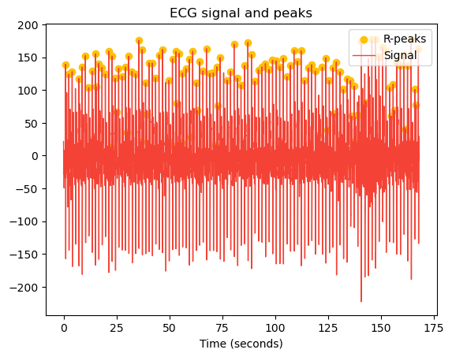

<i>Figura 3.Identifiación de picos R en la señal ECG. </i>

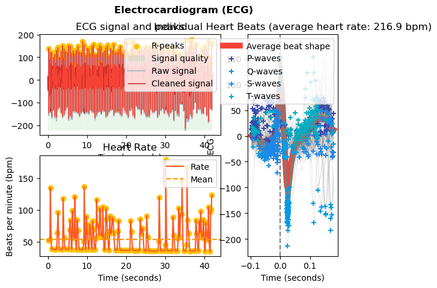

<i>Figura 4. Ploteo de la señal ECG con función ecg_plot().</i>

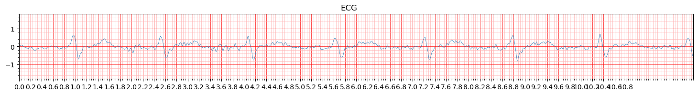

<i>Figura 5. Señal ECG en papel para electrocardiagrama.</i>

### **Segunda derivación:**
#### **Reposo:**

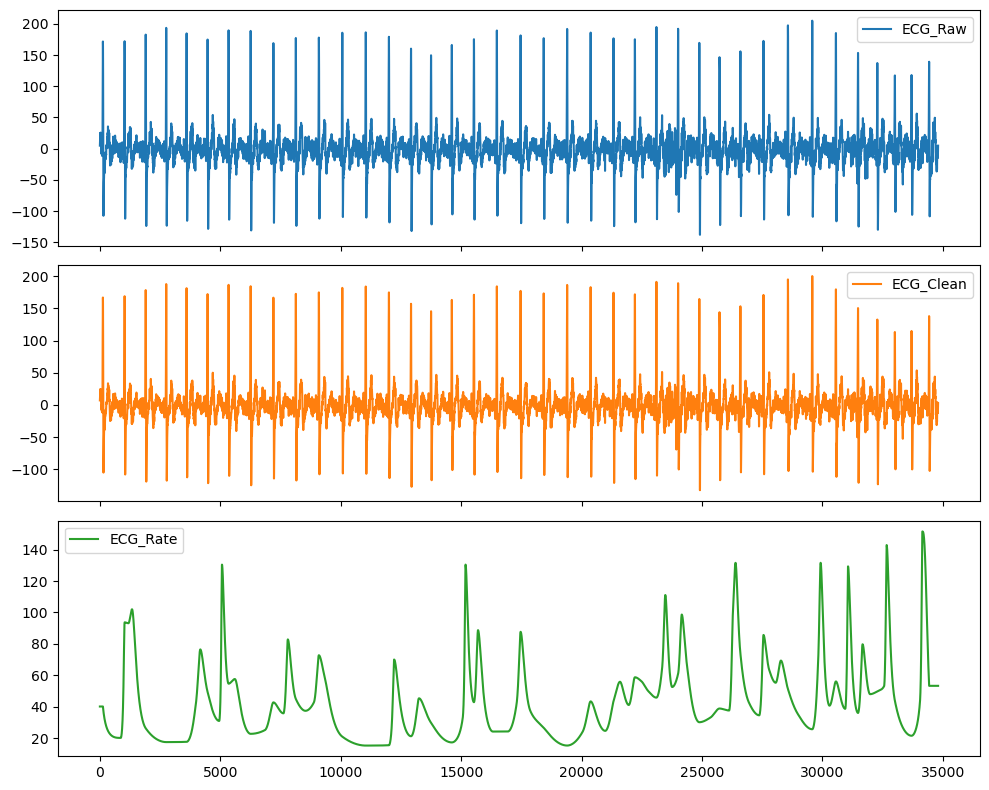

<i>Figura 2.Filtrado de la señal ECG.</i>

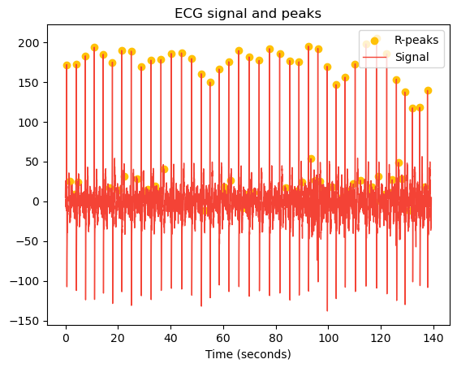

<i>Figura 3.Identifiación de picos R en la señal ECG. </i>

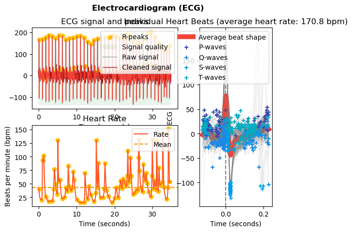

<i>Figura 4. Ploteo de la señal ECG con función ecg_plot().</i>

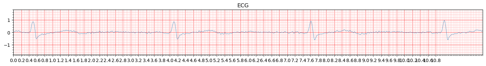

<i>Figura 5. Señal ECG en papel para electrocardiagrama.</i>

#### **Post ejercicio:**

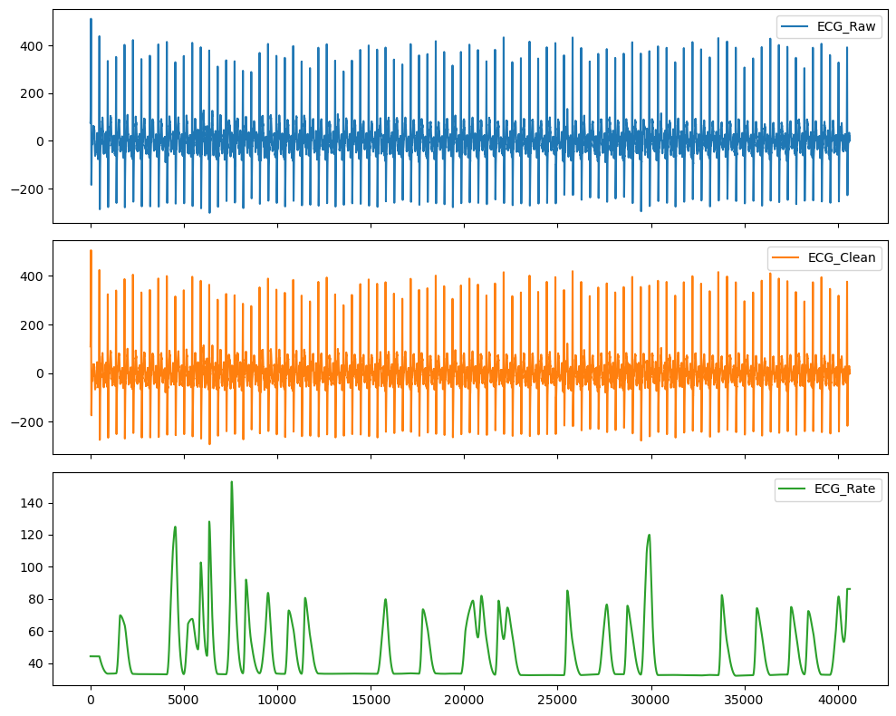

<i>Figura 2.Filtrado de la señal ECG.</i>

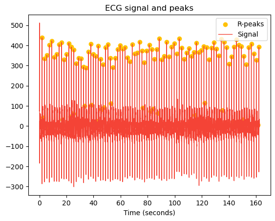

<i>Figura 3.Identifiación de picos R en la señal ECG. </i>

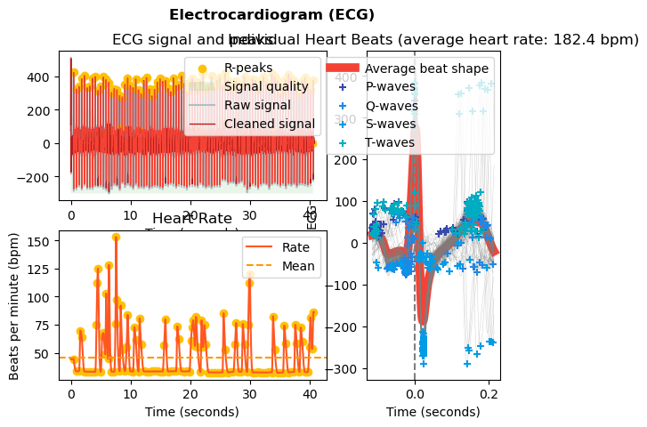

<i>Figura 4. Ploteo de la señal ECG con función ecg_plot().</i>

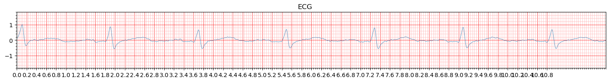

<i>Figura 5. Señal ECG en papel para electrocardiagrama.</i>

### **Tercera derivación:**
#### **Reposo:**

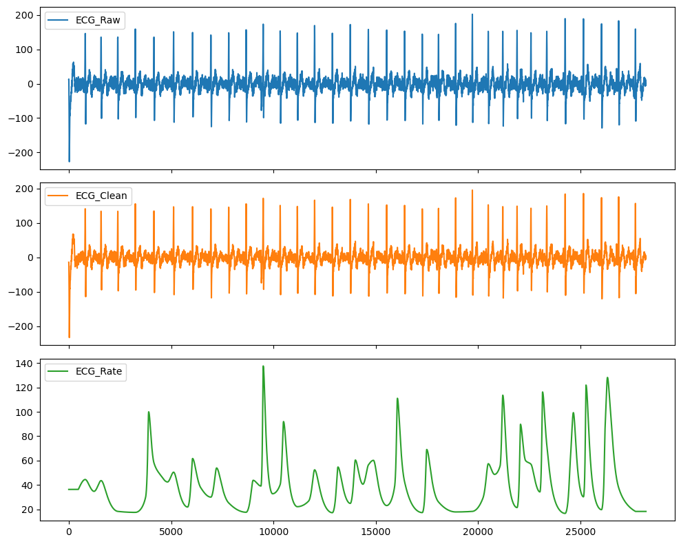

<i>Figura 2.Filtrado de la señal ECG.</i>

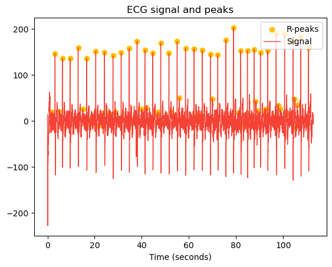

<i>Figura 3.Identifiación de picos R en la señal ECG. </i>

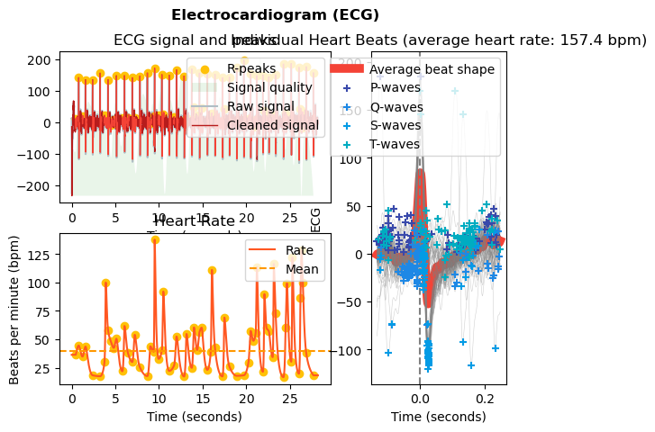

<i>Figura 4. Ploteo de la señal ECG con función ecg_plot().</i>

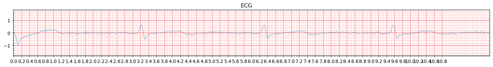

<i>Figura 5. Señal ECG en papel para electrocardiagrama.</i>

#### **Post ejercicio:**

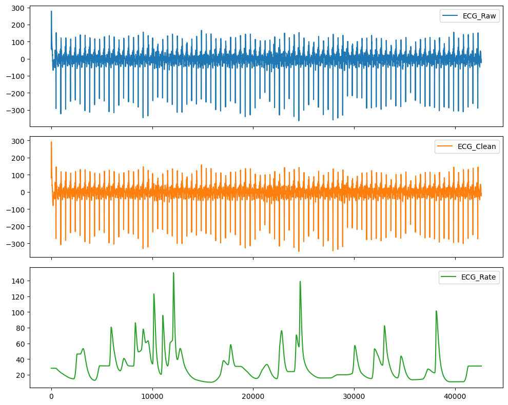

<i>Figura 2.Filtrado de la señal ECG.</i>

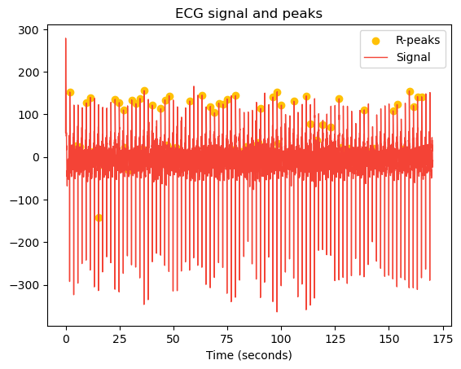

<i>Figura 3.Identifiación de picos R en la señal ECG. </i>

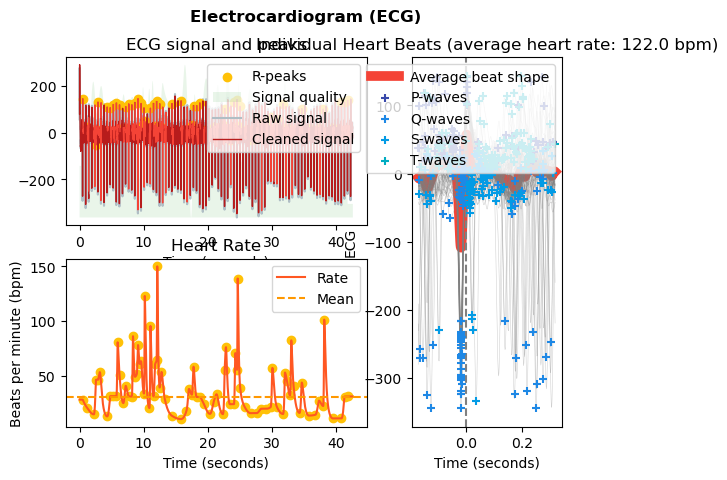

<i>Figura 4. Ploteo de la señal ECG con función ecg_plot().</i>

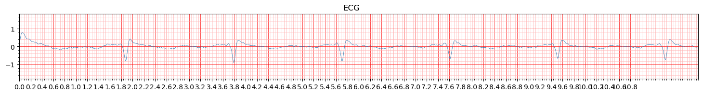

<i>Figura 5. Señal ECG en papel para electrocardiagrama.</i>

## **Bibliografía**
[1] J.-E. Ortiz-Guzman and D. Mendoza-Romero, “VARIABILIDAD DE LA FRECUENCIA CARDIACA. UNA HERRAMIENTA UTIL,” 2017. Accessed: Oct. 30, 2024. [Online]. Available: https://www.researchgate.net/profile/Dario-Mendoza Romero/publication/303926557_VARIABILIDAD_DE_LA_FRECUENCIA_CARDIACA_UNA_HERRAMIENTA_UTIL/links/58a0e015aca272046aad62c2/VARIABILIDAD-DE-LA-FRECUENCIA-CARDIACA-UNA-HERRAMIENTA-UTIL.pdf
‌
