# **LABORATORIO 9: – Procesamiento de EMG**
## **Tabla de contenidos:**
1. [Objetivos](#Objetivos)
2. [Contexto](#Contexto)
3. [Procesamiento y Preprocesamiento de las señales sEMG](#procesamiento-y-preprocesamiento-de-las-señales-semg)
4. [Equipos y materiales utilizados](#Equipos-y-materiales-utilizados)
5. [Metodología](#Metodología)
6. [Discusión](#Discusión)
7. [Bibliografía](#Bibliografía)

   
## **Objetivos:**<a id="Objetivos"></a>
- Revisar la literatura científica sobre técnicas de procesamiento de señales EMG.
- Identificar e implementar el mejor filtrado para eliminar ruido en señales EMG.
- Implementar un proceso de segmentación eficiente para análisis de señales EMG.
- Extraer características relevantes en dominios del tiempo, frecuencia y tiempo-frecuencia.
- Comparar los filtros FIR, IIR y Wavelet para determinar su eficacia en señales EMG.
- Analizar señales EMG adquiridas en laboratorio mediante filtrado y extracción de características.
  
## **Contexto:**<a id="Contexto"></a>
<p align="justify"> La electromiografía de superficie (EMG) es una técnica utilizada para medir la actividad eléctrica de los músculos durante la contracción, proporcionando información esencial sobre las propiedades fisiológicas y funcionales del músculo. La electromiografía (EMG) se refiere a la señal eléctrica colectiva de los músculos, la cual es controlada por el sistema nervioso y producida durante la contracción muscular. La señal representa las propiedades anatómicas y fisiológicas de los músculos; de hecho, una señal EMG es la actividad eléctrica de las unidades motoras de un músculo, que consisten en dos tipos: EMG de superficie y EMG intramuscular. Las señales EMG de superficie y EMG intramuscular se registran mediante electrodos no invasivos y electrodos invasivos, respectivamente. Hoy en día, las señales detectadas en la superficie se prefieren para obtener información sobre el tiempo o la intensidad de la activación de los músculos superficiales. Las señales de electromiografía (EMG) se consideran las más útiles como señales electrofisiológicas tanto en los campos médicos como en los de ingeniería. El método básico para comprender el comportamiento del cuerpo humano bajo condiciones normales y patológicas se proporciona mediante el registro de señales EMG. Siempre que se registra una señal EMG del músculo, varios tipos de ruidos la contaminan. Por lo tanto, analizar y clasificar las señales EMG es muy difícil debido al patrón complicado de la EMG, especialmente cuando ocurre movimiento [1].</p>

## **Procesamiento y Preprocesamiento de las señales sEMG:**<a id="procesamiento-y-preprocesamiento-de-las-señales-semg"></a>
<p align="justify">El procesamiento de las señales de electromiografía de superficie (sEMG) implica la adquisición de datos eléctricos generados por la actividad muscular, seguido de un conjunto de técnicas para eliminar el ruido, extraer características relevantes y clasificar los datos para diversas aplicaciones, como el control de prótesis, la ergonomía industrial y la interacción humano-máquina [2].</p>
<p align="center">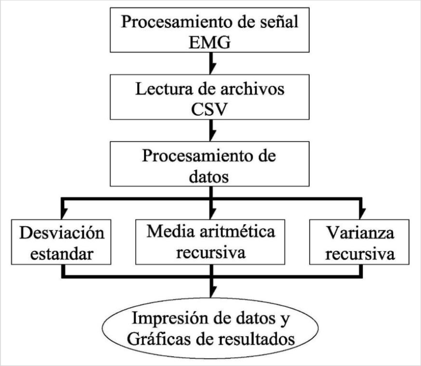</p>
<p align="center"><i>Figura 1: Diagrama de procesamiento de señal EMG [3].</i></p>

#### **1) Adquisición de señales:**
<p align="justify">Las señales sEMG son capturadas mediante electrodos de superficie. Estos pueden ser secos o húmedos, siendo los secos más adecuados para aplicaciones industriales por su facilidad de uso y mejor biocompatibilidad. Las señales capturadas incluyen la suma de los potenciales de acción de las unidades motoras, por lo que es necesario usar técnicas de filtrado y segmentación para mejorar su precisión[2][4] . </p>

#### **2) Filtrado:**
<p align="justify">Una de las primeras etapas en el procesamiento de sEMG es el filtrado, que reduce el ruido no deseado. Los filtros más comunes son los pasa-bajas y pasa-altas, con frecuencias de corte alrededor de los 20 Hz (para eliminar ruido de baja frecuencia) y entre 400 y 500 Hz (para evitar ruido de alta frecuencia), respectivamente. El uso de filtros Butterworth es común en estos casos debido a su capacidad para eliminar eficazmente las componentes de ruido sin afectar las señales útiles [2][4].</p>

#### **3) Denoising (eliminación de ruido):**
<p align="justify">El denoising es un paso crítico debido a la presencia de ruido de varias fuentes, como la interferencia de la red eléctrica o el movimiento. Los métodos más avanzados para eliminar ruido incluyen la Transformada Wavelet Discreta (DWT) y la transformada de componentes independientes (ICA), que permiten identificar y filtrar eficazmente el ruido manteniendo las características relevantes de la señal[2].</p>

#### **4) Extracción de características:**
<p align="justify">Las señales sEMG deben ser convertidas a representaciones más manejables a través de la extracción de características. Estas características pueden clasificarse en tres dominios:</p>

- Dominio del tiempo: Métricas como la RMS (raíz cuadrada media), valor absoluto medio (MAV), o la integral del cuadrado simple (SSI).
- Dominio de la frecuencia: Características como la frecuencia media (MNF) y la frecuencia mediana (MDF) se usan a menudo para estudios de fatiga muscular [2][4].
- Dominio tiempo-frecuencia: Combinación de análisis temporal y frecuencial, ideal para señales no estacionarias como las sEMG. La transformada wavelet es ampliamente utilizada aquí [4].

#### **5) Segmentación:**
<p align="justify">La segmentación implica dividir la señal en ventanas temporales para facilitar el análisis. Ventanas largas permiten una mejor extracción de características, pero a costa de aumentar el tiempo de procesamiento. En aplicaciones en tiempo real, es común usar ventanas de entre 200 y 300 milisegundos con cierto solapamiento para equilibrar precisión y velocidad [2][4].</p>

#### **6) Clasificación:**
<p align="justify">Las características extraídas de las señales se utilizan para entrenar algoritmos de clasificación, como Máquinas de Soporte Vectorial (SVM), Análisis Discriminante Lineal (LDA), y redes neuronales (ANN). Estos algoritmos permiten identificar patrones en las señales sEMG y asociarlos a movimientos específicos o estados musculares, como la fatiga [4].</p>

<p align="justify">El procesamiento de señales sEMG, aunque potente, presenta desafíos debido a la variabilidad de las señales y la sensibilidad al ruido. Sin embargo, las mejoras en la tecnología de adquisición y en los algoritmos de procesamiento han aumentado su utilidad en aplicaciones industriales y clínicas[4].</p>

## **Equipos y materiales utilizados:**<a id="Equipos"></a>
<div align="center">
   
|  **Modelo**  | **Descripción** | **Cantidad** |
|:------------:|:---------------:|:------------:|
|     ASUS     |      Laptop     |       1      | 
</div>
<p align="center"><i>Tabla 1. Equipos y materiales utilizados en este laboratorio. </i></p>

## **Metodología:**<a id="Metodología"></a>
<p align="justify"> El primer paso en el procesamiento de señales EMG es revisar la literatura para encontrar las mejores técnicas que se usan en este campo. A partir de esa revisión, se busca identificar el filtrado más adecuado para eliminar el ruido presente en las señales. Luego, se aplicará un proceso de segmentación que divida las señales en partes más manejables, lo que permitirá un análisis más preciso. Después de eso, se extraerán características importantes en los dominios del tiempo, frecuencia y tiempo-frecuencia, con el objetivo de entender mejor las señales. También se compararán los filtros FIR, IIR y Wavelet para ver cuál es más efectivo con las señales EMG. Finalmente, las señales obtenidas en el laboratorio serán analizadas, utilizando filtrado y extracción de características, para obtener datos que puedan ser útiles en aplicaciones biomédicas o tecnológicas.</p>

## **Características del dominio del tiempo:**<a id="caracteristicas"></a>
<p align="justify"> Estas características son adecuadas para sistemas en tiempo real que deben cumplir con restricciones específicas y se pueden implementar fácilmente utilizando hardware básico. Las características del dominio temporal se extraen de la amplitud de la señal, que cambia con el tiempo. La amplitud de la señal está influenciada por el tipo de músculo y las condiciones de observación [5]. </p>

### **Root Mean Square (RMS):**
<p align="justify">La raíz cuadrada del cuadrado medio de la amplitud de la señal</p>
<p align="center"></p>
<p align="center"><i>Figura 2: Formula RMS.</i></p>

### **Mean Absolute Value (MAV):**
<p align="justify">Representa el promedio del valor absoluto de la amplitud de la señal sEMG y se calcula tomando el valor promedio de las entradas absolutas de la señal.</p>
<p align="center"></p>
<p align="center"><i>Figura 2: Formula Mean Absolute Value.</i></p>

### **Waveform Length (WL):**
<p align="justify">Es la longitud acumulada de la forma de onda sobre la muestra. Indica una medida de la forma de onda relacionada con el tiempo y la amplitud.</p>
<p align="center"></p>
<p align="center"><i>Figura 2: Formula Waveform Length.</i></p>

### **Zero Crossing (ZC):**
<p align="justify">Forma de calcular el número de veces que el valor de amplitud de la señal sEMG cruza el cero. La condición de umbral busca evitar el ruido de fondo.</p>
<p align="center"></p>
<p align="center"><i>Figura 2: Formula Zero Crossing.</i></p>

## **Resultados:**<a id="resultados"></a>
## **Código:**<a id="codigo"></a>
<p align="justify"> En esta sección mostraremos la segmentación y extracción de características de la señal de cada músculo estudiado (reposo, fuerza y movimiento). </p>

### **Reposo:**
``` python
import numpy as np
import matplotlib.pyplot as plt

# Cargar los datos desde el archivo "bicep reposo.txt"
data_reposo = np.genfromtxt("bicep reposo.txt", delimiter="\t", skip_header=2)
vals1 = data_reposo[:, -2]  # Asumiendo que los datos están en la penúltima columna
vals1 = (((vals1 / 1024) - 0.5) * 3.3) / 1009
vals1 = vals1 * 1000
Fs = 1000  # Frecuencia de muestreo
time1 = np.arange(0, len(vals1)) / Fs

# Graficar la señal en reposo
plt.figure(figsize=(12, 4))
plt.plot(time1, vals1)
plt.title("Señal EMG en reposo")
plt.xlabel("Tiempo (s)")
plt.ylabel("Amplitud (mV)")
plt.show()
```
| Músculo |Señal EMG en reposo|
|:--------------:|:--------------:|
|Bícep|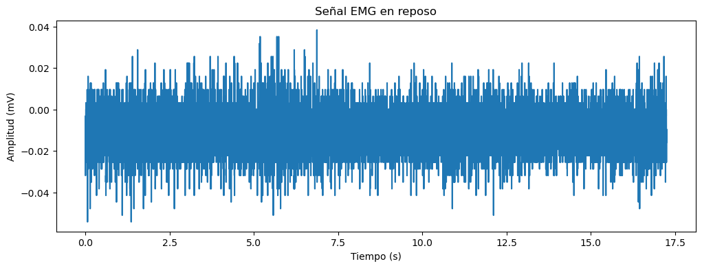|
|Gastrocnemio|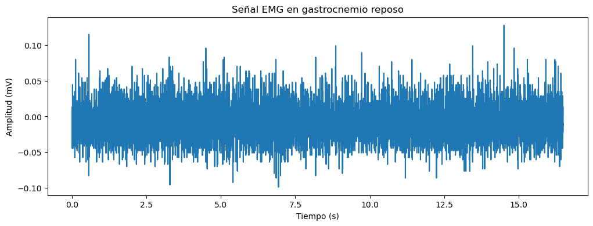|
|Trapecio|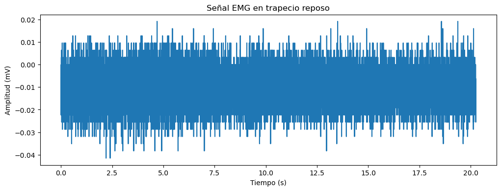|
|Trícep|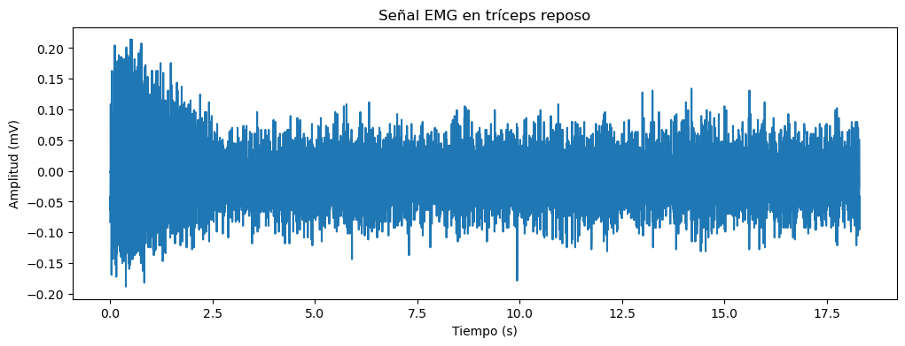|
<p align="center"><i>Tabla 2: Señal EMG en reposo.</i></p>

### **Fuerza:**
``` python
# Cargar los datos desde el archivo "bicep fuerza.txt"
data_fuerza = np.genfromtxt("bicep fuerza.txt", delimiter="\t", skip_header=2)
vals2 = data_fuerza[:, -2]  # Asumiendo que los datos están en la penúltima columna
vals2 = (((vals2 / 1024) - 0.5) * 3.3) / 1009
vals2 = vals2 * 1000
Fs = 1000  # Frecuencia de muestreo
time2 = np.arange(0, len(vals2)) / Fs

# Graficar la señal
plt.figure(figsize=(12, 4))
plt.plot(time2, vals2)
plt.title("Señal EMG en bicep fuerza")
plt.xlabel("Tiempo (s)")
plt.ylabel("Amplitud (mV)")
plt.show()

# Segmentación de la señal
t_start = 4  # Definir el tiempo de inicio para la segmentación
start_index = int(t_start * Fs)
time_segmented2 = time2[start_index:]
vals_segmented2 = vals2[start_index:]

# Graficar la señal segmentada
plt.figure(figsize=(12, 4))
plt.plot(time_segmented2, vals_segmented2)
plt.title("Señal EMG en bicep fuerza segmentada")
plt.xlabel("Tiempo (s)")
plt.ylabel("Amplitud (mV)")
plt.show()
```

| Músculo |Señal EMG en fuerza| Señal EMG en fuerza segmentada|
|:--------------:|:--------------:|:--------------:|
|Bícep|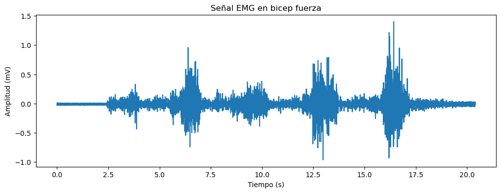| 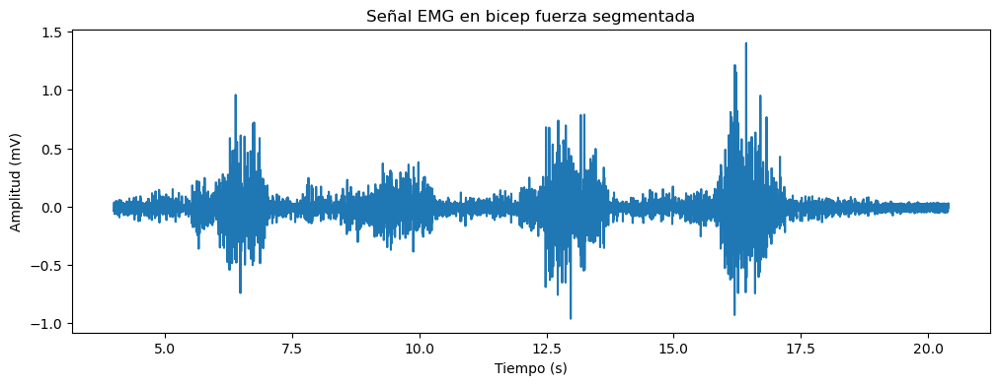|
|Gastrocnemio|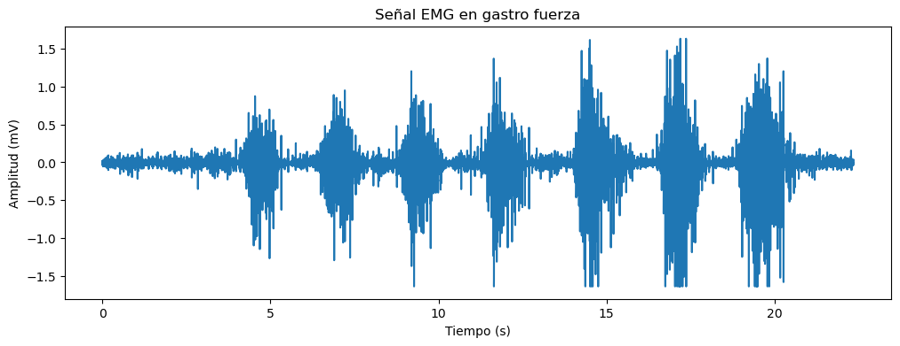|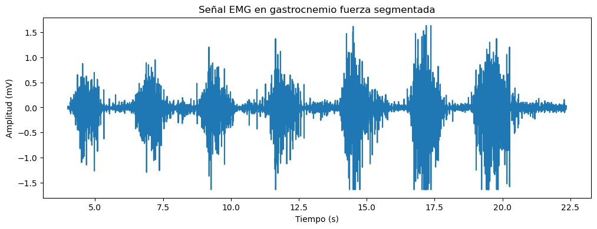|
|Trapecio|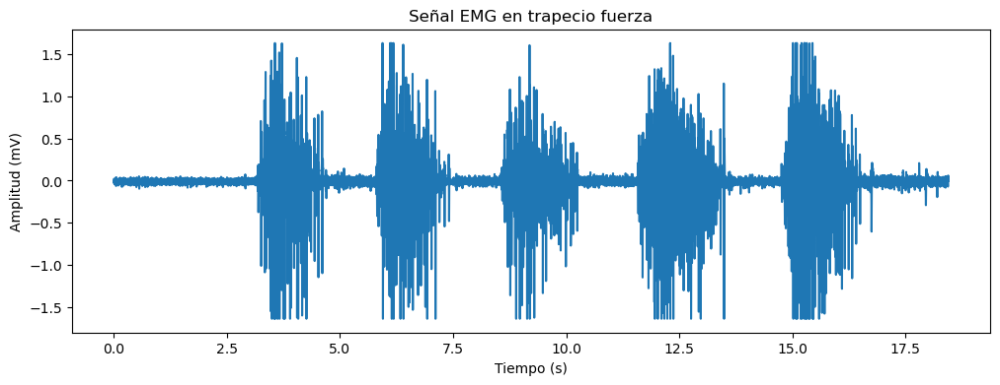|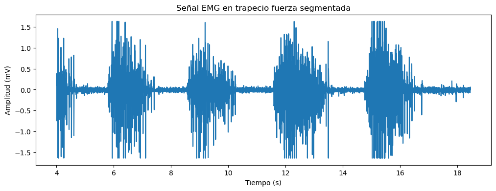|
|Trícep|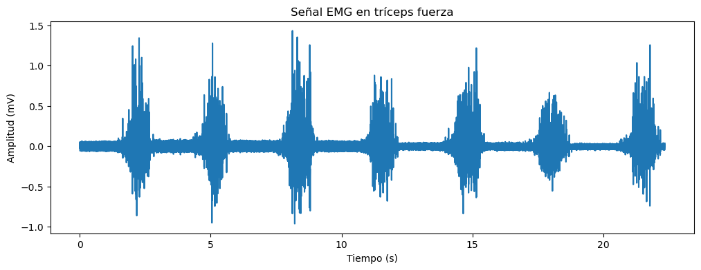|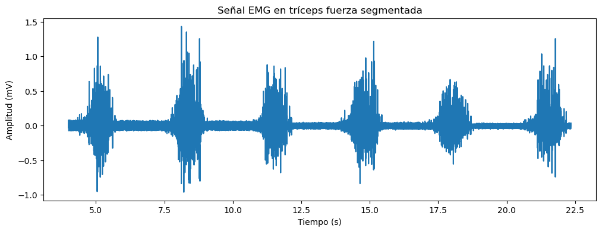|
<p align="center"><i>Tabla 3: Señal EMG en fuerza segmentada.</i></p>

### **Movimiento:**
``` python
# Cargar los datos desde el archivo "bicep movimiento.txt"
data_movimiento = np.genfromtxt("bicep movimiento.txt", delimiter="\t", skip_header=2)
vals3 = data_movimiento[:, -2]  # Asumiendo que los datos están en la penúltima columna
vals3 = (((vals3 / 1024) - 0.5) * 3.3) / 1009
vals3 = vals3 * 1000
Fs = 1000  # Frecuencia de muestreo
time3 = np.arange(0, len(vals3)) / Fs

# Graficar la señal
plt.figure(figsize=(12, 4))
plt.plot(time3, vals3)
plt.title("Señal EMG en bicep movimiento")
plt.xlabel("Tiempo (s)")
plt.ylabel("Amplitud (mV)")
plt.show()

# Segmentación de la señal
t_start = 5  # Definir el tiempo de inicio para la segmentación
start_index = int(t_start * Fs)
time_segmented3 = time3[start_index:]
vals_segmented3 = vals3[start_index:]

# Graficar la señal segmentada
plt.figure(figsize=(12, 4))
plt.plot(time_segmented3, vals_segmented3)
plt.title("Señal EMG en bicep movimiento segmentada")
plt.xlabel("Tiempo (s)")
plt.ylabel("Amplitud (mV)")
plt.show()
```
| Músculo |Señal EMG en movimiento| Señal EMG en movimiento segmentada|
|:--------------:|:--------------:|:--------------:|
|Bícep|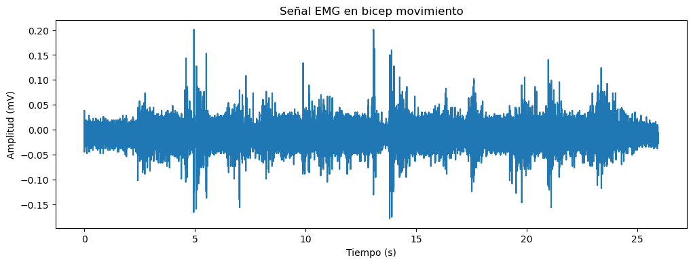| 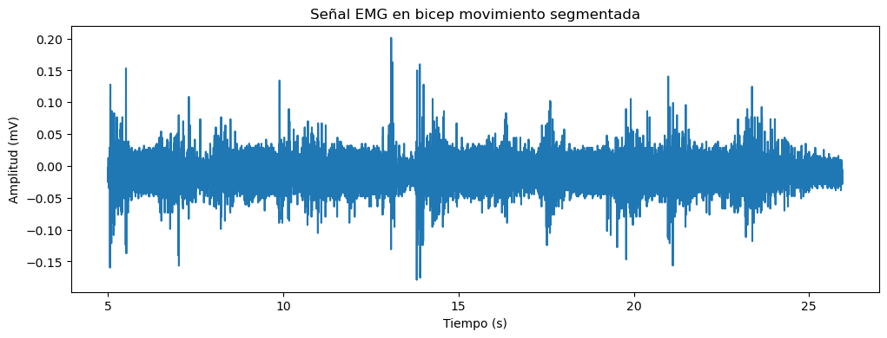|
|Gastrocnemio|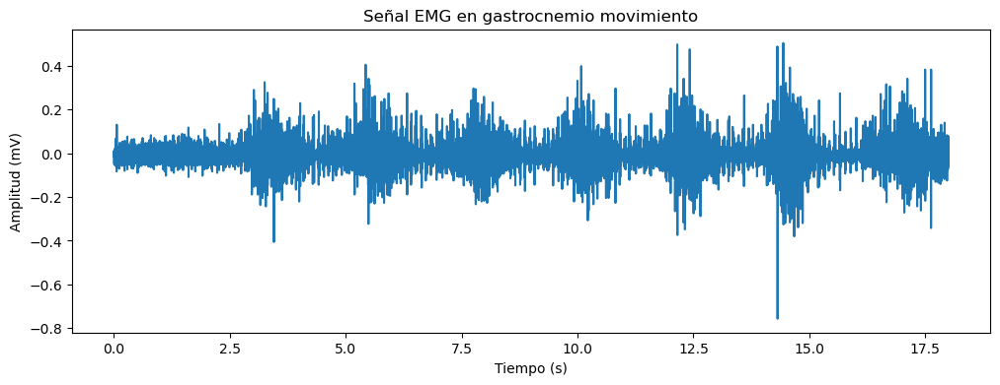|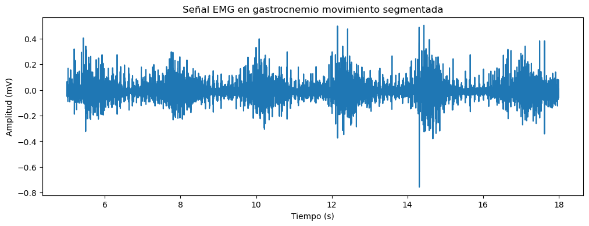|
|Trapecio|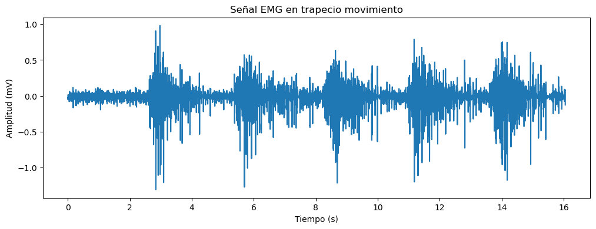|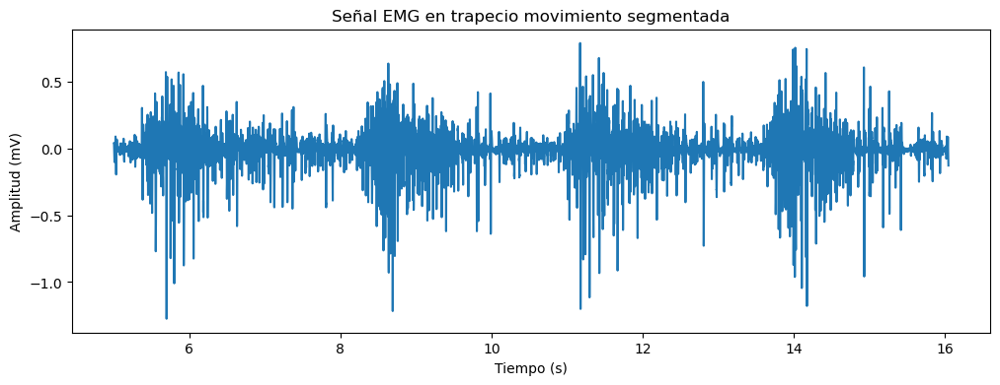|
|Trícep|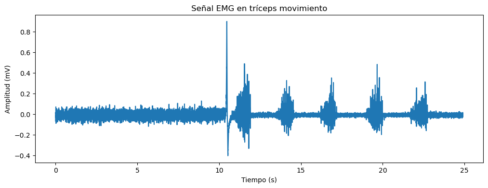|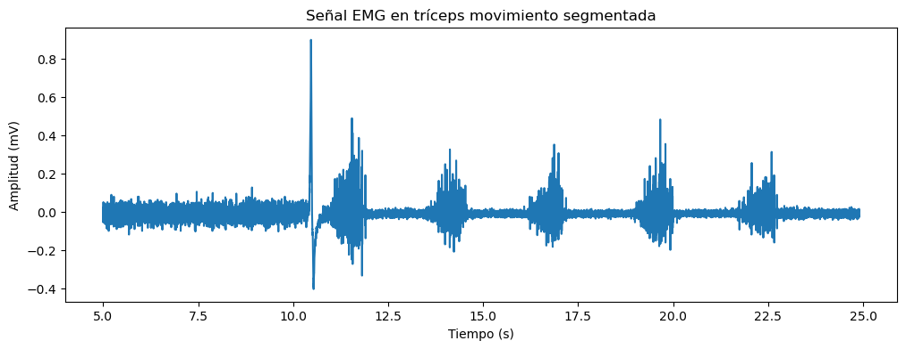|
<p align="center"><i>Tabla 4: Señal EMG en movimiento segmentada.</i></p>

### **Extracción de características:**
``` python
from numpy import sqrt, average

# Definir función para contar cruces por cero
def zero_crossings(values, threshold):
    crossings = 0
    for i in range(len(values) - 1):
        product = values[i] * values[i + 1]
        if product < 0 and abs(values[i] - values[i + 1]) > threshold:
            crossings += 1
    return crossings

threshold = 0

# Características para la señal de fuerza (bicep fuerza segmentada)
rms_fuerza = sqrt(sum(vals_segmented2 * vals_segmented2) / len(vals_segmented2))
mav_fuerza = average(abs(vals_segmented2))
WL_fuerza = np.sum(np.abs(np.diff(vals_segmented2)))
zc_fuerza = zero_crossings(vals_segmented2, threshold)

print("RMS en bicep fuerza: ", rms_fuerza)
print("MAV en bicep fuerza: ", mav_fuerza)
print("Wave Length en bicep fuerza: ", WL_fuerza)
print("Zero crossings en bicep fuerza: ", zc_fuerza)

# Características para la señal de movimiento (bicep movimiento segmentada)
rms_movimiento = sqrt(sum(vals_segmented3 * vals_segmented3) / len(vals_segmented3))
mav_movimiento = average(abs(vals_segmented3))
WL_movimiento = np.sum(np.abs(np.diff(vals_segmented3)))
zc_movimiento = zero_crossings(vals_segmented3, threshold)

print("RMS en bicep movimiento: ", rms_movimiento)
print("MAV en bicep movimiento: ", mav_movimiento)
print("Wave Length en bicep movimiento: ", WL_movimiento)
print("Zero crossings en bicep movimiento: ", zc_movimiento)
```
| Músculo ↓ \ Característica →|RMS| MAV| WL| ZC|
|:--------------:|:--------------:|:--------------:|:--------------:|:--------------:|
|Bícep|0.11894607791031542|0.06644425588907153|603.5150442889|2430|
|Gastrocnemio|0.2394391550494825|0.12046579612675296|1575.1443067083744|3690|
|Trapecio|0.35055621647801655|0.18795293456426762|1341.9536669970266|1992|
|Trícep|0.13176106291218825|0.07389161080588058|941.5426203233399|2751|
<p align="center"><i>Tabla 5: Características para la señal de fuerza segmentada.</i></p>

| Músculo ↓ \ Característica →|RMS| MAV| WL| ZC|
|:--------------:|:--------------:|:--------------:|:--------------:|:--------------:|
|Bícep|0.02759388171744381|0.021146587780382288|221.6702025520317|2139|
|Gastrocnemio|0.06251526652594021|0.04061794957164367|535.7498335294847|3316|
|Trapecio|0.15933781244065723|0.09558985567954024|530.9877121531218|1463|
|Trícep|0.049566200704902766|0.025463174978895962|337.7624814172448|2939|
<p align="center"><i>Tabla 6: Características para la señal de movimiento segmentada.</i></p>

## **Discusion:**<a id="Discusion"></a>

## **Bibliografía:**<a id="Bibliografía"></a>
<p align="justify">[1] R. H. Chowdhury, Mamun, Ali, A. Ashrif, Kalaivani Chellappan, and T. G. Chang, “Surface Electromyography Signal Processing and Classification Techniques,” Sensors, vol. 13, no. 9, pp. 12431–12466, Sep. 2013, doi: https://doi.org/10.3390/s130912431.</p>
<p align="justify">[2] J. Wu, X. Li, W. Liu, and Z. Jane Wang, “sEMG Signal Processing Methods: A Review,” Journal of Physics: Conference Series, vol. 1237, no. 3, p. 032008, Jun. 2019, doi: https://doi.org/10.1088/1742-6596/1237/3/032008.</p>
<p align="justify">[3] “Figura 4. Diagrama de procesamiento de señal EMG,” ResearchGate, 2024. https://www.researchgate.net/figure/Figura-4-Diagrama-de-procesamiento-de-senal-EMG_fig3_381880854 (accessed Oct. 24, 2024).</p>
<p align="justify">[4] M. B. I. Reaz, M. S. Hussain, and F. Mohd-Yasin, “Techniques of EMG signal analysis: detection, processing, classification and applications,” Biological Procedures Online, vol. 8, no. 1, pp. 11–35, Apr. 2006, doi: https://doi.org/10.1251/bpo115.</p>
<p align="justify">[5] S. M. Sid'El Moctar, I. Rida, and S. Boudaoud, "Time-domain features for sEMG signal classification: A brief survey," in JETSAN 2023, Paris, France, Jun. 2023. Available: https://hal.science/hal-04199535v1.</p>
‌
‌
