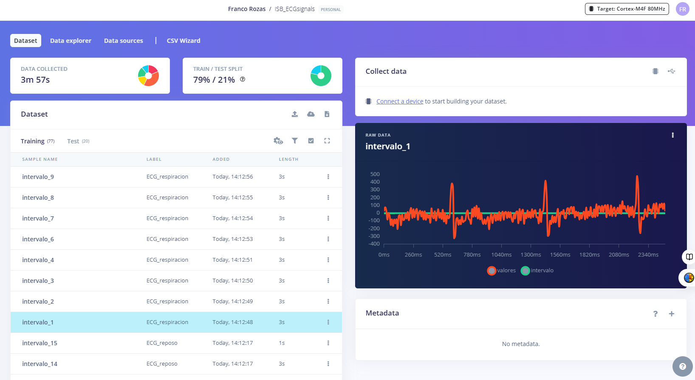
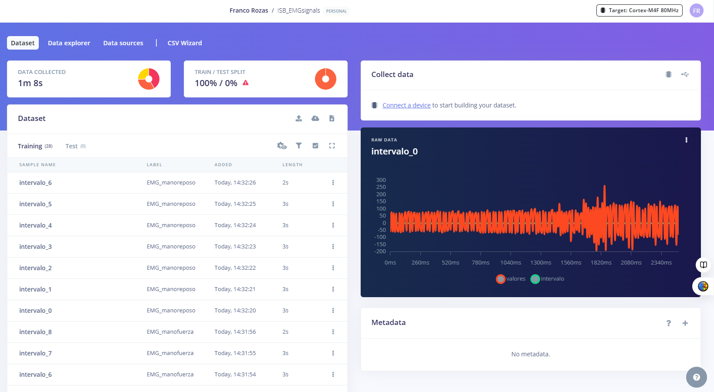
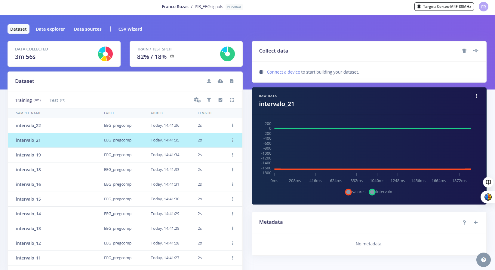

# **LABORATORIO 11: – Datos estructurales Edge Impulse**
## **Edge impluse:**
<p align="justify">Edge Impulse es una plataforma de inteligencia artificial que recopila datos, entrenar modelos e implementarlos en sus dispositivos informáticos de borde. Estos dispositivos pueden ser sensores, microcontroladores, o cualquier hardware con recursos limitados, donde se puede procesar la información localmente sin necesidad de enviarla a la nube. </p>

## **Procedimiento empleado:**
<p align="justify"> 1. Los datos utilizados pra el desarrolo de este laboratorio viene de los laboratorios 3, 4 y 5 de ECG, EMG y EEG. Al adquirir esta data se obtuvo en formato ".txt" asiq ue para poderla subirla al entorno de Edge impulse se tubo que cambiar a un formato ".csv". El codigo empleado fue el siguiente:</p>

```python
import pandas as pd
import numpy as np
import csv
ata_cruda = np.loadtxt('eegsimples.txt')
data_cruda = data_cruda[:, -1]
signal = ((data_cruda-507)/1023)*3.3*1000
fs = 1000
signal_data =list(signal)
total_data = len(signal_data)
time_total = total_data
time_data = np.linspace(0,time_total,total_data)
time_data = list(time_data)
output_file = 'EEG_pregsimple.csv'
with open(output_file, 'w', newline='') as csvfile:
    csvwriter = csv.writer(csvfile)
    csvwriter.writerow(['timestamp', 'valores'])
    for t, v in zip(time_data, signal_data):
        csvwriter.writerow([t, v])
```

<p align="justify"> 2. Una vez ya con la data en formato ".csv" para subir los archivos a cada uno de los repositorios se utilizo google colab dividiendo la data en intervalos de 2 a 2.5 segundos.</p>
<p align="justify"> 3. Con la data separada por intervalo ya se procedio a subirla a los respositorios de Edge Impulse de esta forma:.</p>

```python
for i in range(num_intervalos):
    intervalo_data = data[data['intervalo'] == i]  # Filtra datos del intervalo actual
    intervalo_filename = f'intervalo_{i}.csv'
    intervalo_data.to_csv(intervalo_filename, index=False)  # Guarda en un archivo CSV
    
    file_tuple = ('data', (os.path.basename(intervalo_filename), open(intervalo_filename, 'rb'), 'application/csv'))
    res = requests.post(
        url='https://ingestion.edgeimpulse.com/api/training/files',
        headers={
            'x-label': label,
            'x-api-key': api_key,
        },
        files=[file_tuple]
    )
```

## **Resultados:**
#### **ECG**
<p align="justify">Link del repositorio de las señales ECG: https://studio.edgeimpulse.com/public/559582/live</p>
<p align="center"></p>
<p align="center"><i>Figura 1: Transformada Wavelet [3].</i></p>

#### **EMG**
<p align="justify">Link del repositorio de las señales EMG: https://studio.edgeimpulse.com/public/559657/live</p>
<p align="center"></p>
<p align="center"><i>Figura 1: Transformada Wavelet [3].</i></p>

#### **EEG**
<p align="justify">Link del repositorio de las señales EEG: https://studio.edgeimpulse.com/public/559663/live</p>
<p align="center"></p>
<p align="center"><i>Figura 1: Transformada Wavelet [3].</i></p>


