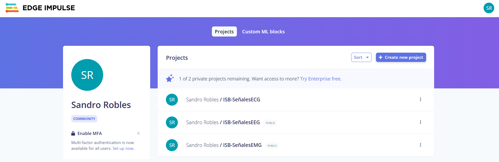
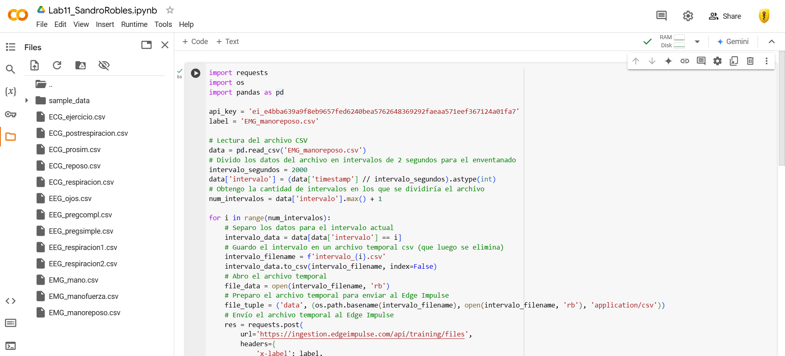

# **LABORATORIO 11:  Edge Impulse**
## **Tabla de contenidos:**
1. [Objetivos](#Objetivos)
2. [Introduccion, ¿Qué es Edge Impulse?](#Introduccion)
3. [Metodología](#Metodología)
4. [Bibliografia](#Bibliografia)
    
## **Objetivos:**<a id="Objetivos"></a>
- Diseñar un proyecto en Edge Impulse para cada categoría de señal procesada (EMG, ECG y EEG).
- Desarrollar un script en VisualStudio que permita cargar las señales correspondientes en la plataforma Edge Impulse.
  
## **¿Qué es Edge Impulse?**<a id="Introduccion"></a>
<p align="justify"> Edge Impulse es una plataforma de desarrollo especializada en aprendizaje automático para dispositivos de borde (edge devices). Su objetivo es facilitar a los desarrolladores la creación, optimización y despliegue de modelos de machine learning en hardware embebido de forma eficiente y accesible.[1]​.‌ </p>

<p align="center"></p>

<p align="center"><i>Figura 1: Logo Edge Impulse [1].</i></p>

## **Metodología:**<a id="Metodología"></a>
<p align="justify"> Los datos empleados para este laboratorio fueron obtenidos en formato .txt, los cuales fueron adquiridos de los laboratorios de señales biológicas (ECG, EMG y EEG). La plataforma Edge Impulse requiere de archivos en formato .csv para poder ser procesados y clasificados, por lo que se empleó un script en Visual Studio Code, el cual que convierte automáticamente los archivos .txt al formato .csv, ajustando así su estructura para cumplir con los requisitos de la plataforma principal. </p>
     
|  **Señal biológica**  | **Imagen de obtención** | **Señal obtenida** |
|:------------:|:---------------:|:---------------:|
| ECG |   <p align="center"></p>  |  <p align="center"></p> | 
| EEG |  <p align="center"></p>  |  <p align="center"></p> | 
| EMG |   <p align="center"></p>  |  <p align="center"></p> | 
</div>
<p align="center"><i>Tabla 1. Señales biológicas que serán procesadas. </i> </p>

### **Coversión de .txt a .csv:**<a id="Conversion"></a>
```python
import csv

def transformar_txt_a_csv(ruta_origen, ruta_destino, indice_columna=5, cabecera=None):
    """
    Convierte un archivo .txt en un archivo .csv, extrayendo una columna específica
    y añadiendo un contador de tiempo como referencia.
    """
    with open(ruta_origen, 'r') as archivo_entrada, open(ruta_destino, 'w', newline='') as archivo_salida:
        escritor = csv.writer(archivo_salida)

        # Escribir la cabecera en el archivo CSV
        if cabecera:
            escritor.writerow(cabecera)
        else:
            escritor.writerow(['tiempo', 'valor'])

        contador_tiempo = 0  # Inicializa el contador de tiempo

        # Procesar cada línea del archivo .txt
        for linea in archivo_entrada:
            if linea.startswith('#'):  # Ignorar líneas de encabezado o comentarios
                continue
            datos = linea.strip().split('\t')  # Dividir las columnas por tabulaciones
            if len(datos) > indice_columna:  # Verificar si la columna requerida existe
                escritor.writerow([contador_tiempo, datos[indice_columna]])  # Guardar tiempo y valor
                contador_tiempo += 1  # Incrementar el contador

# Ejemplo de uso
archivo_txt = 'ECG_ejercicio.txt'
archivo_csv = 'ECG_ejercicio.csv'
transformar_txt_a_csv(archivo_txt, archivo_csv, indice_columna=5, cabecera=['Tiempo (ms)', 'Señal EMG'])

```

<p align="center"></p>

<p align="center"><i>Figura 2: Conversión de .txt a .csv </i></p>

<p align="justify"> En relación con la plataforma, procederemos a desarrollar tres proyectos individuales, cada uno dedicado específicamente a un tipo de señal biológica. Esto incluye un proyecto para señales de ECG (electrocardiografía), otro para EMG (electromiografía) y un tercero para EEG (electroencefalografía). Al organizar cada tipo de señal en proyectos separados, no solo optimizamos la clasificación de las mismas, sino que también facilitamos su análisis individual, permitiendo un enfoque más detallado y preciso en el tratamiento de los datos. Esta segmentación también es crucial para adaptar los modelos de machine learning de manera específica a las características únicas de cada señal, maximizando así la efectividad del sistema y asegurando resultados más confiables. </p>

<p align="center"></p>

<p align="center"><i>Figura 3: Proyectos en Edge Impulse </i></p>

### **Señales en Edge Impulse:**<a id="Señal"></a>
<p align="justify"> Se empleó la plataforma Google Colab como herramienta para gestionar y subir los códigos correspondientes a cada proyecto en Edge Impulse. Para realizar el proceso correctamente, fue necesario ajustar la clave de la API de Edge Impulse en función del proyecto o la señal biológica en cuestión, asegurando así que los datos fueran clasificados y organizados de manera adecuada en la plataforma. Este paso fue esencial para garantizar que cada tipo de señal, ya sea ECG, EMG o EEG, se asociara al proyecto correspondiente, permitiendo una segmentación clara y un procesamiento eficaz.</p>

<p align="center"></p>

<p align="center"><i>Figura 4: Código en Google Colab. </i></p>

<p align="justify"> A continuación, se presenta el código utilizado para realizar la carga en la plataforma:</p>

```python
import requests
import os
import pandas as pd

api_key = 'ei_e4bba639a9f8eb9657fed6240bea5762648369292faeaa571eef367124a01fa7'
label = 'EMG_manoreposo.csv'

# Lectura del archivo CSV
data = pd.read_csv('EMG_manoreposo.csv')
# Divido los datos del archivo en intervalos de 2 segundos para el enventanado
intervalo_segundos = 2000
data['intervalo'] = (data['timestamp'] // intervalo_segundos).astype(int)
# Obtengo la cantidad de intervalos en los que se dividiría el archivo
num_intervalos = data['intervalo'].max() + 1

for i in range(num_intervalos):
    # Separo los datos para el intervalo actual
    intervalo_data = data[data['intervalo'] == i]
    # Guardo el intervalo en un archivo temporal csv (que luego se elimina)
    intervalo_filename = f'intervalo_{i}.csv'
    intervalo_data.to_csv(intervalo_filename, index=False)
    # Abro el archivo temporal
    file_data = open(intervalo_filename, 'rb')
    # Preparo el archivo temporal para enviar al Edge Impulse
    file_tuple = ('data', (os.path.basename(intervalo_filename), open(intervalo_filename, 'rb'), 'application/csv'))
    # Envío el archivo temporal al Edge Impulse
    res = requests.post(
        url='https://ingestion.edgeimpulse.com/api/training/files',
        headers={
            'x-label': label,
            'x-api-key': api_key,
        },
        files=[file_tuple]
    )
    # Cierro el archivo temporal
    file_data.close()
    # Verifico que se esté mandando cada intervalo
    print(f'Intervalo {i} - Resultado: {res.text}')
    # Elimino el archivo temporal
    os.remove(intervalo_filename)

if (res.status_code == 200):
    print('Uploaded file(s) to Edge Impulse\n', res.status_code, res.content)
else:
    print('Failed to upload file(s) to Edge Impulse\n',
          res.status_code, res.content)

```
<p align="center"></p>

<p align="center"><i>Figura 5: Señal ECG en Edge Impulse. </i></p>

<p align="center"></p>

<p align="center"><i>Figura 6: Señal EMG en Edge Impulse. </i></p>

<p align="justify"> Es fundamental destacar la relevancia de crear proyectos separados para cada tipo de señal biológica. Si hubiéramos colocado todas las señales en un único proyecto, aunque técnicamente podrían haberse clasificado, el análisis habría perdido precisión y claridad. Esta división permite un estudio más detallado y específico de cada señal, facilitando una mejor comprensión de sus características individuales y evitando posibles confusiones o solapamientos en los resultados. Además, organizar las señales en proyectos separados asegura una mayor flexibilidad para adaptar los modelos de aprendizaje automático a las particularidades de cada tipo de dato. </p>

<p align="center"></p>

<p align="center"><i>Figura 7: Distribución de los datos en Edge Impulse. </i></p>

## **Bibliografia:**<a id="Bibliografia"></a>
<p align="justify">[1]“Edge Impulse - The Leading Edge AI Platform,” Edgeimpulse.com, 2024. https://edgeimpulse.com/ (accessed Nov. 20, 2024).‌</p>


