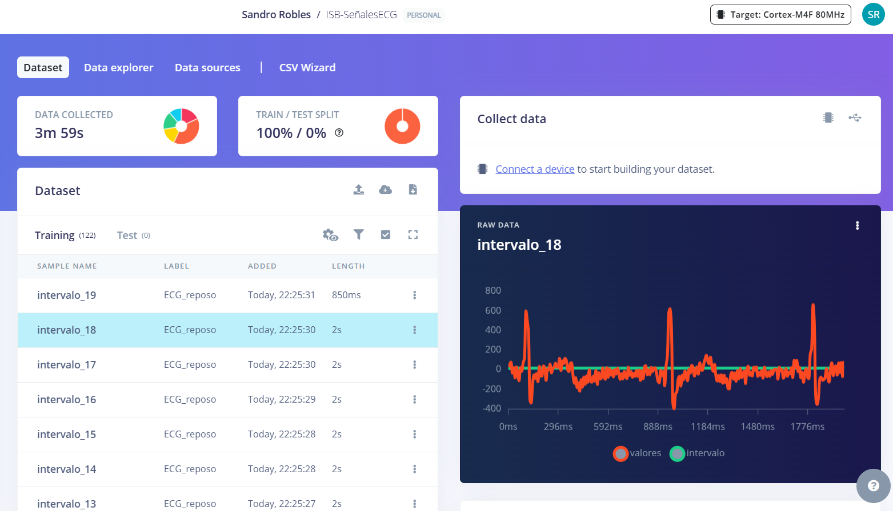
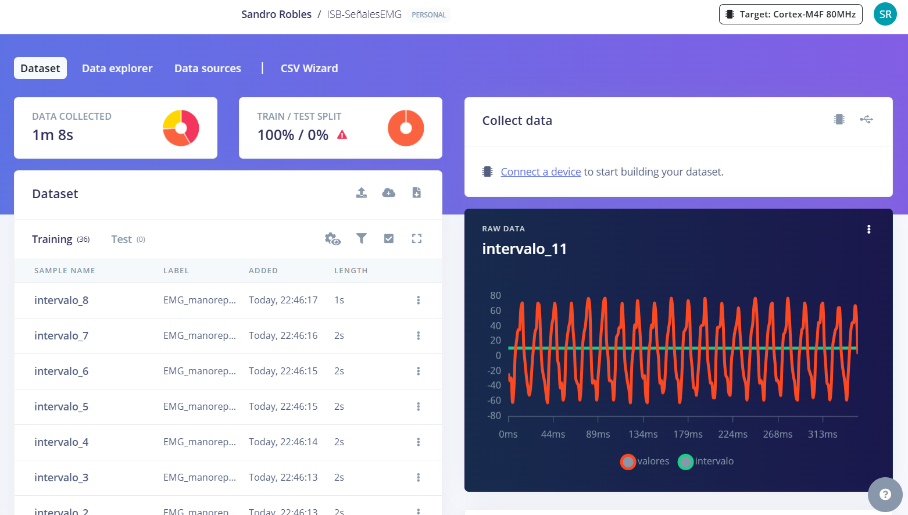

# **LABORATORIO 11: – Edge Impulse**
## **Tabla de contenidos:**
1. [Objetivos](#Objetivos)
2. [Introduccion, ¿Qué es Edge Impulse?](#Introduccion)
3. [Metodología](#Metodología)
5. [Cronología de mediciones](#Cronologíademediciones)
6. [Posiciones de los electrodos](#Posicionesdeloselectrodos)
7. [Resultados](#Resultados)
8. [Discusión](#Discusión)
9. [Ultracortex](#Ultracortex)
10. [Bibliografia](#Bibliografia)
    
## **Objetivos:**<a id="Objetivos"></a>
- Diseñar un proyecto en Edge Impulse para cada categoría de señal procesada (EMG, ECG y EEG).
- Desarrollar un script en VisualStudio que permita cargar las señales correspondientes en la plataforma Edge Impulse.
  
## **¿Qué es Edge Impulse?**<a id="Introduccion"></a>
<p align="justify"> Edge Impulse es una plataforma de desarrollo especializada en aprendizaje automático para dispositivos de borde (edge devices). Su objetivo es facilitar a los desarrolladores la creación, optimización y despliegue de modelos de machine learning en hardware embebido de forma eficiente y accesible.[1]​.‌ </p>

<p align="center"></p>

<p align="center"><i>Figura 1: Logo Edge Impulse [1].</i></p>

## **Metodología:**<a id="Metodología"></a>
<p align="justify"> Los datos empleados para este laboratorio fueron obtenidos en formato .txt, los cuales fueron adquiridos de los laboratorios de señales biológicas (ECG, EMG y EEG). La plataforma Edge Impulse requiere de archivos en formato .csv para poder ser procesados y clasificados, por lo que se empleó un script en Visual Studio Code, el cual que convierte automáticamente los archivos .txt al formato .csv, ajustando así su estructura para cumplir con los requisitos de la plataforma principal. </p>
     
|  **Señal biológica**  | **Imagen de obtención** | **Señal obtenida** |
|:------------:|:---------------:|:---------------:|
| ECG |   <p align="center"></p>  |  <p align="center"></p> | 
| EEG |  <p align="center"></p>  |  <p align="center"></p> | 
| EMG |   <p align="center"></p>  |  <p align="center"></p> | 
</div>
<p align="center"><i>Tabla 1. Señales biológicas que serán procesadas. </i> </p>

### **Coversión de .txt a .csv:**<a id="Conversion"></a>
```python
import csv

def transformar_txt_a_csv(ruta_origen, ruta_destino, indice_columna=5, cabecera=None):
    """
    Convierte un archivo .txt en un archivo .csv, extrayendo una columna específica
    y añadiendo un contador de tiempo como referencia.
    """
    with open(ruta_origen, 'r') as archivo_entrada, open(ruta_destino, 'w', newline='') as archivo_salida:
        escritor = csv.writer(archivo_salida)

        # Escribir la cabecera en el archivo CSV
        if cabecera:
            escritor.writerow(cabecera)
        else:
            escritor.writerow(['tiempo', 'valor'])

        contador_tiempo = 0  # Inicializa el contador de tiempo

        # Procesar cada línea del archivo .txt
        for linea in archivo_entrada:
            if linea.startswith('#'):  # Ignorar líneas de encabezado o comentarios
                continue
            datos = linea.strip().split('\t')  # Dividir las columnas por tabulaciones
            if len(datos) > indice_columna:  # Verificar si la columna requerida existe
                escritor.writerow([contador_tiempo, datos[indice_columna]])  # Guardar tiempo y valor
                contador_tiempo += 1  # Incrementar el contador

# Ejemplo de uso
archivo_txt = 'ECG_ejercicio.txt'
archivo_csv = 'ECG_ejercicio.csv'
transformar_txt_a_csv(archivo_txt, archivo_csv, indice_columna=5, cabecera=['Tiempo (ms)', 'Señal EMG'])

```

<p align="center"></p>

<p align="center"><i>Figura 2: Conversión de .txt a .csv </i></p>

### **Señales en Edge Impulse:**<a id="Señal"></a>
<p align="justify"> Código utilizado para subirlo a la plataforma:</p>

```python
import requests
import os
import csv

# =======================
# Configuración
# =======================

# Clave API para Edge Impulse
clave_api = 'ei_f65e60f5f26d74bd5d6670d43186d03e007d69d0ee4796bf9d4675f4b5609212'

# Lista de rutas de archivos CSV a procesar
lista_csv = [
    r'C:\Users\User\Downloads\Lab11_SandroRobles\ECG\ECG_ejercicio.csv',
    r'C:\Users\User\Downloads\Lab11_SandroRobles\ECG\ECG_postrespiracion.csv',
    r'C:\Users\User\Downloads\Lab11_SandroRobles\ECG\ECG_prosim.csv',
    r'C:\Users\User\Downloads\Lab11_SandroRobles\ECG\ECG_prosim.csv',
    r'C:\Users\User\Downloads\Lab11_SandroRobles\ECG\ECG_respiracion.csv',
]

# Tamaño inicial del intervalo (en filas)
tamano_intervalo = 500  # Configurar según la cantidad de muestras por segundo

# Incremento del intervalo en filas
incremento_intervalo = 100

# Límite máximo de fragmentos por archivo
max_fragmentos = 15

# Carpeta para guardar los fragmentos temporalmente
carpeta_salida = 'csv_fragmentos'
os.makedirs(carpeta_salida, exist_ok=True)

# =======================
# Código Principal
# =======================

for archivo in lista_csv:
    # Obtener el nombre base del archivo
    nombre_archivo = os.path.basename(archivo).replace('.csv', '')

    print(f"\nProcesando el archivo: {archivo}...")
    try:
        # Leer el archivo CSV línea por línea
        with open(archivo, 'r') as entrada_csv:
            lector = csv.reader(entrada_csv)
            encabezado = next(lector)  # Leer el encabezado

            # Renombrar la columna de datos a "Datos"
            if len(encabezado) > 1:
                encabezado[1] = "Datos"

            # Fragmentos
            fragmento_actual = []
            contador_filas = 0
            indice_fragmento = 1
            filas_por_fragmento = tamano_intervalo

            for fila in lector:
                if indice_fragmento > max_fragmentos:
                    break  # Detener si se alcanza el límite de fragmentos

                fragmento_actual.append(fila)
                contador_filas += 1

                # Guardar el fragmento cuando se alcance el tamaño del intervalo
                if contador_filas == filas_por_fragmento:
                    nombre_fragmento = f"{nombre_archivo}_parte_{indice_fragmento}.csv"
                    ruta_fragmento = os.path.join(carpeta_salida, nombre_fragmento)

                    with open(ruta_fragmento, 'w', newline='') as salida_fragmento:
                        escritor = csv.writer(salida_fragmento)
                        escritor.writerow(encabezado)
                        escritor.writerows(fragmento_actual)

                    # Subir el fragmento a Edge Impulse
                    print(f"Subiendo: {nombre_fragmento}...")
                    archivo_preparado = [('data', (nombre_fragmento, open(ruta_fragmento, 'rb'), 'text/csv'))]
                    try:
                        respuesta = requests.post(
                            url='https://ingestion.edgeimpulse.com/api/training/files',
                            headers={
                                'x-label': nombre_archivo,
                                'x-api-key': clave_api,
                            },
                            files=archivo_preparado
                        )

                        if respuesta.status_code == 200:
                            print(f"¡Subida exitosa! Fragmento: {nombre_fragmento}")
                        else:
                            print(f"Error al subir el fragmento: {nombre_fragmento}. Código:", respuesta.status_code)
                            print("Mensaje del servidor:", respuesta.text)
                    finally:
                        for _, fileobj in archivo_preparado:
                            fileobj[1].close()

                    # Reiniciar para el siguiente fragmento
                    fragmento_actual = []
                    contador_filas = 0
                    indice_fragmento += 1
                    filas_por_fragmento += incremento_intervalo

            # Guardar el último fragmento si hay filas restantes
            if fragmento_actual and indice_fragmento <= max_fragmentos:
                nombre_fragmento = f"{nombre_archivo}_parte_{indice_fragmento}.csv"
                ruta_fragmento = os.path.join(carpeta_salida, nombre_fragmento)

                with open(ruta_fragmento, 'w', newline='') as salida_fragmento:
                    escritor = csv.writer(salida_fragmento)
                    escritor.writerow(encabezado)
                    escritor.writerows(fragmento_actual)

                print(f"Subiendo fragmento final: {nombre_fragmento}...")
                archivo_preparado = [('data', (nombre_fragmento, open(ruta_fragmento, 'rb'), 'text/csv'))]
                try:
                    respuesta = requests.post(
                        url='https://ingestion.edgeimpulse.com/api/training/files',
                        headers={
                            'x-label': nombre_archivo,
                            'x-api-key': clave_api,
                        },
                        files=archivo_preparado
                    )

                    if respuesta.status_code == 200:
                        print(f"¡Subida exitosa! Fragmento final: {nombre_fragmento}")
                    else:
                        print(f"Error al subir el fragmento final: {nombre_fragmento}. Código:", respuesta.status_code)
                        print("Mensaje del servidor:", respuesta.text)
                finally:
                    for _, fileobj in archivo_preparado:
                        fileobj[1].close()

    except Exception as error:
        print(f"Error al procesar el archivo {archivo}: {error}")

print("\nProceso completado.")

```
<p align="center"></p>

<p align="center"><i>Figura 3: Señal ECG en Edge Impulse. </i></p>

<p align="center"></p>

<p align="center"><i>Figura 4: Señal EMG en Edge Impulse. </i></p>

<p align="center"></p>

<p align="center"><i>Figura 5: Distribución de los datos en Edge Impulse. </i></p>


## **Bibliografia:**<a id="Bibliografia"></a>
<p align="justify">[1]“Edge Impulse - The Leading Edge AI Platform,” Edgeimpulse.com, 2024. https://edgeimpulse.com/ (accessed Nov. 20, 2024).‌</p>


