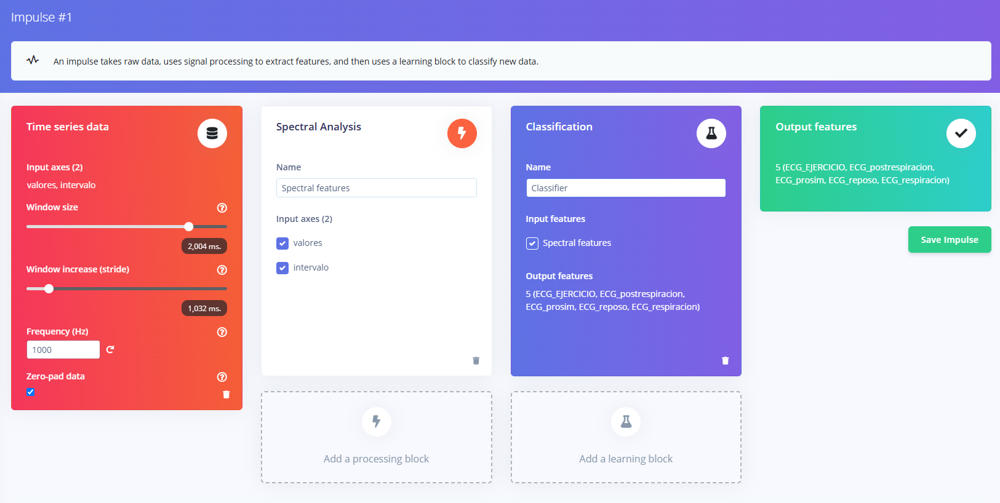
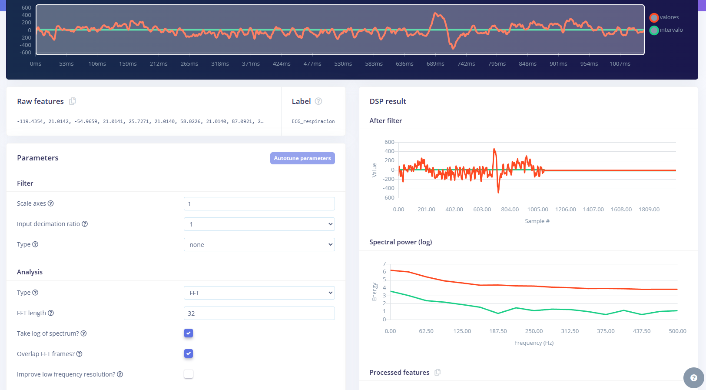
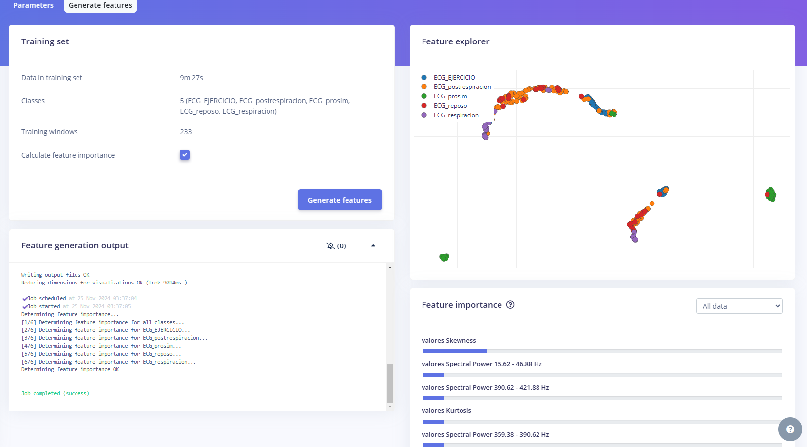
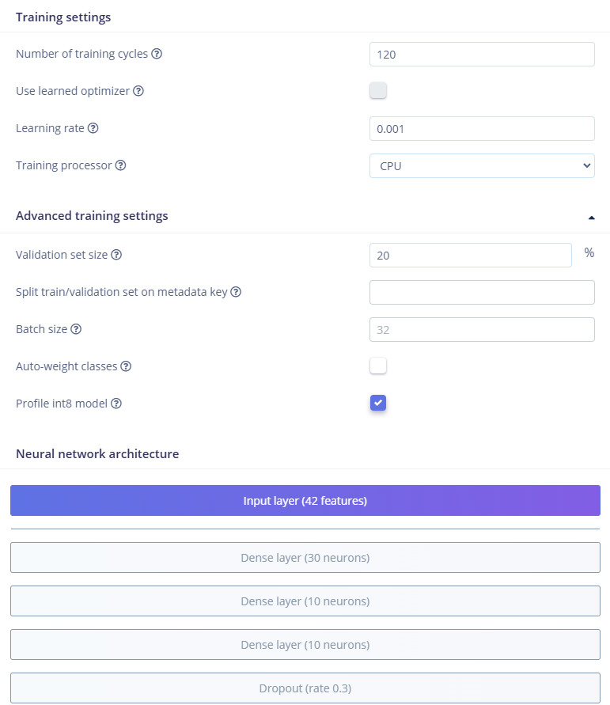
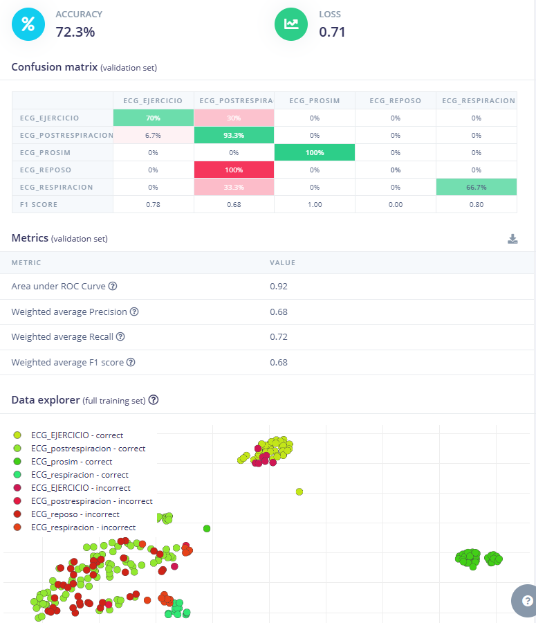
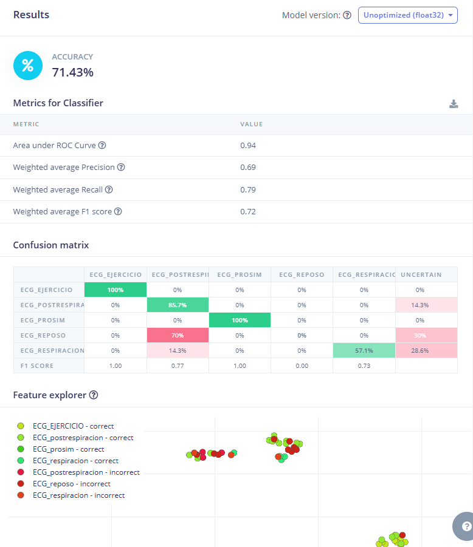

# **LABORATORIO 12: – Continuación Edge Impulse**
## **Introduccion:**

El presente laboratorio (Lab12) es una continuación del Laboratorio 11 (Lab11), donde se exploró el uso de Edge Impulse, una plataforma de inteligencia artificial que permite recopilar datos, entrenar modelos y desplegarlos en dispositivos electrónicos. En Lab11, se abordó el proceso de carga de datos estructurados en la plataforma. En esta ocasión, se utilizarán esos datos para diseñar un "impulse", analizar características espectrales y realizar una clasificación basada en la señal. Para este laboratorio, trabajaremos específicamente con datos de señales ECG del siguiente repositorio: 

Link del repositorio de las señales ECG: https://studio.edgeimpulse.com/public/559582/live

## **DATA augmentation:**

 Para mejorar el modelo, se consideró conveniente aumentar la cantidad de datos disponibles mediante la técnica de data augmentation, utilizando el método overlapping windows. Esta técnica, descrita en un artículo de "Data augmentation for deep-learning-based electroencephalography", muestra su efectivad para incrementar el número de muestras disponibles y mejorar la capacidad de generalización de los modelos. En dicho estudio, se utilizaron ventanas de 8 segundos con un 50 % de traslape para aumentar datos de EEG y entrenar un modelo de CNN que logró una precisión del 97.1 % en la detección de convulsiones neonatales. De manera similar, otros estudios implementaron ventanas deslizantes con traslapes de 87.5 % y 75 % en señales EEG, logrando precisiones de hasta 96.45 %, evidenciando el impacto positivo de esta técnica [1]. Por estos resultados, aplicaremos el método de ventanas traslapadas en las señales ECG de este laboratorio, con el fin de aumentar las muestras y fortalecer el desempeño del modelo entrenado, aumentando a un DATA COLLECTED de 11 minutos y 45 segundos.

<i>Figura 1: Repositorio editado de las señales ECG.</i>

## **Create impulse:**

Procediendo para la creación del impulso se puso un tamaño de ventana de 2000 ms para capturar suficientes características de la señal y un incremento de 1000 ms. Todo esto con una frecuencia de muestreo de 1000Hz.

<i>Figura 2: Creacion del impulso.</i>

## **Spectral features:**

Para la configuración de Spectral Features, se ajustaron os siguientes parametros y un filtro FFT de 32 para extraer información relevante del dominio de la frecuencia, se canvio de 16 ya que es muy pequeño para generar algo significativo y tampoco tan grande para no aumentar la carga computacional. 

<i>Figura 3: Parametros para Spectral features.</i>

<i>Figura 4: Feature explorer.</i>

## **Classifier:**

Pasando a la parte de la clasificacion, las configuraciones realizadas fueron:

<i>Figura 5: Configuraciones para la clasificacion.</i>

Se pusieron 12o ciclos para ajustar mejor los datos del modelo y no tan grande para evitar el overfitting, un learning rate de 0.001 debido a que se obtubo mejores resultados comparado a uno con 0.0005 y por ultimo se aumqntaron enl numero de neuronas: +10 Dense layer para mejorar el rendimiento y un Dropout de 0.3 para evitar overfitting.

Con todas estas configuraciones el modelo obtubo las siguientes caracteristicas, aceptables aunque con mejora:

<i>Figura 6: Accuracy obtenido y matriz de confusion..</i>

## **Model testing:**

Como ultiam parte se reentron el modelo y se hizo un testeo final con un accuracy de 71.43%, un ROC de 0.94 dato importanto ya que nos dice que puede difrenciar las diferentes clases, precision de 0.69, recall de 0,79 y F1 score de 0.72, concluyendo que se obtuvo un modelo funcional pero muy mejorable. Tanto en la parte de la data, un modelo con un dataset mayor arrojaria muchos mejores resultados y seria mas seguro, se lodria aplicar filtrado y explorar mas ajustes aunque con mas carga computacional.

<i>Figura 1: Repositorio editado de las señales ECG.</i>

## **Bibliografía:**

[1] Elnaz Lashgari, Dehua Liang, and Uri Maoz. 2020. Data augmentation for deep-learning-based electroencephalography. Journal of Neuroscience Methods (2020), 108885.

[2] 

[3] 

[4] 

[5] 

‌
‌
