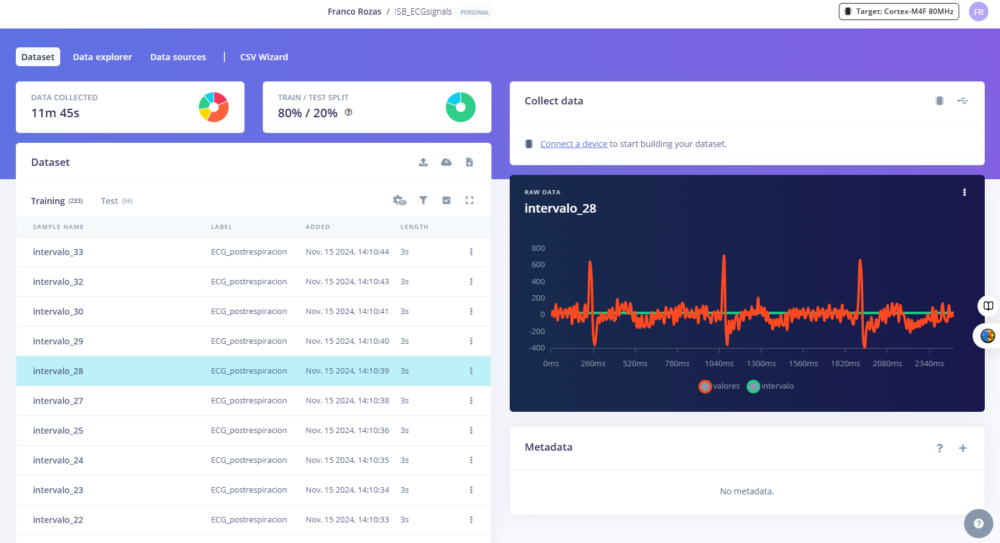

# **LABORATORIO 12: – Continuación Edge Impulse**
## **Introduccion:**

El presente laboratorio (Lab12) es una continuación del Laboratorio 11 (Lab11), donde se exploró el uso de Edge Impulse, una plataforma de inteligencia artificial que permite recopilar datos, entrenar modelos y desplegarlos en dispositivos electrónicos. En Lab11, se abordó el proceso de carga de datos estructurados en la plataforma. En esta ocasión, se utilizarán esos datos para diseñar un "impulse", analizar características espectrales y realizar una clasificación basada en la señal. Para este laboratorio, trabajaremos específicamente con datos de señales ECG del siguiente repositorio: 

Link del repositorio de las señales ECG: https://studio.edgeimpulse.com/public/559582/live

## **DATA augmentation:**

 Para mejorar el modelo, se consideró conveniente aumentar la cantidad de datos disponibles mediante la técnica de data augmentation, utilizando el método overlapping windows. Esta técnica, descrita en un artículo de "Data augmentation for deep-learning-based electroencephalography", muestra su efectivad para incrementar el número de muestras disponibles y mejorar la capacidad de generalización de los modelos. En dicho estudio, se utilizaron ventanas de 8 segundos con un 50 % de traslape para aumentar datos de EEG y entrenar un modelo de CNN que logró una precisión del 97.1 % en la detección de convulsiones neonatales. De manera similar, otros estudios implementaron ventanas deslizantes con traslapes de 87.5 % y 75 % en señales EEG, logrando precisiones de hasta 96.45 %, evidenciando el impacto positivo de esta técnica [1]. Por estos resultados, aplicaremos el método de ventanas traslapadas en las señales ECG de este laboratorio, con el fin de aumentar las muestras y fortalecer el desempeño del modelo entrenado, aumentando a un DATA COLLECTED de 11 minutos y 45 segundos.

<i>Figura 1: Repositorio editado de las señales ECG.</i>

## **Create impulse:**

 

<i>Figura 1: Repositorio editado de las señales ECG.</i>

## **Spectral features:**

 

<i>Figura 1: Repositorio editado de las señales ECG.</i>

<i>Figura 1: Repositorio editado de las señales ECG.</i>

## **Classifier:**

 

<i>Figura 1: Repositorio editado de las señales ECG.</i>

<i>Figura 1: Repositorio editado de las señales ECG.</i>

## **Model testing:**

 

<i>Figura 1: Repositorio editado de las señales ECG.</i>

## **Bibliografía:**

[1] Elnaz Lashgari, Dehua Liang, and Uri Maoz. 2020. Data augmentation for deep-learning-based electroencephalography. Journal of Neuroscience Methods (2020), 108885.

[2] 

[3] 

[4] 

[5] 

‌
‌
