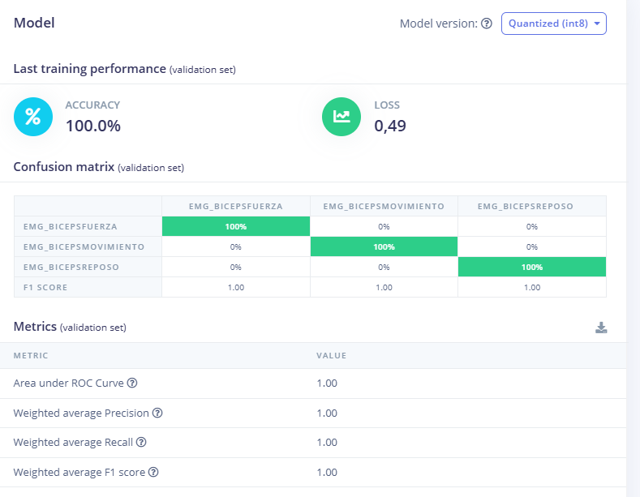

# **LABORATORIO 12: – Edge Impulse**
## **Create impulse:**

Utilizo ventanas de 2000 ms en cada adquisición de EMG a una frecuencia de 1KHz (Frecuencia de muestreo del BITalino).

<i>Figura 1: Creacion del impulso</i>

## **Spectral features:**

El único parámetro que modifico para la obtención de features es la longitud de FFT que va a ser igual a 32. Se puede ver la ventana de 2000 ms en la ventana de raw data y los resultados del procesamiento digital en la parte derecha. 

## **Classifier:**

En la parte del classifier, dispongo de 100 ciclos de entrenamiento y un learning rate de 0.0005, con un validation size de 20.

<i>Figura 2: Configuraciones para la clasificacion.</i>

## **Model results:**

Se obtuvieron los siguientes resultados del modelo entrenado, dando buenos scores para el modelo.

<i>Figura 3: Resultados</i>

