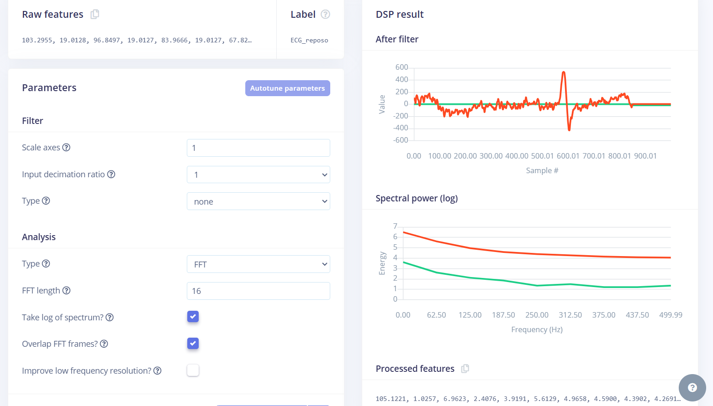

# **LABORATORIO 12: Edge Impulse - Impulse Design**
## **Tabla de contenidos:**
1. [Objetivos](#Objetivos)  
2. [Introducción](#Introduccion)  
3. [División del conjunto de datos](#Division)  
   - [Configuración del impulso](#ConfiguraciónImpulso)  
4. [Análisis espectral](#AnalisisEspectral)  
5. [Generación y exploración de características](#Exploracion)  
6. [Configuración de la red neuronal](#RedNeuronal)  
7. [Evaluación del modelo](#ModelTesting)  
   - [Resultados del conjunto de prueba](#ResultadosPrueba)  
   - [Métricas de desempeño](#MetricasDesempeno)  
   - [Matriz de confusión](#ConfusionMatrix)  
8. [Conclusiones](#Conclusiones)  
9. [Recomendaciones](#Recomendaciones)

## **Objetivos:**
- Explorar las capacidades de Edge Impulse para diseñar e implementar un modelo de aprendizaje automático que clasifique señales biomédicas, específicamente ECG, mediante técnicas avanzadas de procesamiento de datos y extracción de características.
- Evaluar el desempeño del modelo entrenado en Edge Impulse para clasificar diferentes estados fisiológicos asociados a las señales ECG (ejercicio, reposo, respiración, etc.).
- Familiarizarse con las herramientas de Edge Impulse, como la configuración de impulsos, análisis espectral y generación de características, para el desarrollo de aplicaciones basadas en dispositivos IoT y machine learning en tiempo real.
  
## **Introducción:**

 El presente informe detalla el proceso de análisis y clasificación de señales ECG mediante el uso de técnicas de procesamiento de datos, análisis espectral y aprendizaje automático, mediante la plataforme Edge Impulse. Se utilizó un enfoque estructurado que incluye la división de datos, generación de características, y entrenamiento de una red neuronal para clasificar cinco tipos de señales ECG: ejercicio, post-respiración, reposo, respiración, y simulación.‌ 

### **División del Conjunto de Datos**

 Se realizó una división del conjunto de datos en proporciones de 80% para entrenamiento y 20% para prueba. Este paso es crítico para asegurar que el modelo se entrene en un subconjunto representativo de datos y se evalúe en un conjunto independiente.

<i>Figura 1: Confirmación del split.</i>

<i>Figura 2: Split realizado.</i>

#### **Configuración del Impulso**

Se configuró un impulso de procesamiento que toma los datos crudos de ECG y realiza un análisis espectral para extraer características significativas. La configuración incluyó parámetros clave como el tamaño de ventana y el análisis en ejes temporales y de intervalo.

<i>Figura 3: Configuración del Impulso.</i>

#### **Análisis Espectral**

Para extraer características del dominio de la frecuencia, se aplicó la Transformada Rápida de Fourier (FFT). Este análisis permitió representar la potencia espectral en función de la frecuencia, destacando las diferencias entre las clases de señales.

<i>Figura 4: Parámetros de Análisis Espectral.</i>

<i>Figura 5: Resultados de Espectro.</i>

**Parámetros destacados:**

- Tipo de análisis: FFT
- Longitud FFT: 16
- Superposición de ventanas: Activada

### **Generación y Exploración de Características**

Se generaron características con base en los resultados del análisis espectral. Estas se visualizaron en un espacio reducido utilizando técnicas de reducción de dimensionalidad, mostrando la agrupación de las diferentes clases de señales.

<i>Figura 6: Generación de Características.</i>

<i>Figura 7: Explorador de Características.</i>

### **Configuración de la Red Neuronal**

 La red neuronal se configuró con los siguientes parámetros: 

- Ciclos de entrenamiento: 100
- Tasa de aprendizaje: 0.0001
- Tamaño del lote: 32
- Validación: 20% de los datos
- Arquitectura: Una capa de entrada con 26 características.

<i>Figura 8: Configuración de Red Neuronal.</i>

### **Resultados del Entrenamiento**

 El modelo alcanzó una precisión del 60.5% en el conjunto de validación. A continuación, se detalla el desempeño por clase y métricas generales:

<i>Figura 9: Resultados de Entrenamiento 1.</i>

<i>Figura 10: Resultados de Entrenamiento 2.</i>

**Resumen de resultados:**

- Precisión del modelo: 60.5%
- Pérdida: 0.95
- Área bajo la curva ROC (AUC): 0.95
- Clases con mejor desempeño: ECG ejercicio (100%) y ECG post-respiración (93.8%).
- Clases con menor precisión: ECG respiración (0%) y ECG reposo (42.9%).

### **Evaluación del Modelo**

 La evaluación del modelo se llevó a cabo utilizando datos de prueba no vistos previamente por el modelo. Este proceso permite validar su desempeño en un entorno simulado más cercano a la realidad. 

**Resultados del Conjunto de Prueba**

  Se utilizaron varios intervalos de datos para evaluar las predicciones del modelo, considerando la comparación entre los resultados esperados y las predicciones generadas.  

<i>Figura 11: Resultados del conjunto de prueba.</i>

**Resumen de resultados del conjunto de prueba:**

- La mayoría de los intervalos clasificados como ECG_postrespiración fueron correctamente identificados con un 100% de precisión.
- El intervalo 37 presentó un desempeño deficiente, siendo clasificado erróneamente como ECG_ejercicio.

**Métricas de Desempeño del Modelo**

 El modelo fue evaluado utilizando métricas estándar como precisión, F1 Score y la matriz de confusión.

<i>Figura 12: Métricas del modelo.</i>

- Precisión general: 34.69%
- Área bajo la curva ROC: 0.88
- F1 Score ponderado: 0.49
- La clase ECG_postrespiración alcanzó el mejor desempeño, con un 89.5% de precisión.

**Matriz de confusión:**

- La clase ECG_postrespiración fue correctamente clasificada en un alto porcentaje.
- El modelo mostró dificultad para clasificar correctamente las señales de otras clases, con altos niveles de incertidumbre y clasificaciones incorrectas.

### **Conclusiones**

 El modelo demostró ser capaz de identificar señales de ECG_postrespiración con un alto grado de precisión, pero tuvo un desempeño limitado en otras categorías. 

- La precisión global del modelo (34.69%) indica que se requieren mejoras significativas en el preprocesamiento, los datos de entrenamiento y la arquitectura de la red.
- La alta incertidumbre en la clasificación de ciertas clases sugiere la necesidad de ajustar los parámetros del modelo y aumentar la cantidad y diversidad de los datos.

### **Recomendaciones**
- Ampliar y equilibrar el conjunto de datos de entrenamiento para mejorar la generalización.
- Ajustar hiperparámetros del modelo y considerar arquitecturas más complejas.
- Optimizar el preprocesamiento de señales para mejorar la extracción de características.

