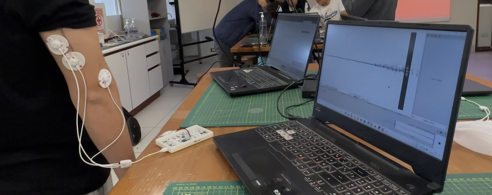
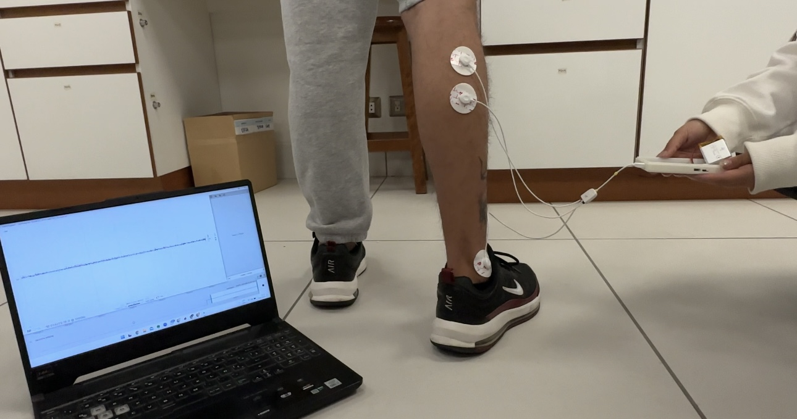
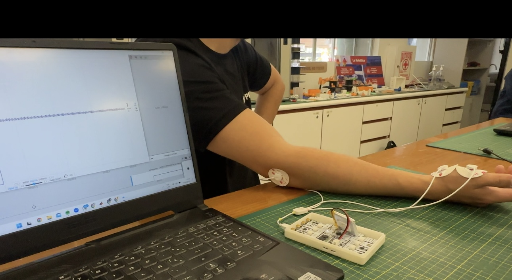
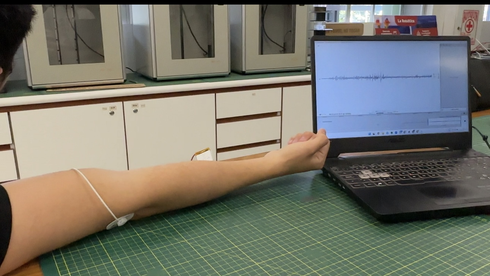
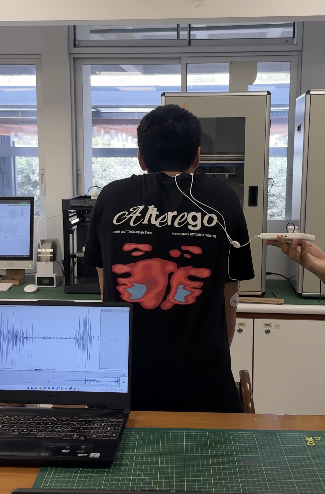

# **LABORATORIO 3: – USO DE BITalino PARA EMG**
## **Tabla de contenidos**
1. [Objetivos](#Objetivos)
2. [Introduccion](#Introduccion)
3. [Equipos y materiales utilizados](#Equipos)
4. [Resultados](#Resultados)
   - [Prueba 01](#P1)
   - [Prueba 02](#P2)
   - [Prueba 03](#P3)
   - [Prueba 04](#P4)
   - [Prueba 05](#P5)
6. [Discusión](#Discusión)
7. [Bibliografia](#Bibliografia)
## **Objetivos:**
* Familiarizarse con el uso del sistema BITalino para la adquisición de señales EMG.
* Realizar mediciones de EMG en diferentes grupos musculares.
* Analizar las señales EMG obtenidas mediante el software OpenSignals (r)evolution.
## **Introduccion:**

<i>Figura 1: [1].</i>

## **Equipos y materiales utilizados:**

## **Resultados:**
### 1. Actividad muscular del tríceps según la literatura: 

 En el artículo de Villalba et al. (2024), el enfoque está en medir la actividad EMG del tríceps braquial (cabeza lateral y cabeza larga) durante un ejercicio de tríceps push-down en varias posiciones del antebrazo (supinada y pronada). También se menciona que la cabeza larga del tríceps muestra mayor actividad EMG cuando el antebrazo está en una posición supinada, lo que sugiere una mayor carga sobre este músculo en comparación con la posición pronada. Esto hace que sea importante medir la actividad EMG en ambas posiciones para entender cómo varía la activación muscular y mejorar la eficiencia del ejercicio [2] .

En el artículo de Hussain et al., se observa que la fatiga afecta las señales EMG de diferentes maneras, reduciendo las frecuencias medias de potencia (MPF) y mediana (MDF) a medida que se avanza hacia la fatiga. También se observa un aumento en la amplitud del RMS bajo condiciones de fatiga, lo que indica un mayor esfuerzo muscular a medida que el músculo se acerca al fallo [3]. 

#### <blockquote> Prueba 01: Tríceps

<i>Figura 2: La medición del EMG del tríceps se realizó con el participante de pie, manteniendo el brazo relajado al costado del cuerpo. Se colocaron electrodos de superficie en la región del tríceps para captar la actividad eléctrica del músculo durante la contracción y el reposo.
</i>

   
|  **Actividad muscular del bíceps braquial en reposo** | **Actividad muscular del Tricep** |
|:-----------------------------------------------------:|:--------------------------------------------------------:|
|  | [Ver video](https://youtu.be/-Klp4Z2_d8Y) | 

<i>Tabla 1. Videos de adquisición la señal EMG según las tres tomas: en reposo, sin oposición y con oposición del músculo bíceps braquial </i>

   
| **Posición** | **Señal y FFT** |
|:------------:|:---------------:|
| **En reposo**|<image src="">|
| **Sin oposición**|<image src="">|
| **Con oposición**|<image src="">|

<i>Tabla 2. Señales adquiridas en reposo, sin oposición y con oposición graficadas en Python </i>

### 2. Actividad muscular del gastrocnemio según la literatura: 

 En el estudio de Wang et al. (2021), se centra en la medición de la actividad EMG del gastrocnemio durante varias inclinaciones y tipos de marcha (caminar en plano, cuesta arriba, cuesta abajo, y subir/bajar escaleras). Se observa que la actividad EMG del gastrocnemio aumenta progresivamente al caminar cuesta arriba, sugiriendo una mayor activación muscular debido a la mayor demanda de fuerza en comparación con caminar en plano o cuesta abajo. Es importante medir la actividad EMG en estas diferentes condiciones para entender cómo varía la activación muscular y cómo optimizar los movimientos en la rehabilitación o el entrenamiento [4]. 

#### <blockquote> Prueba 02: Gastrocenmio

<i>Figura 3.</i>

   
|  **Actividad muscular del bíceps braquial en reposo** | **Actividad muscular del bíceps braquial sin oposición** | **Actividad muscular del bíceps braquial con oposición** |
|:-----------------------------------------------------:|:--------------------------------------------------------:|:---------------------------------------------------------:|
| <video src=""> | <video src=""> | <video src=""> | 

<i>Tabla 3. Videos de adquisición la señal EMG según las tres tomas: en reposo, sin oposición y con oposición del músculo bíceps braquial </i>

   
| **Posición** | **Señal y FFT** |
|:------------:|:---------------:|
| **En reposo**|<image src="">|
| **Sin oposición**|<image src="">|
| **Con oposición**|<image src="">|

<i>Tabla 4. Señales adquiridas en reposo, sin oposición y con oposición graficadas en Python </i>

### 3. Actividad muscular de la mano según la literatura: 

 PARTE ANEL 

#### <blockquote> Prueba 03: Mano

<i>Figura 4: La medición del EMG del nervio mediano se realizó con el participante en una posición sentada, manteniendo una postura natural con los codos apoyados en los reposabrazos y la cabeza en una posición neutral para minimizar la interferencia de otros movimientos.</i>

   
|  **Actividad muscular del bíceps braquial en reposo** | **Actividad muscular del bíceps braquial sin oposición** | **Actividad muscular del bíceps braquial con oposición** |
|:-----------------------------------------------------:|:--------------------------------------------------------:|:---------------------------------------------------------:|
| <video src=""> | <video src=""> | <video src=""> | 

<i>Tabla 5. Videos de adquisición la señal EMG según las tres tomas: en reposo, sin oposición y con oposición del músculo bíceps braquial </i>

   
| **Posición** | **Señal y FFT** |
|:------------:|:---------------:|
| **En reposo**|<image src="">|
| **Sin oposición**|<image src="">|
| **Con oposición**|<image src="">|

<i>Tabla 6. Señales adquiridas en reposo, sin oposición y con oposición graficadas en Python </i>

### 4. Actividad muscular del bíceps según la literatura: 

 En el estudio de Robert W. Smith et al., se evaluaron los cambios en la fatiga muscular y las respuestas neuromusculares en el bíceps braquial después de realizar una contracción isométrica máxima (es decir, mantener una contracción sin mover el brazo) hasta el fallo muscular [3].

#### <blockquote> Prueba 04: Bíceps

<i>Figura 5: La medición del EMG se realizó con el brazo del participante apoyado sobre la mesa, mientras el resto del cuerpo permanecía en una posición sentada sin contacto con la superficie de apoyo, para evitar interferencias externas. Se utilizaron electrodos en el brazo para captar la actividad eléctrica del músculo bíceps durante la contracción.</i>

   
|  **Actividad muscular del bíceps braquial en reposo** | **Actividad muscular del bíceps braquial sin oposición** |
|:-----------------------------------------------------:|:--------------------------------------------------------:|
| <video src="Anexos/Bíceps reposo.mp4"> | <video src=""> |

<video src="Anexos/Bíceps reposo.mp4">

<i>Tabla 7. Videos de adquisición la señal EMG según las tres tomas: en reposo, sin oposición y con oposición del músculo bíceps braquial </i>

   
| **Posición** | **Señal y FFT** |
|:------------:|:---------------:|
| **En reposo**|<image src="">|
| **Sin oposición**|<image src="">|
| **Con oposición**|<image src="">|

<i>Tabla 8. Señales adquiridas en reposo, sin oposición y con oposición graficadas en Python </i>

### 5. Actividad muscular del trapecio según la literatura: 

 En el estudio de Ahmed et al. (2024), se examina la actividad EMG del trapecio durante pruebas cognitivas que inducen estrés, como el test Stroop y el cálculo mental, así como durante una sesión de meditación guiada. Los resultados muestran que la actividad EMG del trapecio aumenta significativamente durante el estrés en comparación con el reposo y la meditación, especialmente en las frecuencias bajas (0.5–4 Hz). Este estudio también introdujo un método novedoso para evaluar la asimetría en la activación del trapecio entre los lados izquierdo y derecho, encontrando que esta asimetría es útil para detectar estados de estrés y meditación [6].

#### <blockquote> Prueba 05: Trapecio

<i>Figura 6.</i>

   
|  **Actividad muscular del bíceps braquial en reposo** | **Actividad muscular del bíceps braquial sin oposición** | **Actividad muscular del bíceps braquial con oposición** |
|:-----------------------------------------------------:|:--------------------------------------------------------:|:---------------------------------------------------------:|
| <video src=""> | <video src=""> | <video src=""> | 

<i>Tabla 9. Videos de adquisición la señal EMG según las tres tomas: en reposo, sin oposición y con oposición del músculo bíceps braquial </i>

   
| **Posición** | **Señal y FFT** |
|:------------:|:---------------:|
| **En reposo**|<image src="">|
| **Sin oposición**|<image src="">|
| **Con oposición**|<image src="">|

<i>Tabla 10. Señales adquiridas en reposo, sin oposición y con oposición graficadas en Python </i>

## **Discusión:**

## **Bibliografia:**
[1] Marina Mello Villalba, Rafael Akira Fujita, Claudinei Iossi Junior, and Matheus Machado Gomes, “Forearm Position Influences Triceps Brachii Activation During Triceps Push-Down Exercise,” ResearchGate, Feb. 23, 2024. https://www.researchgate.net/publication/378472477_Forearm_Position_Influences_Triceps_Brachii_Activation_During_Triceps_Push-Down_Exercise (accessed Sep. 13, 2024).
[2] J. Hussain, K. Sundaraj, I. D. Subramaniam, and C. K. Lam, “Muscle Fatigue in  the Three Heads of Triceps Brachii During Intensity and Speed Variations of Triceps Push-Down Exercise,” Frontiers in Physiology, vol. 11, p. 467739, Feb. 2020, doi: https://doi.org/10.3389/fphys.2020.00112.

