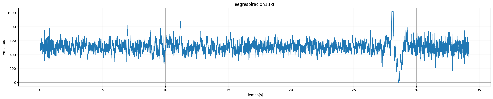
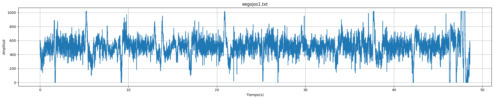
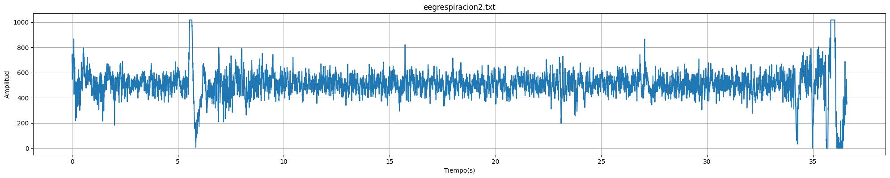
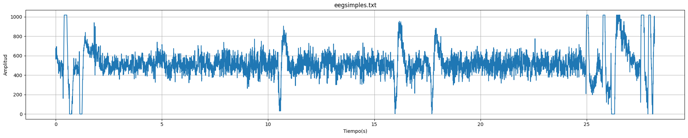
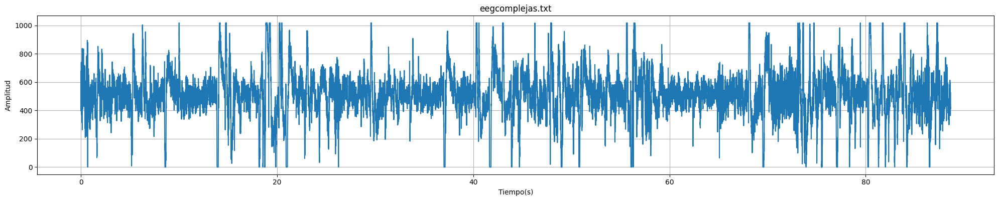

# **LABORATORIO 6: – Uso de BITalino para EEG**
## **Tabla de contenidos:**
1. [Objetivos](#Objetivos)
2. [Introduccion](#Introduccion)
3. [Equipos y materiales utilizados](#Equipos)
4. [Metodología](#Metodología)
5. [Cronología de mediciones](#Cronologíademediciones)
6. [Posiciones de los electrodos](#Posicionesdeloselectrodos)
7. [Resultados](#Resultados)
8. [Discusión](#Discusión)
9. [Bibliografia](#Bibliografia)
## **Objetivos:**
- Investigar técnicas de procesamiento de señales EEG, con énfasis en filtrado y eliminación de ruido.
- Configurar correctamente el dispositivo BiTalino para la adquisición de señales EEG.
- Extraer y analizar señales EEG utilizando el software OpenSignals (r)evolution.
  
## **Introducción:**

 El  

## **Metodología:**

El laboratorio se llevó a cabo utilizando el Kit BITalino como en los laboratorios anteriores, con 3 electrodos de superficie colocados en las siguientes posiciones:

- El electrodo negativo cercano a la la linea media del lado derecho de la cabeza.
- El electrodo positivo cercano a la línea media del lado izquierdo de la cabeza.
- El electrodo de referencia se coloco en una región neutral, el hueso detrás de la oreja.

El sujeto, una compañera de clase, estubo sentado en una silla, en un ambiente controlado (sin ruido excesivo y las luces atenuadas). La prueba se desarrolló en varias fases. Primero, se realizó una fase de línea base inicial durante 30 segundos, en la cual nuestra compañera estuvo con los ojos cerrados, permaneciendo quieta y respiró normalmente. Posteriormente, se procedió con cinco ciclos de apertura y cierre de ojos. Luego, se realizó una segunda fase de línea base de 30 segundos, bajo las mismas condiciones que la primera, para comparar las señales en reposo.
En la siguiente fase de la prueba, un compañero leyó en voz alta una serie de problemas matemáticos simples y complejas. Nuestra compañera resolvio estos problemas, manteniendo la mirada fija en un punto específico para minimizar los artefactos debidos a movimientos oculares. Para cada una de estas fases se midio la señal EEG y  se guardaron los datos obtenidos. Estos datos fueron procesados posteriormente en un programa python para analizar la actividad cerebral en cada una de las fases de la prueba. 

Preguntas simples realizadas:

|  **Preguntas siples**  |
|:------------:|
| Hay 6 gatos en el parque; llegan 3 más. ¿Cuántos gatos hay ahora? |
| Sofía tiene 8 plumas, y Pablo le da 2. ¿Cuántas plumas tiene Sofía ahora? |
| Hay 12 flores en el jardín; se marchitan 5. ¿Cuántas flores quedan? |

<i>Tabla 1. Preguntas simples realizadas durante el laboratorio. </i>

Preguntas complejas realizadas:

| (r)EVOLUTION |
|     ASUS     | 
|       -      |

<i>Tabla 2. Preguntas complejas realizadas durante el laboratorio. </i>

## **Cronología de mediciones:**
1. **Preparación del equipo y del sujeto:**  
   1.1. Conexion de los electrodos, asegurando un buen contacto con la piel y verificando la correcta adherencia de cada uno.  
   1.2. Conexion correcta del Kit BITalino con el portatil.  

3. **Mediciones con  Kit BITalino:**  
   2.1. Registro de la línea base inicial (30 segundos).  
   2.2. Ciclo de apertura y cierre de ojos (5 ciclos).  
   2.3. Registro de una segunda línea base (30 segundos)  
   2.4. Ejercicios mentales (resolución de problemas matemáticos).  

## **Posiciones de los electrodos:**

<i>Figura 4: .</i>

## **Equipos y materiales utilizados:**

   
|  **Modelo**  | **Descripción** | **Cantidad** |
|:------------:|:---------------:|:------------:|
| (r)EVOLUTION |   Kit BITalino  |       1      |
|     ASUS     |      Laptop     |       1      |
|       -      |    Electrodos superficiales   |       3      |
|    MARK IV    |   Ultracortex   |       1      |

<i>Tabla 2. Equipos y materiales utilizados en este laboratorio. </i>

<i>Figura 7 y 8: Kit BITalino conectado a los electrodos y Ultracortex. </i>

## **Resultados:**
### 1. Señales EEG captadas con eL Kit BITalino:
Para el ploteo de la señal se usó un código Python, que se puede ver [aquí](Anexos/Señales_EEGplot.ipynb).

#### <blockquote> Caso 1: Linea base sin movimientos y ojos cerrados durante 30 segundos. </blockquote>

| **Video 1.** | **Señal obtenida** |
|:------------:|:---------------:|
|  |  |

<i>Tabla 3. Video de la adquisición de la señal ECG y la señal obtenida. </i>

#### <blockquote> Caso 2: Ciclo de ojos abiertos - ojos cerrados cinco veces cada 5 segundos </blockquote>

   
| **Video 2.** | **Señal obtenida** |
|:------------:|:---------------:|
|  |  |

<i>Tabla 4. Video de la adquisición de la señal ECG y la señal obtenida. </i>

#### <blockquote> Caso 3: Fase de referencia de 30 segundos </blockquote>

   
| **Video 3.** | **Señal obtenida** |
|:------------:|:---------------:|
|  |  |

<i>Tabla 5. Video de la adquisición de la señal ECG y la señal obtenida. </i>

#### <blockquote> Caso 4: Registro realizando ejercicios mentales (Simples) </blockquote>

   
| **Video 4.** | **Señal obtenida** |
|:------------:|:---------------:|
|  |  |

<i>Tabla 6. Video de la adquisición de la señal ECG y la señal obtenida. </i>

#### <blockquote> Caso 5: Registro realizando ejercicios mentales (Complejos) </blockquote>

   
| **Video 5.** | **Señal obtenida** |
|:------------:|:---------------:|
|  |  |

<i>Tabla 7. Video de la adquisición de la señal ECG y la señal obtenida. </i>

## **Discusión:**

 

## **Bibliografia:**

[1]

