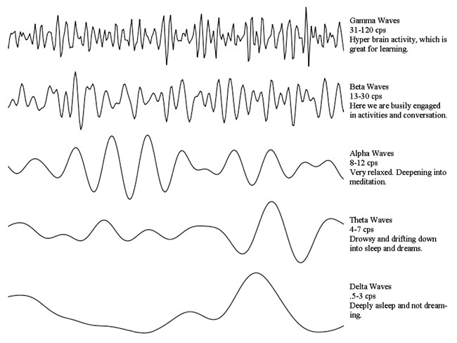
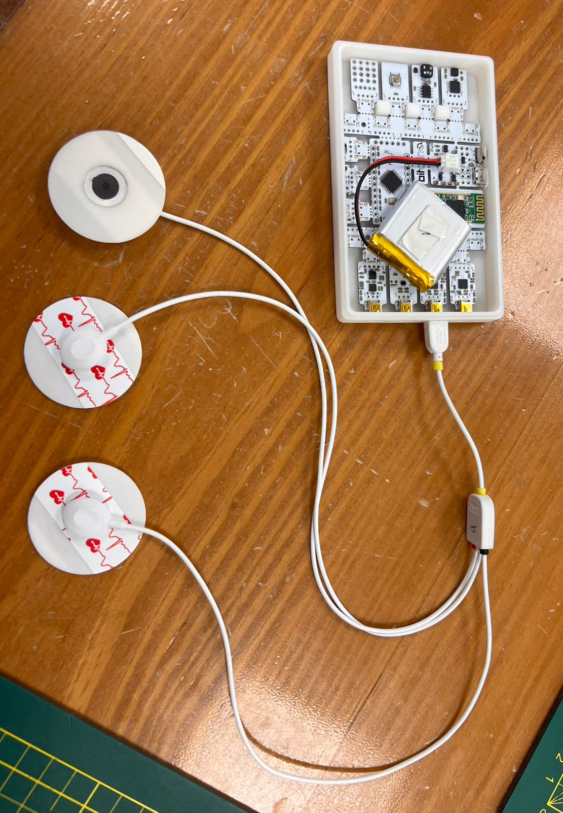
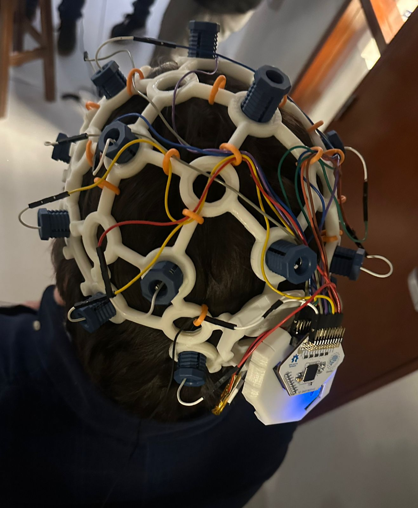
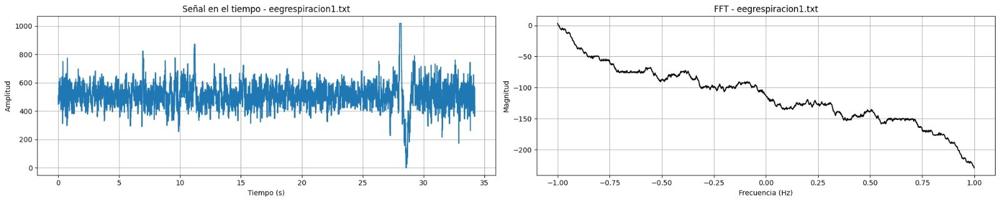
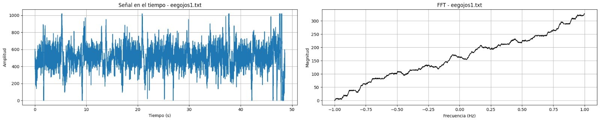
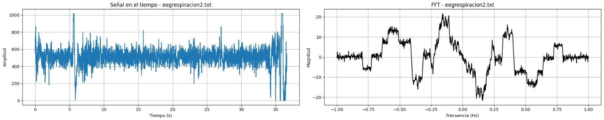
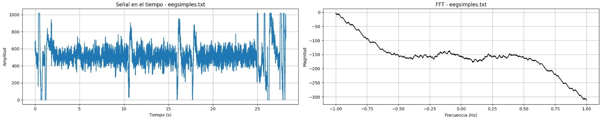
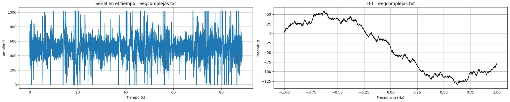
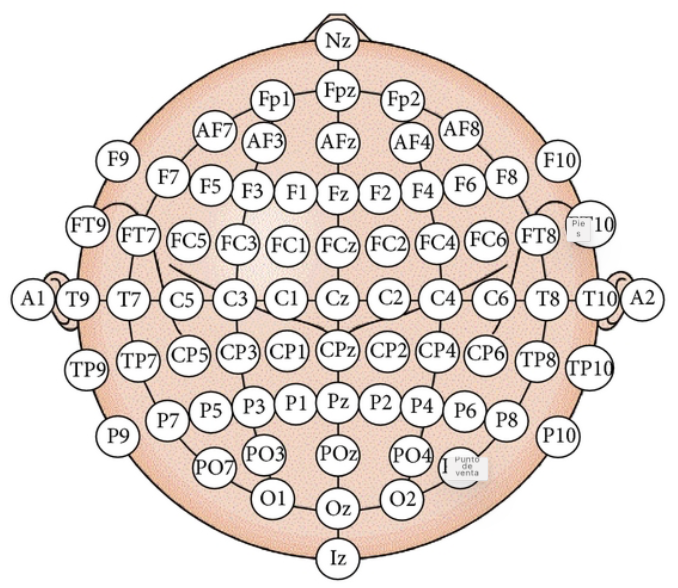

# **LABORATORIO 6: – Uso de BITalino para EEG**
## **Tabla de contenidos:**
1. [Objetivos](#Objetivos)
2. [Introduccion](#Introduccion)
3. [Equipos y materiales utilizados](#Equipos)
4. [Metodología](#Metodología)
5. [Cronología de mediciones](#Cronologíademediciones)
6. [Posiciones de los electrodos](#Posicionesdeloselectrodos)
7. [Resultados](#Resultados)
8. [Discusión](#Discusión)
9. [Ultracortex](#Ultracortex)
10. [Bibliografia](#Bibliografia)
## **Objetivos:**
- Investigar técnicas de procesamiento de señales EEG, con énfasis en filtrado y eliminación de ruido.
- Configurar correctamente el dispositivo BiTalino para la adquisición de señales EEG.
- Extraer y analizar señales EEG utilizando el software OpenSignals (r)evolution.
  
## **Introducción:**

 La electroencefalografía (EEG) es una técnica no invasiva que permite registrar la actividad eléctrica del cerebro a través de electrodos colocados en el cuero cabelludo. Se utiliza ampliamente en neurociencia y medicina para estudiar diversos procesos cognitivos y diagnosticar trastornos neurológicos como la epilepsia, el Alzheimer y la esquizofrenia. A pesar de su limitada resolución espacial en comparación con otras técnicas de neuroimagen, su alta resolución temporal permite capturar la dinámica rápida de la actividad cerebral, lo que la hace ideal para estudios que requieren un análisis detallado de la actividad cerebral en tiempo real [1].‌ 

Los métodos de análisis de señales EEG incluyen técnicas como el análisis espectral y la extracción de características específicas. Estos métodos permiten descomponer las señales en componentes de frecuencia, lo cual es útil para identificar patrones relacionados con diferentes estados mentales, como el sueño, las crisis epilépticas y la actividad cognitiva. Además, la integración de la EEG con otras técnicas de imagen, como la resonancia magnética funcional (fMRI) y la espectroscopía de infrarrojo cercano (fNIRS), permite una visión más completa del cerebro al combinar la alta resolución temporal del EEG con la alta resolución espacial de estas otras modalidades.

### **Ondas cerebrales**

Las formas de onda del EEG se pueden clasificar según su ubicación, amplitud, frecuencia, morfología, continuidad (como rítmica, intermitente o continua), sincronía, simetría y reactividad. Sin embargo, la clasificación más utilizada se basa en su frecuencia, a tal punto que las ondas del EEG se nombran según sus rangos de frecuencia usando letras griegas. Las ondas más estudiadas son las delta (0,5 a 4 Hz), theta (4 a 7 Hz), alfa (8 a 12 Hz), sigma (12 a 16 Hz) y beta (13 a 30 Hz). Además, existen otras formas de onda, como las oscilaciones infralentas (menos de 0,5 Hz) y las oscilaciones de alta frecuencia (más de 30 Hz), que no se encuentran en el rango tradicional del EEG clínico, pero que han adquirido relevancia clínica gracias a los avances en el procesamiento digital de señales [3].‌ 

<i>Figura 1: Ondas cerebrales [4].</i>

## **Metodología:**

El laboratorio se llevó a cabo utilizando el Kit BITalino como en los laboratorios anteriores, con 3 electrodos de superficie colocados en las siguientes posiciones:

- El electrodo negativo cercano a la la linea media del lado derecho de la cabeza.
- El electrodo positivo cercano a la línea media del lado izquierdo de la cabeza.
- El electrodo de referencia se coloco en una región neutral, el hueso detrás de la oreja.

El sujeto, una compañera de clase, estuvo sentado en una silla, en un ambiente controlado (sin ruido excesivo y las luces atenuadas). La prueba se desarrolló en varias fases. Primero, se realizó una fase de línea base inicial durante 30 segundos, en la cual nuestra compañera estuvo con los ojos cerrados, permaneciendo quieta y respiró normalmente. Posteriormente, se procedió con cinco ciclos de apertura y cierre de ojos. Luego, se realizó una segunda fase de línea base de 30 segundos, bajo las mismas condiciones que la primera, para comparar las señales en reposo.
En la siguiente fase de la prueba, un compañero leyó en voz alta una serie de problemas matemáticos simples y complejas. Nuestra compañera resolvió estos problemas, manteniendo la mirada fija en un punto específico para minimizar los artefactos debidos a movimientos oculares. Para cada una de estas fases se midió la señal EEG y  se guardaron los datos obtenidos. Estos datos fueron procesados posteriormente en un programa python para analizar la actividad cerebral en cada una de las fases de la prueba.  
Una vez realizado las pruebas con nuestra compañera se procedió a hacer el mismo procedimiento pero en este caso con nuestro docente pero a diferencia de l primer caso ya no usamos el Kit BITalino sino el Ultracortex. 

Preguntas simples realizadas:

|  **Preguntas simples**  |
|:------------:|
| Hay 6 gatos en el parque; llegan 3 más. ¿Cuántos gatos hay ahora? |
| Sofía tiene 8 plumas, y Pablo le da 2. ¿Cuántas plumas tiene Sofía ahora? |
| Hay 12 flores en el jardín; se marchitan 5. ¿Cuántas flores quedan? |

<i>Tabla 1. Preguntas simples realizadas durante el laboratorio. </i>

Preguntas complejas realizadas:

|  **Preguntas siples**  |
|:------------:|
| Ana tiene 30 lápices, 7 más que Luis. Si juntos tienen 57 lápices, ¿cuántos tiene Luis? |
| El equipo X ganó 56 puntos, 12 menos que el equipo Y. Si el equipo Z ganó 18 más que ambos equipos juntos, ¿cuántos puntos ganó el equipo Z? |
| En una escuela hay 120 estudiantes, 20 más que en otra. Si en ambas escuelas hay 45 estudiantes menos que en una tercera escuela, ¿cuántos estudiantes hay en la tercera escuela? |

<i>Tabla 2. Preguntas complejas realizadas durante el laboratorio. </i>

## **Cronología de mediciones:**
1. **Preparación del equipo y del sujeto:**  
   1.1. Conexion de los electrodos, asegurando un buen contacto con la piel y verificando la correcta adherencia de cada uno.  
   1.2. Conexion correcta del Kit BITalino con el portatil.  

2. **Mediciones con  Kit BITalino:**  
   2.1. Registro de la línea base inicial (30 segundos).  
   2.2. Ciclo de apertura y cierre de ojos (5 ciclos).  
   2.3. Registro de una segunda línea base (30 segundos)  
   2.4. Ejercicios mentales (resolución de problemas matemáticos).  

3. **Mediciones con el Ultracortex:**  
   3.1. Registro de la línea base inicial (30 segundos).  
   3.2. Ciclo de apertura y cierre de ojos (5 ciclos).  
   3.3. Registro de una segunda línea base (30 segundos)  
   3.4. Ejercicios mentales (resolución de problemas matemáticos).  
   
## **Equipos y materiales utilizados:**

   
|  **Modelo**  | **Descripción** | **Cantidad** |
|:------------:|:---------------:|:------------:|
| (r)EVOLUTION |   Kit BITalino  |       1      |
|     ASUS     |      Laptop     |       1      |
|       -      |    Electrodos superficiales   |       3      |
|    MARK IV    |   Ultracortex   |       1      |

<i>Tabla 3. Equipos y materiales utilizados en este laboratorio. </i>

<i>Figura 2 y 3: Kit BITalino conectado a los electrodos y Ultracortex. </i>

## **Posiciones de los electrodos:**

<i>Figura 4: Participante con los electrodos posicionados en la cabeza.</i>

## **Resultados:**
### 1. Señales EEG captadas con eL Kit BITalino:
Para el ploteo de la señal se usó un código Python, que se puede ver [aquí](Anexos/Señales_EEGplot.ipynb).

#### <blockquote> Caso 1: Línea base sin movimientos y ojos cerrados durante 30 segundos. </blockquote>

| **Video 1.** | **Señal obtenida** |
|:------------:|:---------------:|
|<video src="https://github.com/user-attachments/assets/42f96590-4a11-46fe-b84f-c8ca31c68e31"> |  |

<i>Tabla 4. Video de la adquisición de la señal ECG y la señal obtenida. </i>

#### <blockquote> Caso 2: Ciclo de ojos abiertos - ojos cerrados cinco veces cada 5 segundos. </blockquote>

  

| **Video 2.** | **Señal obtenida** |
|:------------:|:---------------:|
|<video src="https://github.com/user-attachments/assets/a6729327-a0c4-4448-85a3-6769a2feeb0f">|  |

<i>Tabla 5. Video de la adquisición de la señal ECG y la señal obtenida. </i>

#### <blockquote> Caso 3: Fase de referencia de 30 segundos. </blockquote>

  

| **Video 3.** | **Señal obtenida** |
|:------------:|:---------------:|
|<video src="https://github.com/user-attachments/assets/dabb644d-1f9d-465d-b192-6a38d9cb3cf2">|  |

<i>Tabla 6. Video de la adquisición de la señal ECG y la señal obtenida. </i>

#### <blockquote> Caso 4: Registro realizando ejercicios mentales (Simples). </blockquote>

| **Video 4.** | **Señal obtenida** |
|:------------:|:---------------:|
|<video src="https://github.com/user-attachments/assets/e4a0ca57-4e45-46d0-b6a8-1b4c8c50d91e">|  |

<i>Tabla 7. Video de la adquisición de la señal ECG y la señal obtenida. </i>

#### <blockquote> Caso 5: Registro realizando ejercicios mentales (Complejos). </blockquote>

   
| **Video 5.** | **Señal obtenida** |
|:------------:|:---------------:|
|<video src="https://github.com/user-attachments/assets/444cd5aa-e248-41b3-a67c-636b4d0af70b">|  |

<i>Tabla 8. Video de la adquisición de la señal ECG y la señal obtenida. </i>

## **Discusión:**

 

### IMPORTANTE: Por motivos de tiempo, nuestro grupo no pudo realizar la experiencia del Ultracortex, sin embargo, se realizará una búsqueda de información a cerca de su importancia y empleo
  
<h2 style = "text-align: center;">Ultracortex</h2>
El Ultracortex es un dispositivo de código abierto, fabricable mediante impresión 3D, diseñado específicamente para ser compatible con cualquier placa OpenBCI. Su función principal es la adquisición de señales electroencefalográficas (EEG), electromiográficas (EMG) y electrocardiográficas (ECG) con un nivel de precisión adecuado para estudios de investigación científica. Es importante señalar que no está destinado para aplicaciones de estimulación transcraneal. El diseño del auricular está optimizado exclusivamente para la captación de señales EEG. En su versión más avanzada, el Ultracortex Mark IV es capaz de registrar hasta 16 canales de EEG, distribuidos en un máximo de 35 ubicaciones anatómicas conforme al sistema internacional 10-20, garantizando una adquisición de datos coherente[5].

<i>Figura 5: Colocación De Nodos EEG Aceptadas Internacionalmente 10-20 [5].</i>

Durante la práctica de laboratorio, para registrar la actividad cerebral (EEG), se emplearon electrodos tipo peine y planos, los cuales se insertan en el casco. Es importante mencionar que todos los cables de los electrodos finalizan en un conector hembra compatible con las placas de biodetección de OpenBCI (Ganglion, Cyton y CytonDaisy).

Los electrodos planos permiten la medición de múltiples puntos en la corteza frontal (F7, AF7, Fp1, Fpz, Fp2, AF8, F8). Por su parte, los electrodos tipo peine a presión facilitan la medición en los nodos FT7/FT8, T7/T8, TP7/TP8, P7/P8, PO7/PO8, O1/O2 y Oz, dependiendo de la ubicación en la correa ajustable. En cuanto a la placa Ganglion, esta utiliza el EEG como canal de entrada y transmite los datos a través de Bluetooth o wifi. Todas las placas de OpenBCI vienen equipadas con un soporte de batería compatible con cuatro pilas AA y un conector estándar JST de 2 pines, o bien con una batería recargable compacta de polímero de litio de 3,7 V y un cargador USB [6].

## **Bibliografia:**

[1]A. Chaddad, Y. Wu, R. Kateb, and A. Bouridane, “Electroencephalography Signal Processing: A Comprehensive Review and Analysis of Methods and Techniques,” Sensors, vol. 23, no. 14, p. 6434, Jul. 2023, doi: https://doi.org/10.3390/s23146434.

[2] D. F. Hight, H. A. Kaiser, J. W. Sleigh, and M. S. Avidan, “An updated introduction to electroencephalogram-based brain monitoring during intended general anesthesia,” Canadian Journal of Anesthesia/Journal canadien d’anesthésie, vol. 67, no. 12, pp. 1858–1878, Nov. 2020, doi: https://doi.org/10.1007/s12630-020-01820-3.

[3] C. S. Nayak and A. C. Anilkumar, “EEG Normal Waveforms,” Nih.gov, Jul. 24, 2023. https://www.ncbi.nlm.nih.gov/books/NBK539805/#:~:text=However%2C%20the%20most%20frequently%20used,beta%20(13%20to%2030Hz). (accessed Sep. 28, 2024).

[4]“¿Para qué es útil el Mapeo Cerebral? - Nepsa Rehabilitación Neurológica,” Nepsa Rehabilitación Neurológica, Dec. 14, 2018. https://nepsa.es/para-que-es-util-el-mapeo-cerebral/ (accessed Sep. 28, 2024).‌

[5]“Ultracortex ‘Mark IV’ EEG Headset,” OpenBCI Online Store, 2015. https://shop.openbci.com/products/ultracortex-mark-iv srsltid=AfmBOooFLJKSwIY1W_qsd0d7tg13ph0ZpA8x1khuEkfJ13LgNWdD2_ja (accessed Sep. 29, 2024).
‌
[6]“OpenBCI EEG Headband Kit Guide | OpenBCI Documentation,” Openbci.com, Jun. 18, 2024. https://docs.openbci.com/AddOns/Headwear/HeadBand/ (accessed Sep. 29, 2024).
‌
‌

