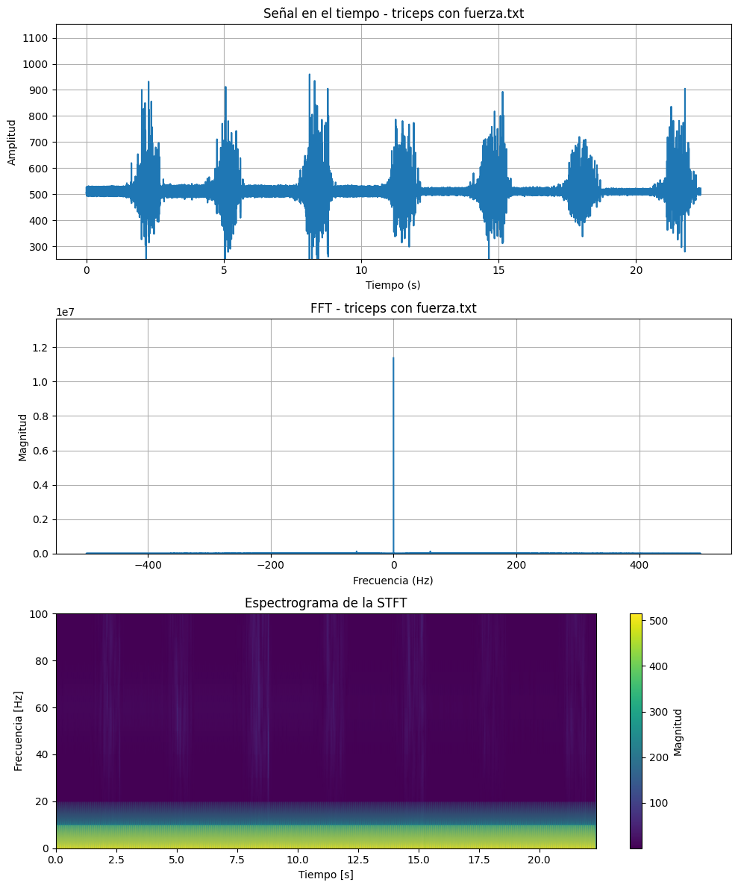

## **Metodologia:**

De la data obtenido en los laboratorios anteriores ahora pasamos a la parte de preosesrla mediante la implemtacion de diferentes filtros y asi eliminar el ruido que puede haber en ella.

### **EMG:**

<i>Figura 1: Imagen de la adquision de la señal EMG.</i>

| **Descripcion de la señal** | **Señal obtenida y su FFT** |
|:------------:|:---------------:|
|Señal EMG del biceps |  |
|Señal EMG del gastrocnemio |  |
|Señal EMG de la mano |  |
|Señal EMG del trapecio |  |
|Señal EMG del triceps |  |

<i>Tabla 1. Señales EMG adquiridas en el laboratorio 4. </i>

### **ECG:**

<i>Figura 2: Imagen de la adquision de la señal ECG.</i>

| **Descripcion de la señal** | **Señal obtenida y su FFT** |
|:------------:|:---------------:|
|Señal ECG en estado de reposo |  |
|Señal ECG en estado de respiración prolongada |  |
|Señal ECG en estado de dost - Respiración |  |
|Señal ECG en estado luego de actividad física |  |

<i>Tabla 2. Señales ECG adquiridas en el laboratorio 5. </i>

## **Resultados:**

Se aplicaron tres diferentes filtros a las señales EMG como para las señales ECG obtenidas.

### **EMG:**

| **Descripcion de la señal** | **Filtro IIR** | **Filtro FIR** | **Filtro FIR** |
|:------------:|:---------------:|:---------------:|:---------------:|
|Señal EMG del biceps |  |  |  |
|Señal EMG del gastrocnemio |  |  |  |
|Señal EMG de la mano |  |  |  |
|Señal EMG del trapecio |  |  |  |
|Señal EMG del triceps |  |  |  |

<i>Tabla 3. Señales EMG filtradas por tres tipos de filtros. </i>

### **ECG:**

| **Descripcion de la señal** | **Filtro IIR** | **Filtro FIR** | **Filtro FIR** |
|:------------:|:---------------:|:---------------:|:---------------:|
|Señal ECG en estado de reposo |  |  |  |
|Señal ECG en estado de respiración prolongada |  |  |  |
|Señal ECG en estado de post - Respiración |  |  |  |
|Señal ECG en estado luego de actividad física |  |  |  |

<i>Tabla 4. Señales ECG filtradas por tres tipos de filtros. </i>

## **Conclusion**

El filtrado es un aspecto fundamental en el procesamiento de señales. A menudo, una señal de entrada a un sistema puede contener información innecesaria o ruido que degrada la calidad de la señal deseada. Por lo tanto, el filtrado se convierte en un proceso esencial para eliminar o atenuar muestras no relevantes. Para ello se etilzan normalmete diferentes tipos de filtros que se clasifican en dos categorías principales: filtros de respuesta de impulso finito (FIR) y filtros de respuesta de impulso infinito (IIR). Cada tipo tiene sus características.

### **Filtros IIR**

Los filtros IIR son conocidos por su similitud con los filtros analógicos, lo que les permite ser más eficientes en términos de recursos computacionales. Contienen una retroalimentacion en su diseño, lo que puede llevar a respuestas de fase no lineales. Aunque los filtros IIR pueden llegar a no ser  estables, ofrecen ventajas en términos de eficiencia y respuesta rápida. [1]

 
<i>Figura 3 Y 4: Diagrama de Bode y de polos y ceros del filtro IIR</i>

### **Filtros FIR - Ventana rectangular**

En cambio los filtros FIR si son mas estables y generan respuestas mas precisas y sus funciones de ventana se utilizan para determinar los coeficientes del filtro, y estas funciones pueden variar en forma y características.[2] 

 
<i>Figura 5 Y 6: Diagrama de Bode y de polos y ceros del filtro FIR- Ventana rectangular</i>

### **Filtros FIR - Ventana kaiser**

En comparacion al primer filtero FIR aqui se uso una ventan KAISER un tipo de filtro que emplea una función de ventana ajustable. Generando en una mejor respuesta en la banda de paso y una mayor atenuación en la banda de detención.La flexibilidad de la ventana de Kaiser permite ajustar parámetros para optimizar el rendimiento del filtro, lo que resulta especialmente útil en aplicaciones de procesamiento de señales, como la eliminación de ruido en señales de ECG.[2] 

 
<i>Figura 7 Y 8: Diagrama de Bode y de polos y ceros del filtro FIR- Ventana kaiser</i>

## **Bibliografia:**

[1] N. Agrawal, A. Kumar, Varun Bajaj, G.K. Singh, "Design of digital IIR filter: A research survey," Applied Acoustics, vol. 172, 2021, Art. no. 107669, doi: 10.1016/j.apacoust.2020.107669.

[2] T. K. Roy and M. Morshed, "Performance analysis of low pass FIR filters design using Kaiser, Gaussian and Tukey window function methods," 2013 2nd International Conference on Advances in Electrical Engineering (ICAEE), Dkaka, Bangladesh, 2013, pp. 1-6, doi: 10.1109/ICAEE.2013.6750294. 

