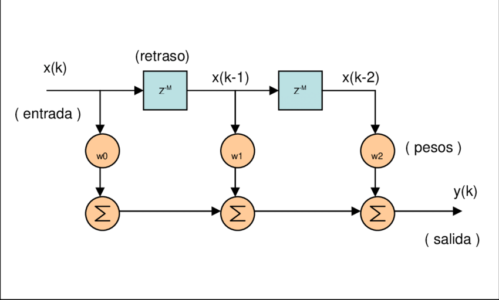
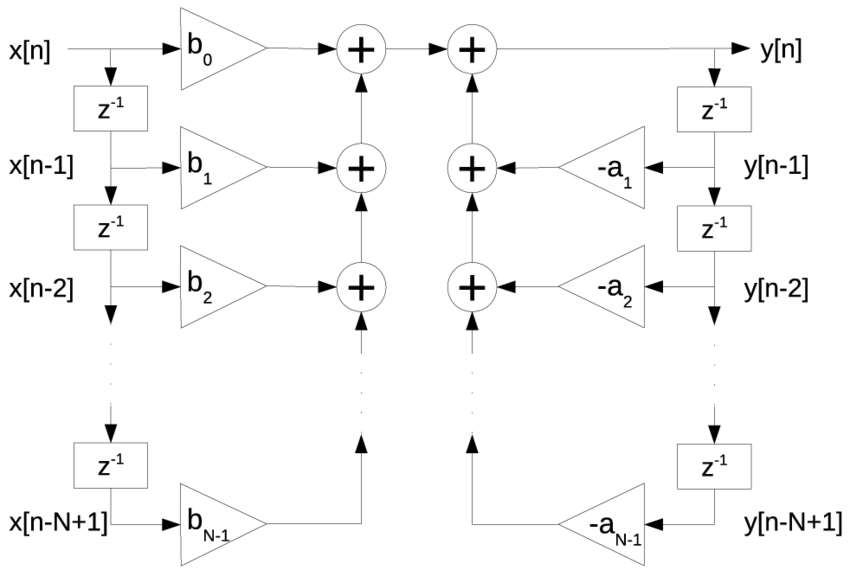
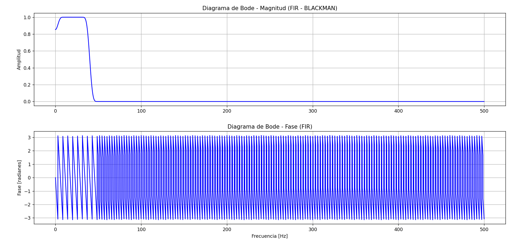
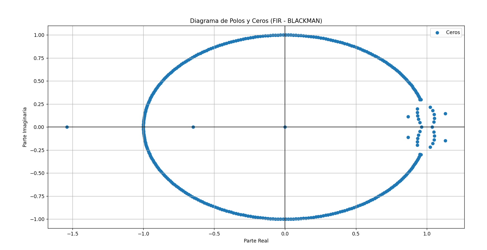
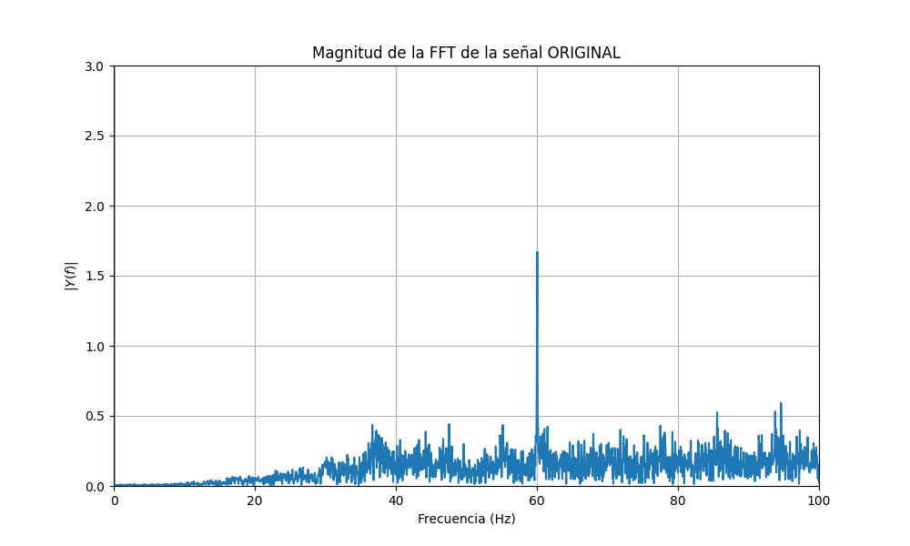
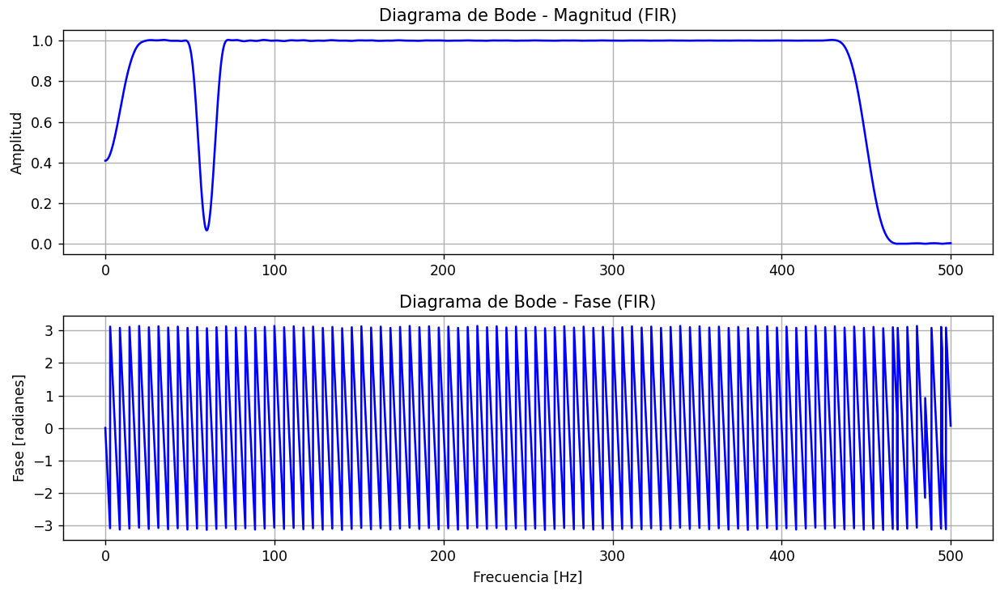
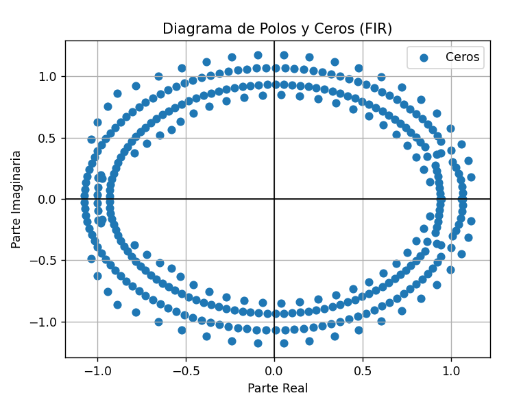
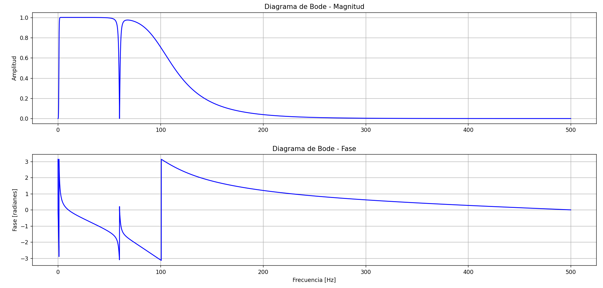
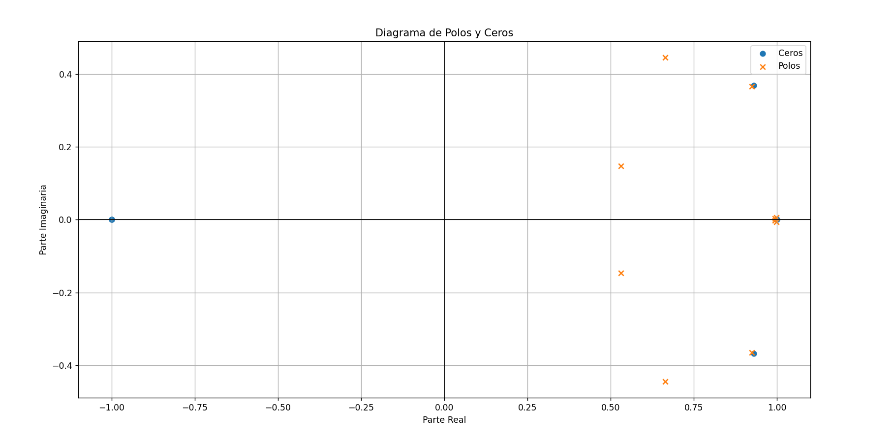

# Laboratorio N°7 - Diseño de Filtros FIR y IIR
## **Tabla de contenidos:**

1. [Introducción](#t1)  
   1.1 [Filtros Digitales](#t2)  
   1.2  [Filtros FIR](#t3)  
      1.2.1 [Método de las ventanas](#t4)  
   1.3  [Filtros IIR](#t5)  
      1.3.1 [Métodos de Diseño de Filtros IIR](#t6)  
2. [Objetivos del laboratorio](#t7)  
3. [Metodología](#t8)  
   3.1 [Ejercicio ECG](#t9)  
4. [Resultados](#t10)  
   4.1 [Ejercicio ECG](#t11)  
   4.2 [Ejercicio EMG](#t12)  
5. [Discusión](#t13)  
   5.1 [Señal ECG](#t14)  
   5.2 [Señal EMG](#t15)  
6. [Bibliografía](#t16)

## 1. Introducción  

El presente informe tiene como objetivo mostrar el uso de distintos tipos de filtros FIR (Filtro de Respuesta al Impulso Finita), IIR (Filtro de Respuesta al Impulso Infinita) en las señales bioeléctricas de ECG (Electrocardiograma) y EMG (Electromiograma) adquiridas durante las sesiones prácticas. Los filtros son herramientas esenciales que nos permiten modificar una señal con el fin de eliminar ruidos o interferencias y así obtener datos más precisos. En el caso del ECG, utilizado para medir la actividad eléctrica del corazón, y el EMG, que registra la actividad eléctrica generada por los músculos, los filtros juegan un papel importante para mejorar la calidad de las señales y facilitar su interpretación, eliminando perturbaciones como el ruido ambiental o el movimiento [1].

### 1.1 Filtros Digitales:  

Un filtro digital es un sistema que procesa señales aplicando operaciones matemáticas sobre una señal previamente muestreada ,es decir, una señal continua convertida en una secuencia de valores discretos. Esta señal discreta no tiene un valor en todos los instantes de tiempo, ya que está cuantificada. Además, al ser una señal digital, representa físicamente una secuencia de valores discretos, como puede ser un flujo de bits o una señal analógica que ha sido digitalizada [2].

### 1.2 Filtros FIR:  

Los filtros FIR, conocidos como filtros no recursivos, tienen una respuesta finita al impulso, lo que significa que su salida depende únicamente de las entradas actuales y no de las salidas anteriores. Este tipo de filtro es muy estable y garantiza una fase lineal, lo que los hace ideales para aplicaciones en las que la precisión de la fase es importante. Al aplicar la convolución, el filtro FIR realiza un promedio ponderado de las muestras de entrada, y su salida eventualmente desaparece cuando las entradas se reducen a cero. Debido a su estabilidad y predictibilidad, los filtros FIR son ampliamente utilizados en aplicaciones como procesamiento de audio, mejora de imágenes y sistemas de comunicación, donde se requiere un control preciso de la frecuencia [3].

<i>Figura 1:Estructura básica de un filtro FIR [4].</i>

#### 1.2.1 Método de las ventanas:  

El diseño de filtros FIR mediante el método de ventanas se basa en modificar la respuesta al impulso de un filtro ideal para obtener un filtro realizable y causal. Primero, se obtiene la respuesta al impulso de un filtro ideal (como paso bajo o paso alto), que es infinita en el tiempo. Luego, se aplica una ventana para truncar esa respuesta y limitarla a una longitud finita. Las ventanas, como las de Hamming o Blackman, ayudan a suavizar los bordes de la señal truncada, mejorando la atenuación de frecuencias no deseadas. Finalmente, la respuesta al impulso se desplaza en el tiempo para hacerla causal, es decir, para garantizar que el filtro sea físicamente implementable en un sistema real. Este método es sencillo y permite diseñar filtros con características controlables, aunque no es tan preciso como otros métodos más avanzados [5].

<i>Figura 2: Respuesta en frecuencia y valores de ponderación de diferentes tipos de ventanas. [6].</i>

### 1.3 Filtros IIR:  

Por otro lado, los filtros IIR son recursivos y tienen una respuesta al impulso infinita, ya que la salida depende tanto de las entradas actuales como de las salidas previas. Esto les permite ser más eficientes en términos computacionales, ya que pueden lograr un filtrado similar a los FIR con menos coeficientes. Sin embargo, los filtros IIR pueden introducir distorsiones de fase y ser susceptibles a inestabilidad si no se diseñan adecuadamente. Estos filtros son preferidos en aplicaciones donde se requiere un procesamiento rápido y eficiente, como en el procesamiento de señales biomédicas (por ejemplo, ECG y EEG), sistemas de control y algoritmos de compresión de audio y voz, donde se necesita una respuesta rápida y eficaz [3].

<i>Figura 3:Esquema general de un filtro IIR [7].</i>

#### 1.3.1 Métodos de Diseño de Filtros IIR:  

 Los diferentes tipos de filtros IIR se utilizan según las necesidades de suavidad, selectividad y tolerancia a ondulaciones en las bandas de paso o de stop, dependiendo de la aplicación en la que se empleen [8].

| **Filtro**           | **Imagen**                                                                                             |
|----------------------|-------------------------------------------------------------------------------------------------------|
| Butterworth: Ideal para una respuesta de frecuencia suave, sin ondulaciones, y cuando no se necesita alta selectividad [8].  | 

 |
| Chebyshev Tipo I:  Alta selectividad con ondulaciones en la banda de paso, útil cuando las ondulaciones no son un problema [8]. | 

 |
| Chebyshev Tipo II:Alta selectividad con ondulaciones en la banda de stop, aplicable cuando se requiere una banda de paso suave [8].| 

 |
| Elíptico: Alta selectividad con ondulaciones en ambas bandas, adecuado cuando se puede tolerar algo de distorsión a cambio de una transición rápida [8].      | 

 |

<i>Tabla 1. Métodos de Diseño de Filtros IIR - imágenes [8].</i>

## 2. Objetivos 
* Utilizar y filtrar señales de EMG y ECG obtenidas previamente, aplicando filtros FIR o IIR.
* Analizar cada señal (original y filtrada) en el dominio del tiempo y la frecuencia.
* Incluir los diagramas de polos y ceros, así como los Diagramas de Bode de los filtros utilizados.
* Justificar la selección de los filtros aplicados.

## 3. Metodología 

En este laboratorio, nos enfocamos en desarrollar e implementar filtros digitales FIR e IIR para reducir el ruido de alta frecuencia que afecta las señales de ECG y EMG adquiridas previamente con el Kit BITalino. La finalidad de aplicar estos filtros es limpiar las señales de interferencias no deseadas, mejorando su calidad y precisión para su análisis posterior.
   
### 3.1 **Equipos y materiales utilizados:**

  
| **Modelo**    | **Descripción**          | **Cantidad** |
|---------------|--------------------------|--------------|
| (r)EVOLUTION  | Kit BITalino              | 1            |
| ASUS          | Laptop                    | 1            |
| -             | Electrodos superficiales  | 3            |

<i>Tabla 2. Equipos y materiales utilizados en este laboratorio.</i>

## 4. Resultados   
### 4.1 Conceptos - Filtros ECG:  

Las señales de electrocardiograma (ECG) suelen estar afectadas por diversos ruidos y artefactos, como el desplazamiento de la línea base y las contracciones musculares, que pueden reducir la calidad de la señal y generar riesgos en el diagnóstico clínico. Para mitigar estos problemas, se ha estudiado ampliamente la técnica de descomposición mediante wavelets, utilizando bancos de filtros FIR (Respuesta Finita al Impulso) para descomponer la señal, aplicar umbrales y reconstruirla. Esta técnica permite mejorar significativamente la fidelidad de la señal de ECG al eliminar el ruido de manera efectiva.
Sin embargo, el uso de filtros FIR de orden elevado conlleva una mayor complejidad en el hardware, lo que aumenta los costos y dificulta su implementación en dispositivos portátiles de monitoreo de salud. Para reducir esta complejidad, se han propuesto bancos de filtros híbridos que combinan filtros FIR e IIR (Respuesta Infinita al Impulso) en la Transformada Wavelet Discreta (DWT). Este enfoque híbrido logra una reducción de ruido efectiva con una menor carga computacional, lo que lo hace ideal para aplicaciones en dispositivos ambulatorios de monitoreo de ECG [9].

### **Archivo de las señales ploteadas en Python.** 
  - [ECG - FIR](https://github.com/sandro-robles/Intro_G4/blob/2de258082a60a7a00dbc90d4647968245e023afa/ISB/Laboratorios/Lab7_Filtros/Mar%C3%ADa%20Mautino/C%C3%B3digos_ECG/FIR%20ecg.py)

  - [ECG - IIR](https://github.com/sandro-robles/Intro_G4/blob/2de258082a60a7a00dbc90d4647968245e023afa/ISB/Laboratorios/Lab7_Filtros/Mar%C3%ADa%20Mautino/C%C3%B3digos_ECG/IIR%20ecg.py)

### **Señales ECG** 
| Campo |  Señal Cruda vs Filtro FIR  |  Señal Cruda vs Filtro IIR |
|-----------|-----------|-----------|
| Basal D2  |    |  |
| Respiración D1 |    |  |
| Post Respiración D3  |    |  |
| Post Ejercicio D2  |    |  |

  <b>Tabla 2. Resumen de la señal filtrada con filtros FIR e IIR para la data ECG.</b>

### **Señales ECG - FFT** 
| Campo | FFT - Original vs FIR| FFT - Original vs IIR |
|-----------|-----------|-----------|
| Basal D2  |    |  |
| Respiración D1 |    |  |
| Post Respiración D3  |    |  |
| Post Ejercicio D2  |    |  |

### **Análisis del Filtro - ECG** 
| Filtro | Diagrama de Bode | Diagrama de Polos y Ceros |
|--------|------------------|--------------------------|
| FIR    |  |  |
| IIR    |  |  |

### **Justificación de la elección de filtros para ECG - FIR:**

 Se utilizó filtros FIR con ventana Blackman para procesar señales ECG, eliminando interferencias y preservando la calidad de la señal. Se eligió un filtro notch para eliminar el ruido de 60 Hz, que proviene de la red eléctrica, dado que estas interferencias pueden contaminar las señales ECG. La ventana Blackman es seleccionada porque ofrece una excelente atenuación de lóbulos laterales, minimizando las fugas espectrales y preservando las frecuencias adyacentes importantes para la señal. El ancho de banda de 5 Hz es estrecho, lo que asegura una eliminación precisa de la interferencia sin comprometer las frecuencias circundantes.

 Por otro lado, el filtro FIR pasa-banda con un rango de 0.5 Hz a 80 Hz es utilizado para conservar las componentes de baja frecuencia que son cruciales para la identificación de ondas P y T, mientras que el límite superior de 80 Hz captura los detalles finos del complejo QRS, fundamentales en el análisis clínico del ECG. La elección de la ventana Blackman en este filtro también está justificada por su capacidad de proporcionar una respuesta en frecuencia suave y evitar la distorsión de las fases de la señal, lo cual es esencial para el análisis preciso del ECG.

 El uso de filtros FIR con estas características está respaldado en investigaciones sobre dispositivos portátiles y adquisición de señales ECG, como se destaca en el artículo de Rodríguez-Jorge et al. (2021) [10], quienes implementan técnicas de procesamiento en tiempo real para la detección de complejos QRS en señales ECG adquiridas con dispositivos portátiles como BITalino​. En el estudio se demuestra cómo el filtrado pasa-banda seguido de transformaciones numéricas, como la derivada de la señal y la transformación de Hilbert, mejora la detección del complejo QRS incluso en señales con bajo SNR (relación señal-ruido) o morfología variable.

### **Justificación de la elección de filtros para ECG - IIR:**

El uso del filtro IIR (Respuesta Infinita al Impulso) Butterworth en el procesamiento de señales ECG es una opción ampliamente aceptada debido a sus características específicas. El filtro Butterworth es elegido por su respuesta en frecuencia lo más plana posible en la banda de paso, lo que minimiza la distorsión de la amplitud de las frecuencias que se encuentran dentro del rango de interés, en este caso, entre 0.5 Hz y 40 Hz. Esto es importante en la señal ECG, ya que estas frecuencias contienen la mayor parte de la información clínica relevante (ondas P, QRS y T). 

El filtro Butterworth también tiene la ventaja de introducir una fase mínima en la señal, lo que es importante para señales biológicas, como el ECG, donde la preservación de la fase es crucial para mantener la forma de la señal original y evitar distorsiones en la temporalidad de los eventos cardíacos. El filtro diseñado tiene un orden de 4, lo que proporciona una transición suave entre la banda de paso y las bandas de rechazo, sin introducir demasiada distorsión de fase ni atenuar las frecuencias dentro de la banda de paso.

El uso de un filtro IIR Butterworth en este contexto también está respaldado por estudios previos como el de Rodríguez-Jorge et al. (2021)​[10], quienes resaltan la importancia de utilizar filtros pasa-banda en la adquisición de señales ECG para eliminar ruido y mejorar la precisión en la detección de complejos QRS, especialmente en entornos portátiles y de baja potencia como los sistemas basados en IoT. En ese trabajo, también se menciona que los filtros Butterworth, debido a su capacidad para reducir la distorsión en la banda de paso y mantener una buena linealidad de fase, son particularmente efectivos para procesar señales ECG en tiempo real.

### 4.2 Conceptos - Filtros EMG:  

Las señales de electromiografía de superficie (sEMG) suelen verse afectadas por varios tipos de ruidos, como el ruido de la línea eléctrica (PLI), el desplazamiento de la línea base (BW) y el ruido blanco gaussiano (WGN). Para mitigar estos ruidos, se suelen utilizar filtros digitales simples como los filtros IIR (Respuesta Infinita al Impulso) y FIR (Respuesta Finita al Impulso). Los filtros IIR son eficientes en términos computacionales, ya que requieren menos coeficientes para alcanzar una respuesta similar a la de los filtros FIR. No obstante, pueden introducir distorsiones de fase y ser menos estables. Los filtros FIR, por su parte, aunque garantizan una fase lineal y son siempre estables, requieren más recursos computacionales debido a la mayor cantidad de coeficientes necesarios. Ambos tipos de filtros son efectivos en reducir ruidos como el PLI y BW, pero tienen dificultades para manejar el WGN, que se superpone con el espectro de la señal sEMG.
Debido a estas limitaciones, se han desarrollado técnicas avanzadas para mejorar la calidad de las señales sEMG. Entre ellas, la Transformada Wavelet se destaca, ya que permite separar el ruido de la señal utilizando resoluciones en el tiempo y la frecuencia [11].

### **Archivo de las señales ploteadas en Python.** 
  - [EMG - FIR](https://github.com/sandro-robles/Intro_G4/blob/a164dcd24f881cf9e05baff796d131be994c7412/ISB/Laboratorios/Lab7_Filtros/Mar%C3%ADa%20Mautino/C%C3%B3digos_EMG/FIR%20emg.py)

  - [EMG - IIR](https://github.com/sandro-robles/Intro_G4/blob/a164dcd24f881cf9e05baff796d131be994c7412/ISB/Laboratorios/Lab7_Filtros/Mar%C3%ADa%20Mautino/C%C3%B3digos_EMG/IIR%20emg.py)

### **Señales EMG** 
| Campo | Señal Cruda vs Filtro FIR | Señal Cruda vs Filtro IIR |
|-----------|-----------|-----------|
| Bícep en Movimiento   |   |  
| Trícep en Movimiento |  | | 
|Mano en reposo  |  | | 
|Trapecio Movimiento/Fuerza  |  | | 
|Gastrocnemio Movimiento  | | | 

  <b>Tabla 3. Resumen de la señal filtrada con filtros FIR e IIR para la data EMG</b>

### **Señales EMG - FFT** 
| Campo | FFT - Original | FFT - FIR | FFT - IIR |
|-----------|-----------|-----------|-----------|
| Bícep en Movimiento   |   |   |   |
| Trícep en Movimiento |   |   |   |
|Mano en reposo  |    |   |   |
|Trapecio Movimiento/Fuerza  |    |   |   |
|Gastrocnemio Movimiento  |   |   |   |

  <b>Tabla 3. Resumen de la señal filtrada con filtros FIR e IIR para la data EMG</b>

### **Análisis del Filtro - EMG** 
| Filtro | Diagrama de Bode | Diagrama de Polos y Ceros |
|--------|------------------|--------------------------|
| FIR    |  |  |
| IIR    |  |  |

### **Justificación de la elección de filtros para EMG - FIR:**

 El uso de filtros FIR para procesar señales EMG se destaca por sus ventajas, en especial su capacidad para mantener una respuesta en fase lineal. Esta propiedad es esencial para preservar la estructura temporal de la señal original y evitar distorsiones que podrían alterar la interpretación de eventos musculares en las señales EMG. El filtro notch FIR de 60 Hz se emplea para eliminar el ruido de la red eléctrica, que es una de las principales fuentes de interferencia en las señales biomédicas. El ancho de banda de 10 Hz garantiza una eliminación precisa de este ruido sin afectar las frecuencias importantes de la señal EMG, asegurando la preservación de la calidad de la señal. Además, el filtro pasa-banda FIR, con un rango de frecuencias de 6 Hz a 450 Hz, permite capturar las frecuencias clave de la actividad muscular, eliminando al mismo tiempo el ruido de baja frecuencia, como los artefactos de movimiento, y el ruido de alta frecuencia, no relacionado con la actividad muscular.

La elección de filtros FIR en el procesamiento de señales EMG está respaldada por estudios previos. En investigaciones como las de Batista et al. (2017) [12], se destaca que las señales EMG adquiridas mediante plataformas portátiles como BITalino son propensas al ruido eléctrico de 60 Hz, lo que refuerza la necesidad de aplicar filtros notch y pasa-banda para garantizar la calidad de los datos procesados. Asimismo, Carbajal-Serrano et al. (2024) [13] enfatizan la eficacia de los filtros FIR para eliminar este tipo de ruido y conservar las frecuencias clave para el análisis de la fatiga muscular. Además, estudios como el de Okoniewski et al. (2018) [14] justifican el uso de filtros FIR en mediciones rápidas de EMG para eliminar de manera eficiente las interferencias de 50/60 Hz, manteniendo intactas las características temporales de las señales. Esto es especialmente importante para la detección precisa de eventos clave en la actividad muscular, como contracciones y relajaciones.

 
### **Justificación de la elección de filtros para EMG - IIR:**

El uso de filtros IIR en señales EMG se justifica por su capacidad para eliminar eficientemente el ruido y las interferencias, manteniendo las frecuencias relevantes para el análisis de la actividad muscular. Un filtro notch IIR es particularmente útil para suprimir el ruido de 60 Hz proveniente de la red eléctrica, una interferencia común en entornos clínicos o domésticos. Al centrarse en eliminar solo esta frecuencia específica, el filtro notch IIR evita distorsionar el resto de la señal EMG, permitiendo la preservación de las características clave del comportamiento muscular.

Por otro lado, el filtro de paso de banda IIR, con frecuencias de corte bajas y altas ajustadas para eliminar tanto artefactos de movimiento (frecuencias inferiores a 1 Hz) como ruidos de alta frecuencia (por encima de 100 Hz), es una solución óptima para mantener únicamente las componentes esenciales de la señal EMG. Esto asegura que la señal conservada contenga información relevante sobre la contracción y relajación muscular, mientras que los elementos indeseados quedan excluidos. El uso de este tipo de filtro también está alineado con la frecuencia natural de la actividad muscular, que generalmente se sitúa entre 1 y 100 Hz.

Los filtros IIR son preferidos en este tipo de aplicaciones debido a su eficiencia en términos de procesamiento, ya que requieren menos coeficientes que los filtros FIR para lograr un resultado similar. Esto los hace adecuados para aplicaciones en tiempo real o en dispositivos con recursos limitados, como los sistemas de monitoreo de señales biomédicas portátiles. Investigaciones como las de Piskorowski (2013) [15] han mostrado que los filtros IIR son eficaces para la eliminación del ruido de la red eléctrica en señales EMG, mejorando la calidad de las mediciones y la interpretación de los resultados​. 

### **Bibliografía:** 

[1] L. Romero, “Análisis de señales electrocardiográficas usando técnicas de procesamiento digital,” Uoc.edu, 2015, doi: http://hdl.handle.net/10609/40186.
 

[2] DEWESoft d.o.o, “Signal filtering, Signal suppression, Signal processing | Dewesoft,” Dewesoft.com, 2023. https://training.dewesoft.com/online/course/filters (accessed Oct. 06, 2024).
 

[3] Hardware, “Hardware and Systems Engineering Design - FIR vs IIR Digital Filter,” Hwe.design, 2024. https://www.hwe.design/theories-concepts/signal-processing/fir-vs-iir-digital-filter (accessed Oct. 06, 2024).
 

[4] “Figura 2-2. Filtro FIR, estructura básica,” ResearchGate, 2024. https://www.researchgate.net/figure/Figura-2-2-Filtro-FIR-estructura-basica_fig1_335241476 (accessed Oct. 06, 2024).
 

[5] “Jaime Ramirez Grupo 11-Tarea 4 - Tarea 4 - Realizar simulaciones de filtros aplicando herramientas - Studocu,” Studocu, 2020. https://www.studocu.com/co/document/universidad-nacional-abierta-y-a-distancia/tratamiento-de-imagenes/jaime-ramirez-grupo-11-tarea-4/39937696 (accessed Oct. 07, 2024).
 

[6] “FIR Filters by Windowing - The Lab Book Pages,” Labbookpages.co.uk, 2024. http://www.labbookpages.co.uk/audio/firWindowing.html (accessed Oct. 07, 2024).
 

[7] “Figura 5-7.: Esquema general de un sistema de filtro IIR con estructura...,” ResearchGate, 2016. https://www.researchgate.net/figure/Figura-5-7-Esquema-general-de-un-sistema-de-filtro-IIR-con-estructura-Directa-tipo-I_fig58_323019453 (accessed Oct. 06, 2024).
 

[8] “Métodos de diseño filtros IIR,” SlideShare, 2023. https://es.slideshare.net/slideshow/mtodos-de-diseo-filtros-iir/257404855 (accessed Oct. 07, 2024).
 

[9] Yaprak Eminaga, A. Coskun, and I. Kale, “Hybrid IIR/FIR Wavelet Filter Banks for ECG Signal Denoising,” WestminsterResearch (University of Westminster), Oct. 2018, doi: https://doi.org/10.1109/biocas.2018.8584717.
 

[10] R. Rodríguez-Jorge, I. De León-Damas, J. Bila, and Jiří Škvor, “Internet of things-assisted architecture for QRS complex detection in real time,” Internet of Things, vol. 14, pp. 100395–100395, Mar. 2021, doi: https://doi.org/10.1016/j.iot.2021.100395.
 

[11] C. Li, H. Deng, S. Yin, C. Wang, and Y. Zhu, “sEMG signal filtering study using synchrosqueezing wavelet transform with differential evolution optimized threshold,” Results in Engineering, vol. 18, p. 101150, Jun. 2023, doi: https://doi.org/10.1016/j.rineng.2023.101150.
 

[12] D. Batista, H. Silva, and A. Fred, “Experimental characterization and analysis of the BITalino platforms against a reference device,” PubMed, Jul. 2017, doi: https://doi.org/10.1109/embc.2017.8037344.
 

[13] A. Carbajal-Serrano, E. Cuti-Riveros, L. De, Gianfranco Feria-Maquera, N. Galindo-Concha, and M. Meza-Rodriguez, “A Practical Case of Learning Muscle Fatigue Based on a sEMG Signal Using Bitalino Kit,” Jan. 2024, doi: https://doi.org/10.18687/laccei2024.1.1.1622.
 

[14] P. Okoniewski, S. Kocon, and J. Piskorowski, “Linear Time-Varying Multi-Notch FIR Filter for Fast EMG Measurements,” Aug. 2018, doi: https://doi.org/10.1109/mmar.2018.8486122.
 

[15] J. Piskorowski, “Time-efficient removal of power-line noise from EMG signals using IIR notch filters with non-zero initial conditions,” Journal of Applied Biomedicine, vol. 33, no. 3, pp. 171–178, Jan. 2013, doi: https://doi.org/10.1016/j.bbe.2013.07.006.

‌

