# **LABORATORIO 7: – Filtros (Sandro Robles)**
## **Tabla de contenidos:**
1. [Objetivos](#Objetivos)
2. [Filtro FIR: EMG](#FiltroFIREMG)
  
## **Introducción:**<a id="Introduccion"></a>
<p align="justify"> El corazón está compuesto por varios tejidos, entre los cuales se encuentra el músculo cardíaco, que puede producir señales eléctricas que son detectables en la superficie de la piel utilizando un sensor de ECG. [1]. </p>

<p align="justify"> El electrocardiograma (ECG) es una herramienta fundamental en la medicina cardiovascular, utilizada para identificar una amplia variedad de patologías cardíacas, como arritmias y alteraciones miocárdicas y pericárdicas, así como desequilibrios electrolíticos y enfermedades pulmonares. Su facilidad de uso, carácter no invasivo y bajo costo han consolidado al ECG como una de las pruebas más empleadas en la práctica clínica. Sin embargo, su utilidad diagnóstica depende en gran medida de la precisión en la interpretación de los resultados [2]. </p>

<p align="center"></p>

<p align="center"><i>Figura 1: Interpretación de ECG [3].</i></p>

<p align="justify"> </p>

## **Filtro FIR: EMG**<a id="FiltroFIREMG"></a>

## Código en Python

``` python
# Importamos las librerías necesarias
import numpy as np
import matplotlib.pyplot as plt
from scipy.signal import firwin, lfilter, freqz, tf2zpk

# Leer los archivos de texto de EMG en el bíceps -> AQUI SOLO CAMBIAMOS LOS DIFERENTES TXT PARA CADA MÚSCULO
array_reposo = np.genfromtxt("bicep reposo.txt", delimiter="\t")
array_movimiento = np.genfromtxt("bicep movimiento.txt", delimiter="\t")
array_fuerza = np.genfromtxt("bicep fuerza.txt", delimiter="\t")

# Extraer los valores de cada señal
valores_reposo = array_reposo[:,-2]
valores_movimiento = array_movimiento[:,-2]
valores_fuerza = array_fuerza[:,-2]

# Determinar la longitud de cada arreglo
cantidad_reposo = np.size(valores_reposo)
cantidad_movimiento = np.size(valores_movimiento)
cantidad_fuerza = np.size(valores_fuerza)

# Frecuencia de muestreo de las señales
Fs = 1000  # Hz

# Crear vectores de tiempo para cada señal
tiempo_reposo = np.arange(0, cantidad_reposo) / Fs
tiempo_movimiento = np.arange(0, cantidad_movimiento) / Fs
tiempo_fuerza = np.arange(0, cantidad_fuerza) / Fs

# Convertir valores a mV (ajustar si no es necesario para EMG)
valores_reposo = (((valores_reposo / 1024) - 0.5) * 3.3) / 1100 * 1000
valores_movimiento = (((valores_movimiento / 1024) - 0.5) * 3.3) / 1100 * 1000
valores_fuerza = (((valores_fuerza / 1024) - 0.5) * 3.3) / 1100 * 1000

# Mostrar las señales originales sin filtrar
plt.figure(figsize=(15, 10))
plt.subplot(3, 1, 1)
plt.plot(tiempo_reposo, valores_reposo)
plt.xlabel('Tiempo (s)')
plt.ylabel('Amplitud (mV)')
plt.title('Señal en reposo (cruda)')
plt.xlim([3, 8])

plt.subplot(3, 1, 2)
plt.plot(tiempo_movimiento, valores_movimiento)
plt.xlabel('Tiempo (s)')
plt.ylabel('Amplitud (mV)')
plt.title('Señal en movimiento (cruda)')
plt.xlim([3, 8])

plt.subplot(3, 1, 3)
plt.plot(tiempo_fuerza, valores_fuerza)
plt.xlabel('Tiempo (s)')
plt.ylabel('Amplitud (mV)')
plt.title('Señal en fuerza (cruda)')
plt.xlim([3, 8])

plt.tight_layout()
plt.show()

# Aplicar FFT para análisis espectral
N = 1024
X_reposo = np.fft.fft(valores_reposo, N)[:N//2]
X_movimiento = np.fft.fft(valores_movimiento, N)[:N//2]
X_fuerza = np.fft.fft(valores_fuerza, N)[:N//2]

# Magnitudes
mag_reposo = np.abs(X_reposo)
mag_movimiento = np.abs(X_movimiento)
mag_fuerza = np.abs(X_fuerza)

# Frecuencias
F = np.linspace(0, Fs / 2, N // 2)

# Análisis espectral de las señales
plt.figure(figsize=(15, 5))
plt.plot(F, mag_reposo, label="Reposo")
plt.plot(F, mag_movimiento, label="Movimiento")
plt.plot(F, mag_fuerza, label="Fuerza")
plt.xlabel("Frecuencia (Hz)")
plt.ylabel("Magnitud (dB)")
plt.title("Análisis espectral de las señales EMG")
plt.legend()
plt.xlim([0, 200])
plt.grid(linestyle=":")
plt.show()

# Diseño del filtro FIR
M = 37  # Orden del filtro FIR
Fc = 30  # Frecuencia de corte
w = firwin(numtaps=M, cutoff=Fc, window='hamming', fs=Fs)

# Aplicar el filtro FIR a las señales
y_reposo = lfilter(w, 1.0, valores_reposo)
y_movimiento = lfilter(w, 1.0, valores_movimiento)
y_fuerza = lfilter(w, 1.0, valores_fuerza)

# Graficar las señales filtradas
plt.figure(figsize=(15, 10))
plt.subplot(3, 1, 1)
plt.plot(tiempo_reposo, y_reposo)
plt.xlabel('Tiempo (s)')
plt.ylabel('Amplitud (mV)')
plt.title('Señal en reposo (filtrada)')
plt.xlim([3, 8])

plt.subplot(3, 1, 2)
plt.plot(tiempo_movimiento, y_movimiento)
plt.xlabel('Tiempo (s)')
plt.ylabel('Amplitud (mV)')
plt.title('Señal en movimiento (filtrada)')
plt.xlim([3, 8])

plt.subplot(3, 1, 3)
plt.plot(tiempo_fuerza, y_fuerza)
plt.xlabel('Tiempo (s)')
plt.ylabel('Amplitud (mV)')
plt.title('Señal en fuerza (filtrada)')
plt.xlim([3, 8])

plt.tight_layout()
plt.show()

# Diagrama de polos y ceros del filtro FIR
z, p, k = tf2zpk(w, 1)
plt.figure(figsize=(6, 6))
plt.scatter(np.real(z), np.imag(z), marker='o', label='Ceros', edgecolor='blue')
plt.scatter(np.real(p), np.imag(p), marker='x', label='Polos', edgecolor='red')
plt.title('Diagrama de Polos y Ceros')
plt.xlabel('Parte Real')
plt.ylabel('Parte Imaginaria')
plt.grid(True, linestyle='--')
plt.axhline(0, color='black', linewidth=0.5)
plt.axvline(0, color='black', linewidth=0.5)
plt.legend()
plt.show()

# Diagrama de Bode del filtro FIR
w_freq, h = freqz(w, worN=8000, fs=Fs)
plt.figure(figsize=(12, 6))

# Magnitud
plt.subplot(2, 1, 1)
plt.plot(w_freq, 20 * np.log10(abs(h)), 'b')
plt.title('Diagrama de Bode (Magnitud y Fase)')
plt.ylabel('Magnitud (dB)')
plt.xscale('log')
plt.grid(which='both', linestyle='--')
plt.axvline(Fc, color='green')  # Frecuencia de corte

# Fase
plt.subplot(2, 1, 2)
angles = np.unwrap(np.angle(h))
plt.plot(w_freq, angles, 'g')
plt.ylabel('Fase (radianes)')
plt.xlabel('Frecuencia (Hz)')
plt.xscale('log')
plt.grid(which='both', linestyle='--')
plt.axvline(Fc, color='green')  # Frecuencia de corte

plt.tight_layout()
plt.show()


```
| Diagrama de Polos y Ceros |Diagrama de Bode (Magnitud y Fase) |
|:--------------:|:--------------:|
|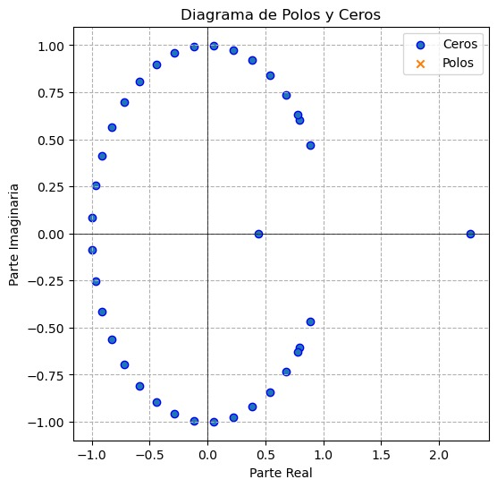|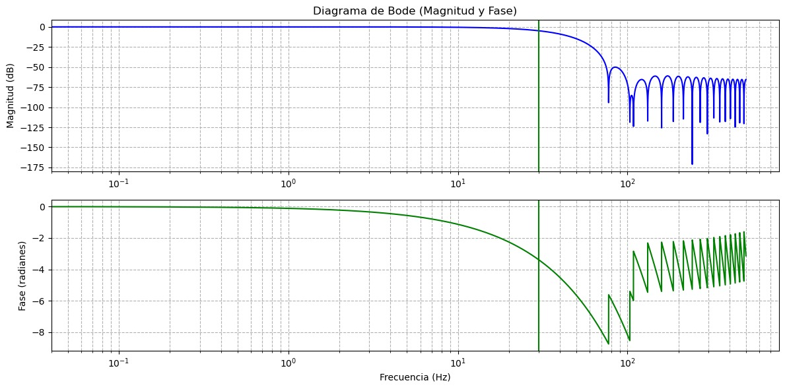|
<p align="center"><i>Tabla 1: EMG - Filtro FIR.</i></p>

<p align="justify"> </p>


| Señal Cruda | Análisis espectral | Filtro FIR | 
|:--------------:|:--------------:|:--------------:|
|  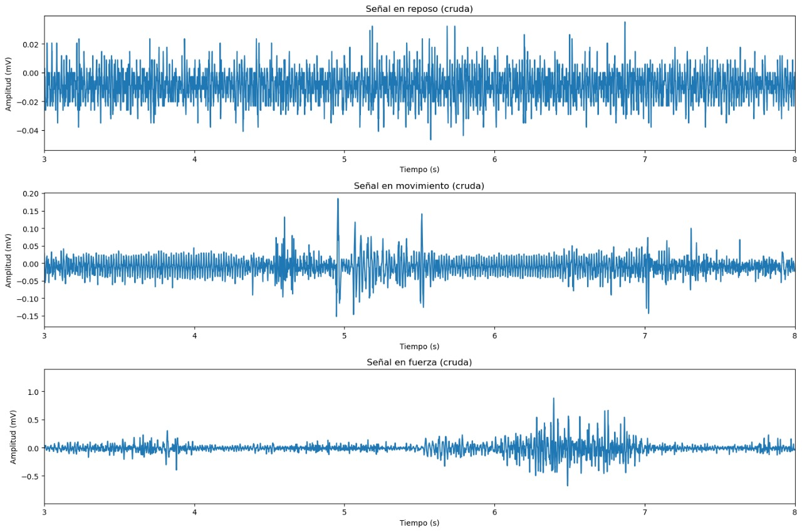|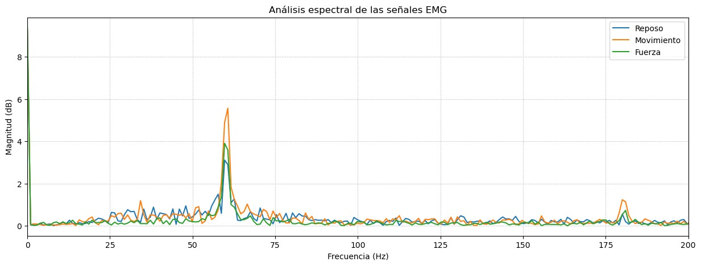|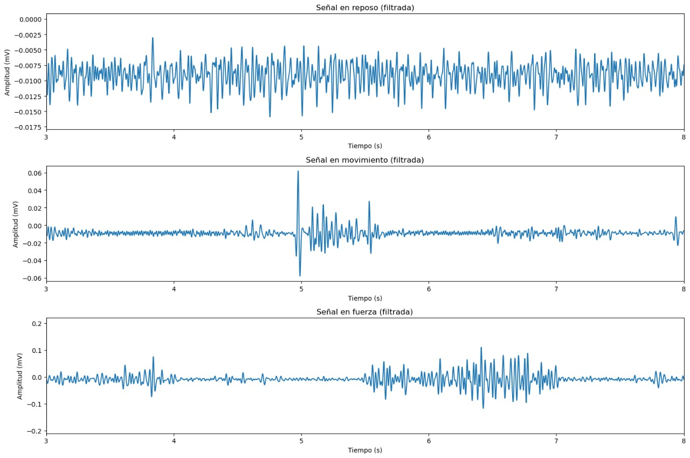
<p align="center"><i>Tabla 2: EMG - Bicep con filtro FIR.</i></p>

<p align="justify"> </p>


| Señal Cruda | Análisis espectral | Filtro FIR |
|:--------------:|:--------------:|:--------------:|
|  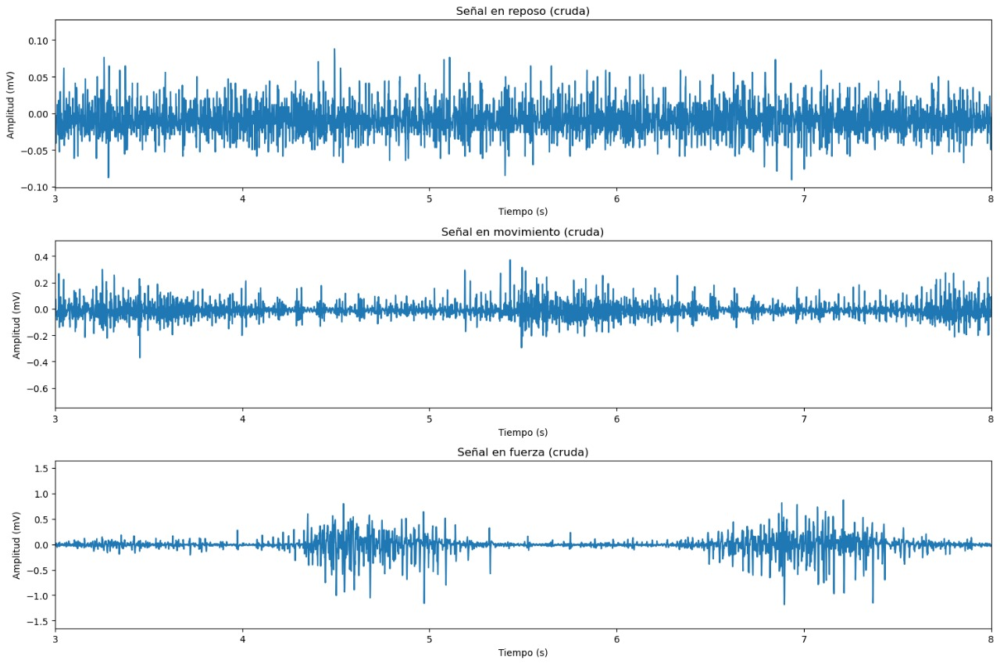|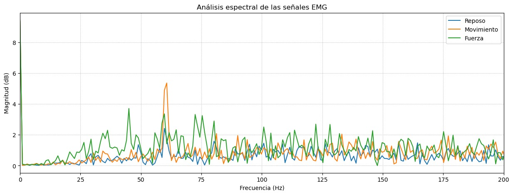|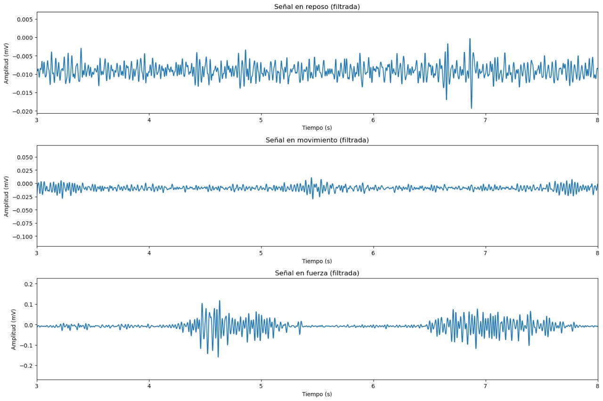|

<p align="center"><i>Tabla 3: EMG - Gastrocnemio con filtro FIR.</i></p>

<p align="justify"> </p>


| Señal Cruda | Análisis espectral | Filtro FIR |
|:--------------:|:--------------:|:--------------:|
|  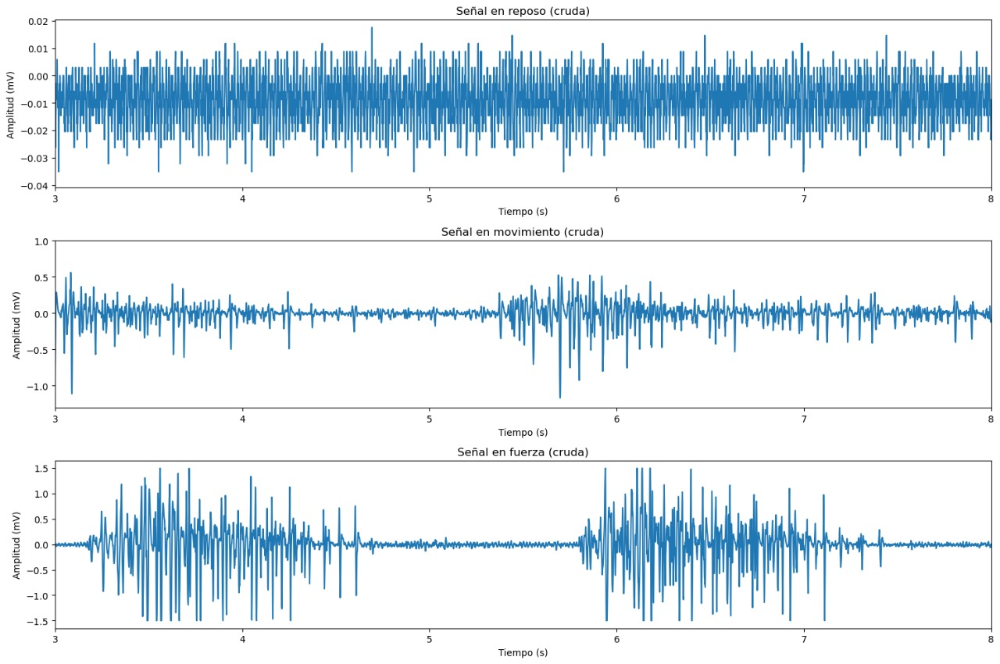|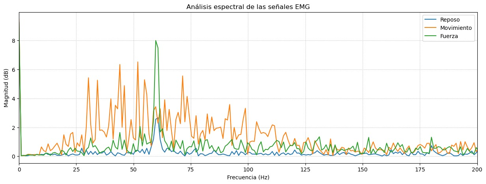|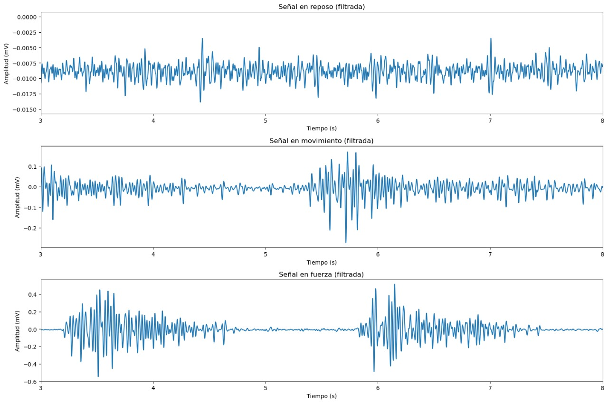|

<p align="center"><i>Tabla 4: EMG - Trapecio con filtro FIR.</i></p>

<p align="justify"> </p>


| Señal Cruda | Análisis espectral | Filtro FIR |
|:--------------:|:--------------:|:--------------:|
|  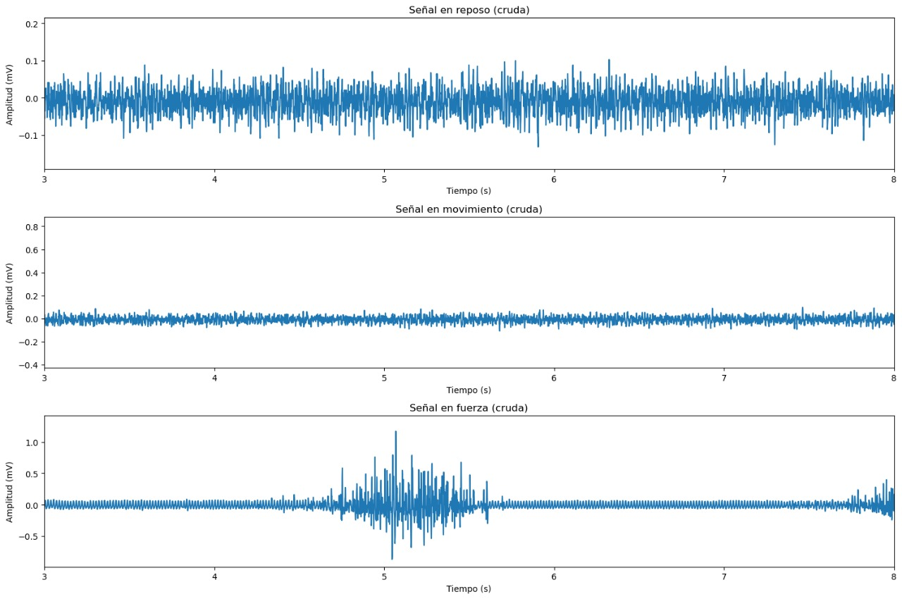|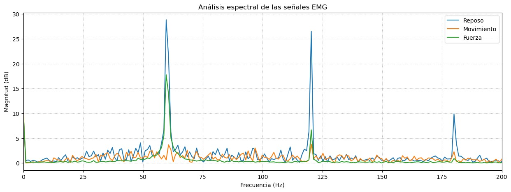|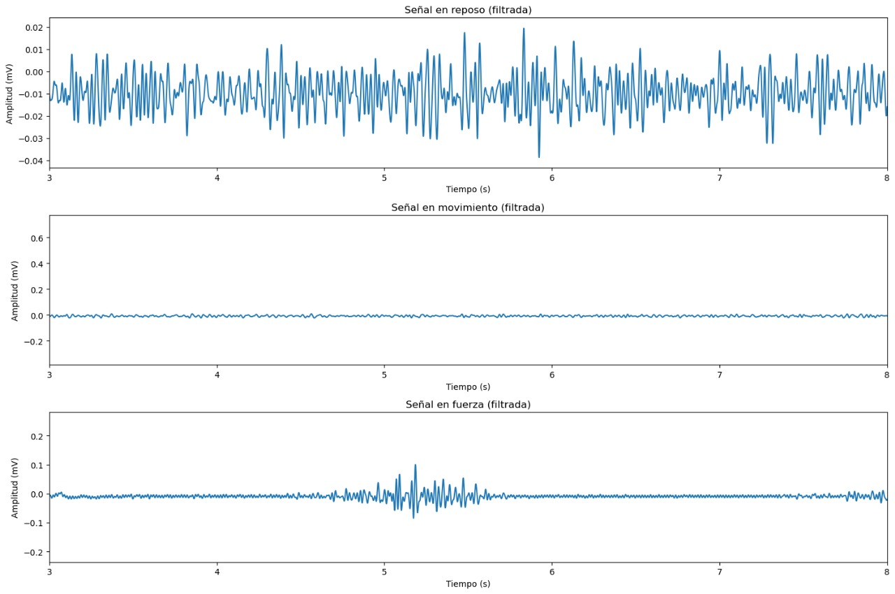|

<p align="center"><i>Tabla 5: EMG - Tricep con filtro FIR.</i></p>

<p align="justify"> </p>
