# **LABORATORIO 8: – Filtro Wavelet**
## **Tabla de contenidos:**
1. [Objetivos](#Objetivos)
2. [Introduccion](#Introduccion)
3. [Equipos y materiales utilizados](#Equipos)
4. [Metodología](#Metodología)
5. [Cronología de mediciones](#Cronologíademediciones)
6. [Posiciones de los electrodos](#Posicionesdeloselectrodos)
7. [Resultados](#Resultados)
8. [Discusión](#Discusión)
9. [Ultracortex](#Ultracortex)
10. [Bibliografia](#Bibliografia)
## **Objetivos:**
- Desarrollar filtros basados en la Transformada Wavelet Discreta (DWT) para eliminar ruido en señales ECG, EMG y EEG.
- Comparar la eficiencia de diferentes wavelets en la reducción de ruido en señales biomédicas.
- Extraer y analizar características clave de señales filtradas para su aplicación clínica.
  
## **Introducción:**

 En el campo de la ingeniería biomédica, la obtención y correcta interpretación de señales médicas como el electrocardiograma (ECG), electromiograma (EMG) y electroencefalograma (EEG) son fundamentales tanto para el diagnóstico de enfermedades como para la investigación. En este contexto, la transformada Wavelet ha demostrado ser una herramienta matemática altamente eficaz para el procesamiento y análisis de estas señales, permitiendo descomponerlas en diferentes niveles de resolución para un análisis más preciso y adaptable. A diferencia de métodos tradicionales como la transformada de Fourier, la transformada Wavelet es especialmente útil para señales no estacionarias, cuyas características varían en el tiempo. Esto la convierte en una técnica ideal para aplicaciones biomédicas, donde las señales suelen estar contaminadas por ruido. La Discrete Wavelet Transform (DWT), en particular, facilita la selección de diferentes familias de wavelets que optimizan el procesamiento al reducir el ruido sin comprometer las características clave de las señales, mejorando la calidad y confiabilidad del análisis diagnóstico [1]​.‌ 

### **Transformada Wavelet**

 La transformada wavelet proporciona una técnica avanzada de análisis de señales que, a diferencia de la Transformada de Fourier, permite realizar un análisis multiresolución, lo que significa que puede descomponer una señal en diferentes niveles de frecuencia, manteniendo tanto la información temporal como la de frecuencia. Es especialmente útil en el análisis de señales no estacionarias o que presentan cambios abruptos, como muchas señales biomédicas, porque permite examinar diferentes escalas de tiempo. La principal ventaja es su capacidad para ajustar la resolución en función de la frecuencia: usa intervalos de tiempo grandes para baja frecuencia y pequeños para alta frecuencia, mejorando el detalle en las zonas donde es necesario.

 El proceso básico de la transformada wavelet implica pasar la señal por filtros pasaaltos y pasabajos para dividirla en sus componentes de alta y baja frecuencia. Esto se puede repetir, dividiendo aún más la señal en distintas bandas de frecuencia. Este enfoque produce una representación multiresolución, donde cada nivel corresponde a una banda específica de frecuencia, permitiendo observar qué frecuencias están presentes en qué momento de la señal. La transformada wavelet puede ser continua o discreta [2]. 

<i>Figura 1: Transformada Wavelet [3].</i>

#### **Transformada Wavelet Continua**

La Transformada Wavelet Continua (CWT) permite analizar una señal en segmentos localizados del tiempo y consiste en expresar la señal como una expansión de coeficientes obtenidos a partir del producto interno entre la señal y una Wavelet Madre. Esta wavelet madre es una función de energía finita, que se dilata y se traslada en el tiempo para generar una familia de funciones conocidas como wavelets hijas. La CWT es especialmente útil para obtener información en baja frecuencia a través de intervalos grandes de tiempo, o en alta frecuencia utilizando intervalos pequeños de tiempo. Aunque la transformada maneja principalmente un plano de tiempo-escala, también puede trabajar en el dominio de tiempo-frecuencia mediante el teorema de Parseval, lo que la hace versátil para diferentes aplicaciones de análisis de señales [4].

#### **Transformada Wavelet Discreta**

La Transformada Wavelet Discreta (DWT) es una versión discretizada de la CWT que permite realizar el análisis numérico de señales. Para ello, se discretizan los parámetros de escala y traslación, transformando la señal en una serie de funciones elementales con sus respectivos coeficientes. En este proceso, la Wavelet Madre y las funciones de escala son fundamentales, donde las wavelets se encargan de captar los detalles finos de la señal (alta frecuencia), mientras que las funciones de escala se encargan de las aproximaciones más generales (baja frecuencia). Esta transformada permite representar una señal como una sumatoria de wavelets discretizadas, lo que facilita su análisis y reconstrucción. La DWT es una opción altamente eficiente para sistemas digitales, proporcionando una base ortonormal que asegura una buena precisión en el procesamiento de señales no estacionarias [4].

## **Metodología:**

 Para este laboratorio, utilizaremos las señales ECG, EMG y EEG previamente adquiridas en laboratorios anteriores con el Kit BITalino. A partir de estas señales, se procederá a su análisis para identificar el ruido presente. Luego, se diseñarán e implementarán filtros basados en la Transformada Wavelet Discreta (DWT), seleccionando los parámetros óptimos para cada tipo de señal (ECG, EMG y EEG) basándonos en referencias y estudios previos. 

  
## **Equipos y materiales utilizados:**

   
|  **Modelo**  | **Descripción** | **Cantidad** |
|:------------:|:---------------:|:------------:|
| (r)EVOLUTION |   Kit BITalino  |       1      |

<i>Tabla 1. Equipos y materiales utilizados en este laboratorio. </i> 

## **Procedimiento:**

### **SEÑAL ECG:**

Para el filtrado con transformada Wavelet de las señales ECG, se utilizaron los datos obtenidos previamente en el Laboratorio 4, en tres escenarios distintos: reposo, respiración controlada y después de realizar actividad física.

- Estado de reposo: El sujeto permaneció en una posición estable y tranquila, representando nuestra prueba de control. La señal fue registrada durante 30 segundos.

- Estado de respiración controlada: El sujeto realizó un ciclo de respiración prolongada, manteniendo la inhalación, conteniendo la respiración y exhalando, mientras se registraba la señal a lo largo de 30 segundos.

- Estado post-ejercicio: Después de realizar una actividad física intensa, que consistió en subir y bajar escaleras durante 5 minutos, se registró la señal tanto durante como inmediatamente después de la actividad física, también durante un periodo de 30 segundos.

***Justificación de parámetros para la Señal ECG***

 Para el filtrado se utilizó el artículo "Efficient wavelet families for ECG classification using neural classifiers" donde se compara el uso de varias familias de wavelets en la clasificación de señales ECG usando diferentes redes neuronales. La DWT es clave en este trabajo porque permite descomponer la señal ECG en varios niveles de resolución, lo que facilita la extracción de características tanto morfológicas como estadísticas que alimentan los clasificadores neuronales. Para nuestro filtrado tomamos en cuenta características que se usan en el artículo usando la wavelet Daubechies (db4), que es la que tuvo mejores resultados. Entre las características vistas el artículo menciona dos etapas una donde se aplica una técnica de umbralización suave para eliminar el ruido de alta frecuencia y una segunda etapa que elimina el ruido de desvío de línea base utilizando un rango de 0,15 a 0,5 Hz [5]. 

| **Descripcion de la señal** | **Señal original** | **Señal filtrada** | **Wavelet** |
|:------------:|:---------------:|:---------------:|:---------------:|
|Señal ECG en estado de reposo | 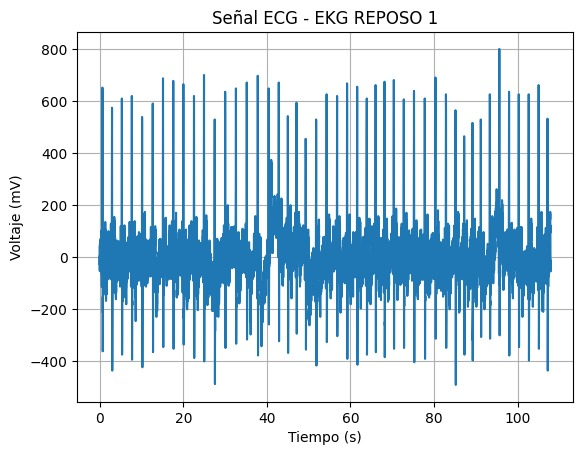 | 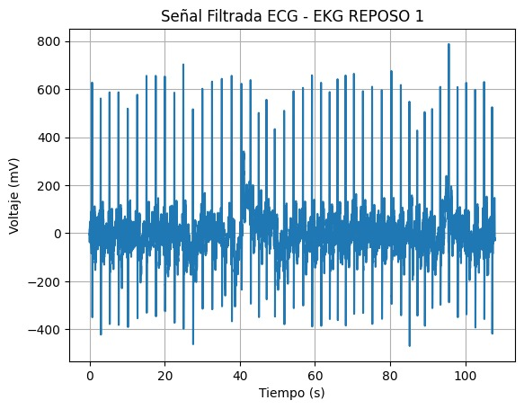 | 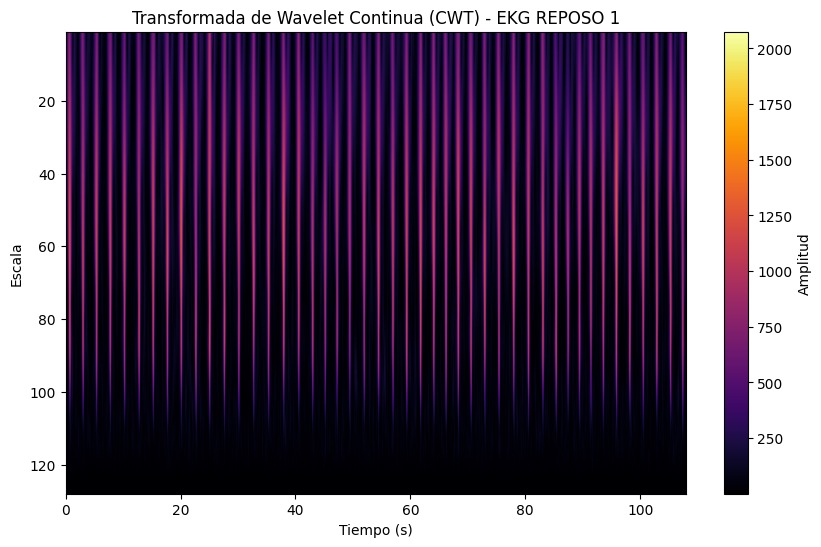 |
|Señal ECG en estado de respiración prolongada | 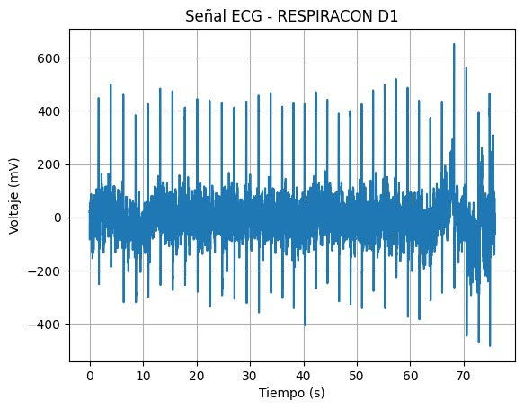 | 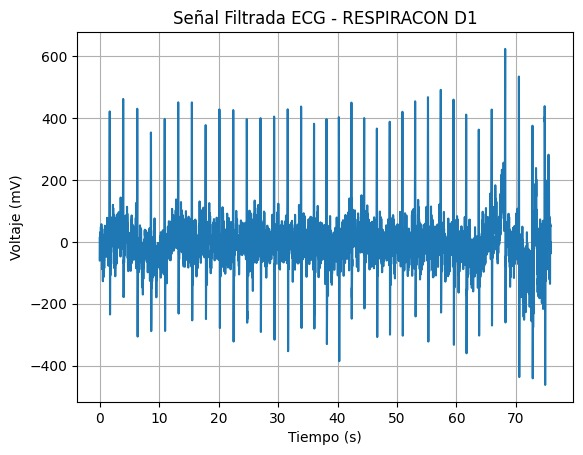 | 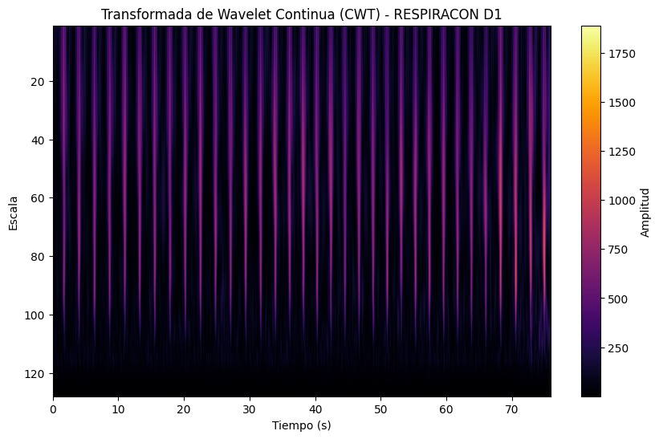 |
|Señal ECG en estado de post - Respiración | 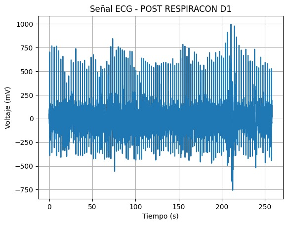 | 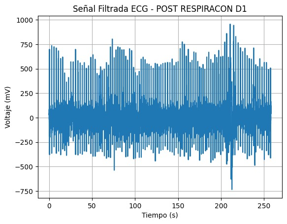 | 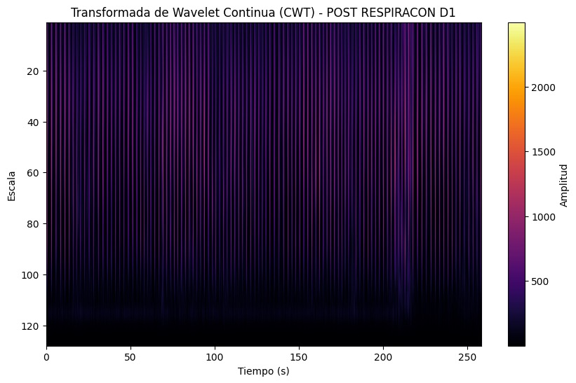 |
|Señal ECG en estado luego de actividad física | 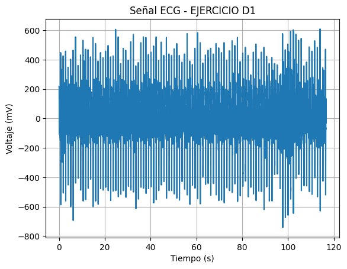 | 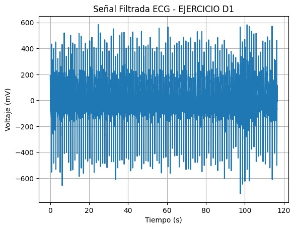 | 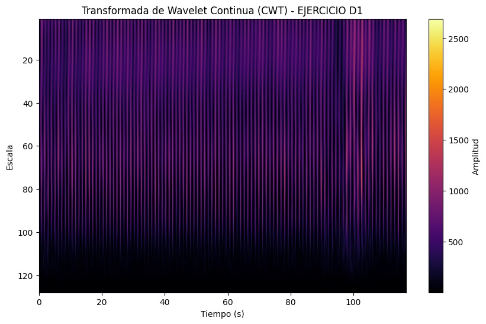 |

<i>Tabla 2. Señales ECGs orignales y filtradas por la transformada Wavelet. </i>

### **SEÑAL EMG:**

 Para el EMG, se tomaron mediciones de los siguientes músculos en distintos estados:

- Actividad muscular del tríceps braquial: Durante esta prueba, se registró la actividad eléctrica del tríceps braquial tanto en reposo como durante contracción. El electrodo de referencia se colocó en el codo para minimizar las interferencias.

 

<i>Figura 2: Trícep braquial.</i>

- Actividad muscular del gastrocnemio (pantorrilla): Se registró la actividad eléctrica del músculo gastrocnemio durante el movimiento de flexión y extensión del pie. El electrodo de referencia se ubicó en la rodilla para evitar interferencias.

<i>Figura 3: Gastrocnemio.</i>

- Actividad muscular de la mano: En esta medición, se registró la actividad eléctrica durante la flexión y extensión de los dedos. El electrodo de referencia se colocó en el antebrazo para minimizar el ruido.

<i>Figura 4: Mano-dedos.</i>

- Actividad muscular del bíceps braquial: Durante esta prueba, se midió la actividad del bíceps braquial en estados de reposo y contracción. El electrodo de referencia se ubicó en el codo.

<i>Figura 5: Bícep braquial.</i>

- Actividad muscular del trapecio: Se registró la actividad eléctrica del músculo trapecio durante la elevación y descenso de los hombros. El electrodo de referencia se colocó en la espalda, sobre la escápula.

<i>Figura 6: Trapecio.</i>

***Justificación de parámetros para la Señal EMG***
| **Músculo** | **Señales**|
|:------------:|:---------------:|
|Tricep en reposo| |
|Gastro en reposo||
|Mano en reposo||
|Bícep braquial en reposo||
|Trapecio en reposo||

### **SEÑAL EEG:**

 Se consideraron las señales de electroencefalograma (EEG) obtenidas en el Laboratorio 06 para el proceso de filtrado utilizando la transformada wavelet. Estas señales fueron registradas en diferentes estados:

- Estado de reposo: El sujeto permaneció en una posición estable y tranquila, manteniendo la calma, con el fin de registrar una línea base de señal con mínimas interferencias y sin movimientos. Este estado sirve como prueba de control, y el registro de la señal duró 30 segundos.

- Estado de ojos cerrados y abiertos: El sujeto realizó un ciclo de abrir y cerrar los ojos en cinco ocasiones, manteniendo cada estado durante 5 segundos. Para evitar artefactos en la señal, el sujeto permaneció tranquilo y mirando a un punto fijo. La señal fue registrada durante 50 segundos.

- Estado de segundo reposo: Después de la actividad de parpadeo, el sujeto retomó el estado de calma, sin movimientos, como una segunda fase de referencia. La señal fue grabada nuevamente por 30 segundos.

- Estado de razonamiento: El sujeto resolvió mentalmente una serie de ejercicios matemáticos, de menor a mayor dificultad, mientras mantenía la mirada fija en un punto para evitar artefactos. Entre cada respuesta y la siguiente pregunta, se dejó un lapso de 12 segundos para el registro de la señal.

***Justificación de parámetros para la Señal EEG***

 En el estudio titulado "Procesamiento de señales de electroencefalograma mediante wavelets para la eliminación de artefactos cardíacos",  se seleccionaron tres tipos de wavelets: Coiflets de orden 3, Daubechies de orden 4 y Symlets de orden 5. Estas fueron elegidas por su capacidad de filtrar artefactos cardíacos sin distorsionar la señal EEG. Los niveles de detalle eliminados fueron los niveles 2 y 3, ya que los artefactos cardíacos suelen aparecer en frecuencias bajas (0.5 a 4 Hz), y la eliminación de estos niveles permite eliminar el ruido sin afectar las ondas cerebrales importantes. El umbral de eliminación se ajustó usando SNR y NMSE para optimizar el filtrado sin pérdida significativa de información [X].

## **Discusión:**

 

## **Bibliografia:**

[1]Seshapu Prassanna, et al. “Application of Wavelet Based Security and Compression Techniques for Biomedical Instrumentation Signals.” International Journal of Innovative Technology and Exploring Engineering, vol. 9, no. 4, 13 Feb. 2020, pp. 57–64, www.researchgate.net/publication/364028066_Application_of_Wavelet_Based_Security_and_Compression_Techniques_for_Biomedical_Instrumentation_Signals, https://doi.org/10.35940/ijitee.c9014.029420. Accessed 20 Oct. 2024.

[2] S. Kouro and R. Musalem, “Tutorial introductorio a la Teoría de Wavelet.” Available: http://www2.elo.utfsm.cl/~elo377/documentos/Wavelet.pdf
‌.

[3]G. Antonio and L. Paredes, “Reconocimiento de patrones en electroforesis capilar utilizando análisis multiresolucional y programación dinámica / Gerardo Ceballos,” 2024. https://www.researchgate.net/publication/44720047_Reconocimiento_de_patrones_en_electroforesis_capilar_utilizando_analisis_multiresolucional_y_programacion_dinamica_Gerardo_Ceballos (accessed Oct. 20, 2024).

[4] N. N. B and D. Marcela, “El uso de la transformada wavelet discreta en la reconstrucción de señales senosoidales.,” Scientia et Technica, vol. 1, no. 38, pp. 381–386, 2024, doi: https://dialnet.unirioja.es/descarga/articulo/4782789.pdf.‌‌

[5] R Singh and R Mehta, “Efficient wavelet families for ECG classification using neural classifiers” Science Direct, 2014, doi: https://doi.org/10.1016/j.procs.2018.05.054

[X] Beatriz, Pérez Alberruche. “Procesamiento de Señales de Electroencefalograma Mediante Wavelets Para La Eliminación de Artefactos Cardíacos  | Archivo Digital UPM.” Oa.upm.es, Sept. 2022, oa.upm.es/71888/, https://oa.upm.es/71888/. Accessed 21 Oct. 2024.

