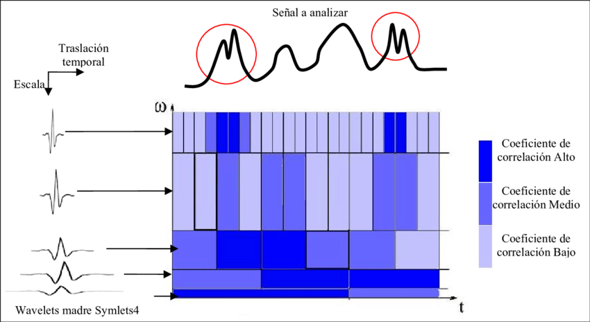

# **LABORATORIO 8: – Filtro Wavelet**
## **Tabla de contenidos:**
1. [Objetivos](#Objetivos)
2. [Introduccion](#Introduccion)
3. [Equipos y materiales utilizados](#Equipos)
4. [Metodología](#Metodología)
5. [Cronología de mediciones](#Cronologíademediciones)
6. [Posiciones de los electrodos](#Posicionesdeloselectrodos)
7. [Resultados](#Resultados)
8. [Discusión](#Discusión)
9. [Ultracortex](#Ultracortex)
10. [Bibliografia](#Bibliografia)
## **Objetivos:**
- Desarrollar filtros basados en la Transformada Wavelet Discreta (DWT) para eliminar ruido en señales ECG, EMG y EEG.
- Comparar la eficiencia de diferentes wavelets en la reducción de ruido en señales biomédicas.
- Extraer y analizar características clave de señales filtradas para su aplicación clínica.
  
## **Introducción:**

 En el campo de la ingeniería biomédica, la obtención y correcta interpretación de señales médicas como el electrocardiograma (ECG), electromiograma (EMG) y electroencefalograma (EEG) son fundamentales tanto para el diagnóstico de enfermedades como para la investigación. En este contexto, la transformada Wavelet ha demostrado ser una herramienta matemática altamente eficaz para el procesamiento y análisis de estas señales, permitiendo descomponerlas en diferentes niveles de resolución para un análisis más preciso y adaptable. A diferencia de métodos tradicionales como la transformada de Fourier, la transformada Wavelet es especialmente útil para señales no estacionarias, cuyas características varían en el tiempo. Esto la convierte en una técnica ideal para aplicaciones biomédicas, donde las señales suelen estar contaminadas por ruido. La Discrete Wavelet Transform (DWT), en particular, facilita la selección de diferentes familias de wavelets que optimizan el procesamiento al reducir el ruido sin comprometer las características clave de las señales, mejorando la calidad y confiabilidad del análisis diagnóstico. [1]​.‌ 

### **Transformada Wavelet**

 La transformada wavelet proporciona una técnica avanzada de análisis de señales que, a diferencia de la Transformada de Fourier, permite realizar un análisis multiresolución, lo que significa que puede descomponer una señal en diferentes niveles de frecuencia, manteniendo tanto la información temporal como la de frecuencia. Es especialmente útil en el análisis de señales no estacionarias o que presentan cambios abruptos, como muchas señales biomédicas, porque permite examinar diferentes escalas de tiempo. La principal ventaja es su capacidad para ajustar la resolución en función de la frecuencia: usa intervalos de tiempo grandes para baja frecuencia y pequeños para alta frecuencia, mejorando el detalle en las zonas donde es necesario.

 El proceso básico de la transformada wavelet implica pasar la señal por filtros pasaaltos y pasabajos para dividirla en sus componentes de alta y baja frecuencia. Esto se puede repetir, dividiendo aún más la señal en distintas bandas de frecuencia. Este enfoque produce una representación multiresolución, donde cada nivel corresponde a una banda específica de frecuencia, permitiendo observar qué frecuencias están presentes en qué momento de la señal. La transformada wavelet puede ser continua o discreta [2]. 

<i>Figura 1: Transformada Wavelet [3].</i>

#### **Transformada Wavelet Continua**

La Transformada Wavelet Continua (CWT) permite analizar una señal en segmentos localizados del tiempo y consiste en expresar la señal como una expansión de coeficientes obtenidos a partir del producto interno entre la señal y una Wavelet Madre. Esta wavelet madre es una función de energía finita, que se dilata y se traslada en el tiempo para generar una familia de funciones conocidas como wavelets hijas. La CWT es especialmente útil para obtener información en baja frecuencia a través de intervalos grandes de tiempo, o en alta frecuencia utilizando intervalos pequeños de tiempo. Aunque la transformada maneja principalmente un plano de tiempo-escala, también puede trabajar en el dominio de tiempo-frecuencia mediante el teorema de Parseval, lo que la hace versátil para diferentes aplicaciones de análisis de señales [4].

#### **Transformada Wavelet Discreta**

La Transformada Wavelet Discreta (DWT) es una versión discretizada de la CWT que permite realizar el análisis numérico de señales. Para ello, se discretizan los parámetros de escala y traslación, transformando la señal en una serie de funciones elementales con sus respectivos coeficientes. En este proceso, la Wavelet Madre y las funciones de escala son fundamentales, donde las wavelets se encargan de captar los detalles finos de la señal (alta frecuencia), mientras que las funciones de escala se encargan de las aproximaciones más generales (baja frecuencia). Esta transformada permite representar una señal como una sumatoria de wavelets discretizadas, lo que facilita su análisis y reconstrucción. La DWT es una opción altamente eficiente para sistemas digitales, proporcionando una base ortonormal que asegura una buena precisión en el procesamiento de señales no estacionarias [4].

## **Metodología:**

El laboratorio se llevó a cabo utilizando el Kit BITalino como en los laboratorios anteriores, con 3 electrodos de superficie colocados en las siguientes posiciones:

- El electrodo negativo cercano a la la linea media del lado derecho de la cabeza.
- El electrodo positivo cercano a la línea media del lado izquierdo de la cabeza.
- El electrodo de referencia se coloco en una región neutral, el hueso detrás de la oreja.

El sujeto, una compañera de clase, estuvo sentado en una silla, en un ambiente controlado (sin ruido excesivo y las luces atenuadas). La prueba se desarrolló en varias fases. Primero, se realizó una fase de línea base inicial durante 30 segundos, en la cual nuestra compañera estuvo con los ojos cerrados, permaneciendo quieta y respiró normalmente. Posteriormente, se procedió con cinco ciclos de apertura y cierre de ojos. Luego, se realizó una segunda fase de línea base de 30 segundos, bajo las mismas condiciones que la primera, para comparar las señales en reposo.
En la siguiente fase de la prueba, un compañero leyó en voz alta una serie de problemas matemáticos simples y complejas. Nuestra compañera resolvió estos problemas, manteniendo la mirada fija en un punto específico para minimizar los artefactos debidos a movimientos oculares. Para cada una de estas fases se midió la señal EEG y  se guardaron los datos obtenidos. Estos datos fueron procesados posteriormente en un programa python para analizar la actividad cerebral en cada una de las fases de la prueba.  
Una vez realizado las pruebas con nuestra compañera se procedió a hacer el mismo procedimiento pero en este caso con nuestro docente pero a diferencia de l primer caso ya no usamos el Kit BITalino sino el Ultracortex. 

Preguntas simples realizadas:

|  **Preguntas simples**  |
|:------------:|
| Hay 6 gatos en el parque; llegan 3 más. ¿Cuántos gatos hay ahora? |
| Sofía tiene 8 plumas, y Pablo le da 2. ¿Cuántas plumas tiene Sofía ahora? |
| Hay 12 flores en el jardín; se marchitan 5. ¿Cuántas flores quedan? |

<i>Tabla 1. Preguntas simples realizadas durante el laboratorio. </i>

Preguntas complejas realizadas:

|  **Preguntas siples**  |
|:------------:|
| Ana tiene 30 lápices, 7 más que Luis. Si juntos tienen 57 lápices, ¿cuántos tiene Luis? |
| El equipo X ganó 56 puntos, 12 menos que el equipo Y. Si el equipo Z ganó 18 más que ambos equipos juntos, ¿cuántos puntos ganó el equipo Z? |
| En una escuela hay 120 estudiantes, 20 más que en otra. Si en ambas escuelas hay 45 estudiantes menos que en una tercera escuela, ¿cuántos estudiantes hay en la tercera escuela? |

<i>Tabla 2. Preguntas complejas realizadas durante el laboratorio. </i>

## **Cronología de mediciones:**
1. **Preparación del equipo y del sujeto:**  
   1.1. Conexion de los electrodos, asegurando un buen contacto con la piel y verificando la correcta adherencia de cada uno.  
   1.2. Conexion correcta del Kit BITalino con el portatil.  

2. **Mediciones con  Kit BITalino:**  
   2.1. Registro de la línea base inicial (30 segundos).  
   2.2. Ciclo de apertura y cierre de ojos (5 ciclos).  
   2.3. Registro de una segunda línea base (30 segundos)  
   2.4. Ejercicios mentales (resolución de problemas matemáticos).  

3. **Mediciones con el Ultracortex:**  
   3.1. Registro de la línea base inicial (30 segundos).  
   3.2. Ciclo de apertura y cierre de ojos (5 ciclos).  
   3.3. Registro de una segunda línea base (30 segundos)  
   3.4. Ejercicios mentales (resolución de problemas matemáticos).  
   
## **Equipos y materiales utilizados:**

   
|  **Modelo**  | **Descripción** | **Cantidad** |
|:------------:|:---------------:|:------------:|
| (r)EVOLUTION |   Kit BITalino  |       1      |
|     ASUS     |      Laptop     |       1      |
|       -      |    Electrodos superficiales   |       3      |
|    MARK IV    |   Ultracortex   |       1      |

<i>Tabla 3. Equipos y materiales utilizados en este laboratorio. </i>

<i>Figura 3 y 4: Kit BITalino conectado a los electrodos y Ultracortex. </i>

## **Posiciones de los electrodos:**

<i>Figura 5: Participante con los electrodos posicionados en la cabeza.</i>

## **Resultados:**
### 1. Señales EEG captadas con eL Kit BITalino:
Para el ploteo de la señal se usó un código Python, que se puede ver [aquí](Anexos/Señales_EEGplot.ipynb).

#### <blockquote> Caso 1: Línea base sin movimientos y ojos cerrados durante 30 segundos. </blockquote>

| **Video 1.** | **Señal obtenida** |
|:------------:|:---------------:|
|<video src="https://github.com/user-attachments/assets/42f96590-4a11-46fe-b84f-c8ca31c68e31"> |  |

<i>Tabla 4. Video de la adquisición de la señal EEG y la señal obtenida. </i>

#### <blockquote> Caso 2: Ciclo de ojos abiertos - ojos cerrados cinco veces cada 5 segundos. </blockquote>

  

| **Video 2.** | **Señal obtenida** |
|:------------:|:---------------:|
|<video src="https://github.com/user-attachments/assets/a6729327-a0c4-4448-85a3-6769a2feeb0f">|  |

<i>Tabla 5. Video de la adquisición de la señal EEG y la señal obtenida. </i>

#### <blockquote> Caso 3: Fase de referencia de 30 segundos. </blockquote>

  

| **Video 3.** | **Señal obtenida** |
|:------------:|:---------------:|
|<video src="https://github.com/user-attachments/assets/dabb644d-1f9d-465d-b192-6a38d9cb3cf2">|  |

<i>Tabla 6. Video de la adquisición de la señal EEG y la señal obtenida. </i>

#### <blockquote> Caso 4: Registro realizando ejercicios mentales (Simples). </blockquote>

| **Video 4.** | **Señal obtenida** |
|:------------:|:---------------:|
|<video src="https://github.com/user-attachments/assets/e4a0ca57-4e45-46d0-b6a8-1b4c8c50d91e">|  |

<i>Tabla 7. Video de la adquisición de la señal EEG y la señal obtenida. </i>

#### <blockquote> Caso 5: Registro realizando ejercicios mentales (Complejos). </blockquote>

   
| **Video 5.** | **Señal obtenida** |
|:------------:|:---------------:|
|<video src="https://github.com/user-attachments/assets/444cd5aa-e248-41b3-a67c-636b4d0af70b">|  |

<i>Tabla 8. Video de la adquisición de la señal EEG y la señal obtenida. </i>

### 2. Señales EEG captadas con eL Ultracortex:

| **Estado** | **Señal obtenida  (Ultracortex)** |
|:------------:|:---------------:|
|Línea base sin movimientos y ojos cerrados durante 30 segundos |  |
|Ciclo de ojos abiertos - ojos cerrados cinco veces cada 5 segundos |  |
|Fase de referencia de 30 segundos |  |
|Registro realizando ejercicios mentales |  |

<i>Tabla 9. Señales adquiridas de la señal EEG por el Ultracortex. </i>

## **Discusión:**

En la gráfica se pueden observar diferentes ondas en diferentes rangos de frecuencia como lo son las ondas delta (0.5 a 4Hz), ondas teta (4 a 7Hz), ondas alfa (8 a 12Hz), ondas sigma (12 a 16Hz) y ondas beta (13 a 30Hz) y cada una de estas ondas proporcionan características fisiológicas de la persona [7]. La onda delta se presenta fisiológicamente activa en el sueño profundo y es prominente en regiones fotocentrales de la cabeza [7]. La onda teta se encuentra con mayor intensidad en las primeras etapas de sueño y es más prominente en las regiones frontocentrales [7], además de ser indicador neuronal de procesos internos que requieren autogestión [8]. La onda alfa predomina en tareas que requieren atención, memoria semántica. Es fácil de ver cuando el paciente se encuentra con los ojos cerrados y mentalmente inactivo y hay un bloqueo de esta onda cuando el paciente se encuentra con los ojos abiertos y en un lugar con iluminación [8]. La onda sigma se observa fisiológicamente en el sueño N2, estas pueden ser lentas (12 a 14Hz) o rápidas (14 a 16Hz) y se observan con mayor intensidad en regiones frontocentrales de la cabeza [9]. Por último, las ondas beta son más prominentes en regiones frontales y centrales de la cabeza y se muestran con mayor actividad cuando el paciente se encuentra alerta, atento, enfocado en resolver problemas o concentrado en actividades mentales [8]. Se debe tener en cuenta que la gráfica obtenida de electroencefalograma puede verse afectada por diferentes artefactos como la respiración y la actividad del corazón [11].

## **Bibliografia:**

[1]Seshapu Prassanna, et al. “Application of Wavelet Based Security and Compression Techniques for Biomedical Instrumentation Signals.” International Journal of Innovative Technology and Exploring Engineering, vol. 9, no. 4, 13 Feb. 2020, pp. 57–64, www.researchgate.net/publication/364028066_Application_of_Wavelet_Based_Security_and_Compression_Techniques_for_Biomedical_Instrumentation_Signals, https://doi.org/10.35940/ijitee.c9014.029420. Accessed 20 Oct. 2024.

[2] S. Kouro and R. Musalem, “Tutorial introductorio a la Teoría de Wavelet.” Available: http://www2.elo.utfsm.cl/~elo377/documentos/Wavelet.pdf
‌.

[3]G. Antonio and L. Paredes, “Reconocimiento de patrones en electroforesis capilar utilizando análisis multiresolucional y programación dinámica / Gerardo Ceballos,” 2024. https://www.researchgate.net/publication/44720047_Reconocimiento_de_patrones_en_electroforesis_capilar_utilizando_analisis_multiresolucional_y_programacion_dinamica_Gerardo_Ceballos (accessed Oct. 20, 2024).

[4] N. N. B and D. Marcela, “El uso de la transformada wavelet discreta en la reconstrucción de señales senosoidales.,” Scientia et Technica, vol. 1, no. 38, pp. 381–386, 2024, doi: https://dialnet.unirioja.es/descarga/articulo/4782789.pdf.‌‌

[5]“Ultracortex ‘Mark IV’ EEG Headset,” OpenBCI Online Store, 2015. https://shop.openbci.com/products/ultracortex-mark-iv srsltid=AfmBOooFLJKSwIY1W_qsd0d7tg13ph0ZpA8x1khuEkfJ13LgNWdD2_ja (accessed Sep. 29, 2024).
‌
[6]“OpenBCI EEG Headband Kit Guide | OpenBCI Documentation,” Openbci.com, Jun. 18, 2024. https://docs.openbci.com/AddOns/Headwear/HeadBand/ (accessed Sep. 29, 2024).
‌
[7]C. S. Nayak and A. C. Anilkumar, “EEG Normal Waveforms,” Nih.gov, Jul. 24, 2023. https://www.ncbi.nlm.nih.gov/books/NBK539805/ (accessed Sep. 29, 2024).
‌‌
[8]P. Kora, K. Meenakshi, K. Swaraja, A. Rajani, and Mantena Satyanarayana Raju, “EEG based interpretation of human brain activity during yoga and meditation using machine learning: A systematic review,” Complementary Therapies in Clinical Practice, vol. 43, pp. 101329–101329, Feb. 2021, doi: https://doi.org/10.1016/j.ctcp.2021.101329.

[10]A. R. Gondeck and J. R. Smith, “Dynamics of human sleep sigma spindles,” Electroencephalography and Clinical Neurophysiology, vol. 37, no. 3, pp. 293–297, Sep. 1974, doi: https://doi.org/10.1016/0013-4694(74)90033-9.
‌
[11]S. Majumder, Bijay Guragain, C. Wang, and N. Wilson, “On-board Drowsiness Detection using EEG: Current Status and Future Prospects,” ResearchGate, May 2019. https://www.researchgate.net/publication/335794861_On-board_Drowsiness_Detection_using_EEG_Current_Status_and_Future_Prospects (accessed Sep. 29, 2024).
