# **LABORATORIO 5: – Uso de BITalino para ECG**
## **Tabla de contenidos:**
1. [Objetivos](#Objetivos)
2. [Introduccion](#Introduccion)
3. [Triángulo de Eithoven](#TriángulodeEithoven)
4. [Equipos y materiales utilizados](#Equipos)
5. [Metodología](#Metodología)
6. [Cronología de mediciones](#Cronologíademediciones)
7. [Posiciones de los electrodos](#Posicionesdeloselectrodos)
8. [Resultados](#Resultados)
9. [Discusión](#Discusión)
10. [Bibliografia](#Bibliografia)
## **Objetivos:**
- Captar señales biomédicas de ECG de alta calidad para su análisis.
- Configurar de manera óptima el dispositivo BiTalino para la recolección de datos ECG.
- Extraer y analizar las señales ECG utilizando el software OpenSignals (r)evolution.
  
## **Introducción:**

 El corazón está compuesto por varios tejidos, entre los cuales se encuentra el músculo cardíaco, que puede producir señales eléctricas que son detectables en la superficie de la piel utilizando un sensor de ECG. [1]. 

 El electrocardiograma (ECG) es una herramienta fundamental en la medicina cardiovascular, utilizada para identificar una amplia variedad de patologías cardíacas, como arritmias y alteraciones miocárdicas y pericárdicas, así como desequilibrios electrolíticos y enfermedades pulmonares. Su facilidad de uso, carácter no invasivo y bajo costo han consolidado al ECG como una de las pruebas más empleadas en la práctica clínica. Sin embargo, su utilidad diagnóstica depende en gran medida de la precisión en la interpretación de los resultados [2]. 

<i>Figura 1: Interpretación de ECG [3].</i>

 

## **Triángulo de Eithoven**

 Para nuestro laboratorio, es crucial destacar la importancia del triángulo de Einthoven, el cual describe la relación entre las tres derivaciones bipolares de las extremidades (DI, DII y DIII) y los electrodos. Aunque tradicionalmente este triángulo se forma utilizando el brazo izquierdo, el brazo derecho y la pierna izquierda, en este experimento optamos por cambiar la ubicación del electrodo de la pierna izquierda hacia la cresta ilíaca, siguiendo la guía proporcionada. Este cambio no afecta de manera significativa la medición, ya que el ECG mide las diferencias de potencial eléctrico entre los electrodos, y la ubicación exacta no altera sustancialmente el registro de las derivaciones, siempre que se mantenga una distribución similar a las posiciones clásicas. 

 Sin embargo, es importante destacar que la colocación incorrecta accidental de los electrodos de las extremidades es una causa común de anomalías en el ECG, y puede simular patologías como ritmo auricular ectópico, agrandamiento de cámaras cardíacas, isquemia o incluso infarto de miocardio. Por lo tanto, se debe tener especial cuidado al posicionar los electrodos para evitar diagnósticos erróneos [4]. 

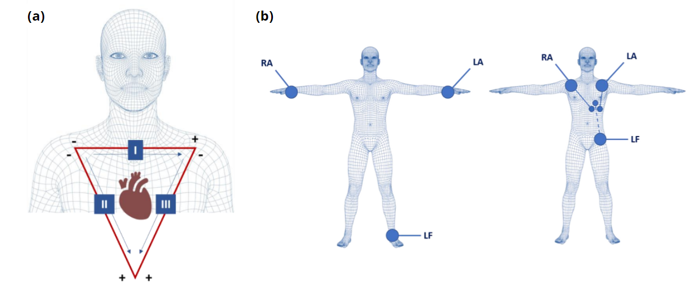

<i>Figura 2: (a) Derivaciones de Einthoven I-III (b) Posicionamiento de los electrodos para la derivación I: muñecas y tobillo (izquierdo), clavículas y cresta ilíaca o pecho (derecho) [1].</i>

## **Componentes tradicionales del ECG:**
|  **Onda/Segmento**  | **Descripción** |
|:------------:|:---------------:|
| Onda P | La onda P aparece como la primera elevación positiva en el trazado del electrocardiograma e indica el proceso de despolarización de las aurículas, la duración normal es inferior a 0.12 segundos, lo que equivale a menos de 120 milisegundos o a 3 cuadros pequeños en el trazado del ECG [5].|
| Intervalo PR  |El intervalo PR es el periodo que abarca desde el comienzo de la onda P hasta el inicio del complejo QRS, y refleja la conducción del impulso eléctrico a través del nodo auriculoventricular (AV). Duración normal: menos de 0.12 segundos (menos de 120 ms o 3 cuadros pequeños en el ECG) [6].|
| Complejo QRS | El complejo QRS corresponde a la despolarización de los ventrículos. La onda Q, que es la primera deflexión descendente, debe tener una duración menor a 0,05 segundos en todas las derivaciones, excepto en V1–V3. En estas derivaciones, la aparición de una onda Q se considera patológica y puede indicar la presencia de un infarto de miocardio, ya sea reciente o antiguo [7].|
| Intervalo QT | El intervalo QT se extiende desde el inicio de la onda Q hasta el final de la onda T, reflejando el tiempo total que dura la despolarización y repolarización ventricular, es decir, la sístole ventricular completa, desde la contracción isovolumétrica hasta la relajación isovolumétrica. La duración del intervalo QT varía inversamente con la frecuencia cardíaca: se acorta cuando el ritmo es más rápido y se alarga cuando es más lento [8].|
|  Segmento ST  | El segmento ST normalmente se presenta como una línea plana o isoeléctrica, aunque puede experimentar variaciones menores a 0.5 mm. Para determinar su desplazamiento, se utiliza como punto de referencia el segmento entre la onda T del latido anterior y la onda P del latido actual (segmento TP previo) [9].|
|  Onda T  | La onda T aparece como una deflexión positiva después del complejo QRS, representa la repolarización de los ventrículos. Es positiva en la mayoría de las derivaciones, excepto en aVR y V1. En cuanto a su amplitud, debe ser menor a 5 mm en las derivaciones de las extremidades y no superar los 10 mm en las derivaciones precordiales (con un límite de 10 mm en hombres y 8 mm en mujeres). Su duración está relacionada con el intervalo QT [10].  |
|  Onda U  | La onda U es una pequeña deflexión (alrededor de 0.5 mm) que aparece inmediatamente después de la onda T. Normalmente tiene la misma dirección que la onda T y se observa mejor en las derivaciones V2 y V3 [11].  |

<i>Tabla 1. Intervalos de una señal ECG. </i>

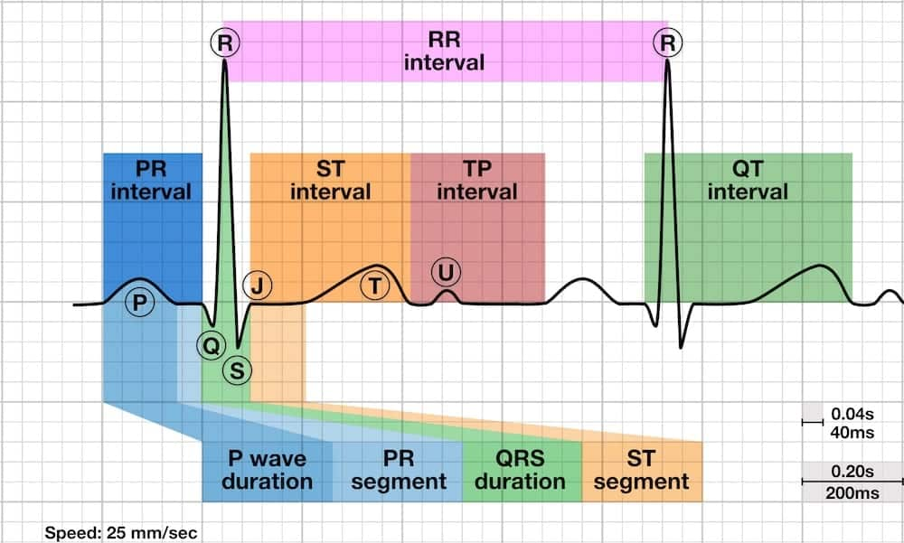

<i>Figura 3: Trazado de electrocardiograma (ECG) con los diferentes intervalos y segmentos del ciclo cardíaco [5].</i>

## **Metodología:**

En primer lugar, se realizaron tres registros para cada una de las tres derivaciones en reposo (derivaciones I, II y III). El participante debía estar en una posición cómoda, relajado y sin moverse para evitar interferencias en los registros. 

A continuación, se procedió a la segunda fase de medición, en la cual se solicitó al participante que retuviera la respiración. Se realizó un solo registro para cada derivación bajo las siguientes condiciones: el participante retenía la respiración durante 20 segundos, y luego se le daba un tiempo de recuperación de 2 minutos, durante el cual se registraba la segunda parte de la toma. Este proceso se repitió para cada una de las tres derivaciones. 

Para la última prueba, el participante realizó una actividad física moderada, que consistió en subir y bajar escaleras durante 5 minutos con el fin de aumentar su frecuencia cardíaca. Inmediatamente después de finalizar la actividad física, se realizó una toma única de cada derivación, registrando la actividad cardíaca durante un periodo de 20 minutos. 

 Se recomienda seguir estrictamente la cronología de las mediciones, ya que es crucial que el paciente se encuentre en reposo absoluto al inicio, sin haber experimentado ningún tipo de estrés previo. Si se realizaran primero las mediciones con retención de la respiración o, especialmente, la prueba de actividad física, se afectarían de manera significativa los registros en reposo debido al incremento de la frecuencia cardíaca, lo que alteraría los resultados de manera irreversible.

## **Cronología de mediciones:**
1. **Mediciones en Reposo:**  
1.1. Primera toma de la primera derivación (20 segundos). 
1.2. Segunda toma de la primera derivación (20 segundos). 
1.3. Tercera toma de la primera derivación (20 segundos). 
1.4. Primera toma de la segunda derivación (20 segundos). 
1.5. Segunda toma de la segunda derivación (20 segundos). 
1.6. Tercera toma de la segunda derivación (20 segundos). 
1.7. Primera toma de la tercera derivación (20 segundos). 
1.8. Segunda toma de la tercera derivación (20 segundos). 
1.9. Tercera toma de la tercera derivación (20 segundos). 

2. **Mediciones con Retención de la Respiración:**  
2.1. Toma de la primera derivación durante retención de la respiración (20 segundos). 
2.2. Toma de la recuperación de 2 minutos tras la retención de la respiración para la primera derivación. 
2.3. Toma de la segunda derivación durante retención de la respiración (20 segundos). 
2.4. Toma de la recuperación de 2 minutos tras la retención de la respiración para la segunda derivación. 
2.5. Toma de la tercera derivación durante retención de la respiración (20 segundos). 
2.6. Toma de la recuperación de 2 minutos tras la retención de la respiración para la tercera derivación. 

3. **Mediciones Posteriores a la Actividad Física:**  
3.1. Toma de la primera derivación tras 5 minutos de actividad física. 
3.2. Toma de la segunda derivación tras 5 minutos de actividad física. 
3.3. Toma de la tercera derivación tras 5 minutos de actividad física. 

## **Posiciones de los electrodos:**

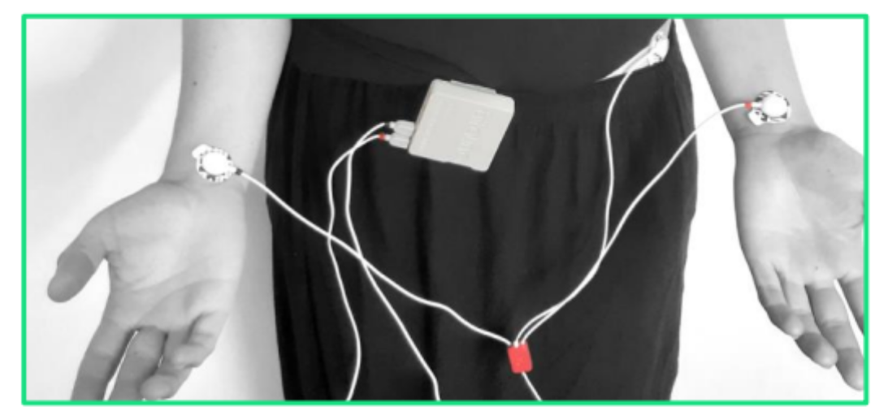

<i>Figura 4: Colocación de electrodos para la derivación I: IN+ (rojo) e IN- (negro) en las muñecas y REF (blanco) en la cresta ilíaca [1].</i>

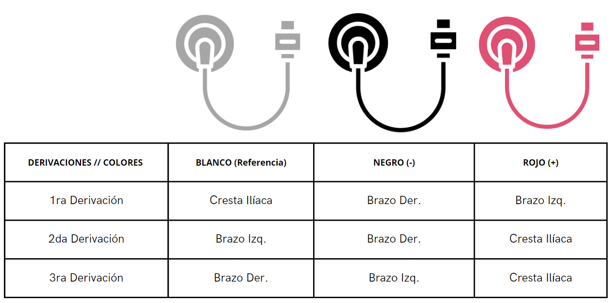

<i>Figura 5: Tabla de posiciones de los electrodos de acuerdo a la derivación analizada. Elaboración propia.</i>

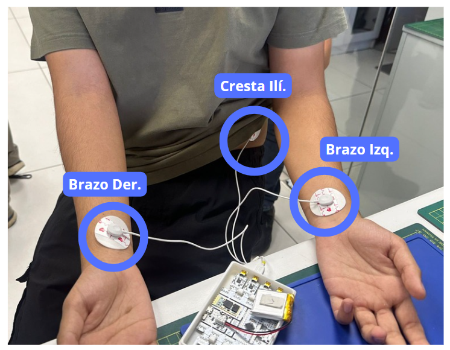

<i>Figura 6: Imagen referencial de las posiciones en donde deben colocarse los electrodos, para una mejor precisión al hacer los cambios. Elaboración propia.</i>

## **Equipos y materiales utilizados:**

   
|  **Modelo**  | **Descripción** | **Cantidad** |
|:------------:|:---------------:|:------------:|
| (r)EVOLUTION |   Kit BITalino  |       1      |
|     ASUS     |      Laptop     |       1      |
|       -      |    Electrodos superficiales   |       3      |
|    FLUKE ProSim 4    |   Vital Signs Simulators   |       1      |

<i>Tabla 2. Equipos y materiales utilizados en este laboratorio. </i>

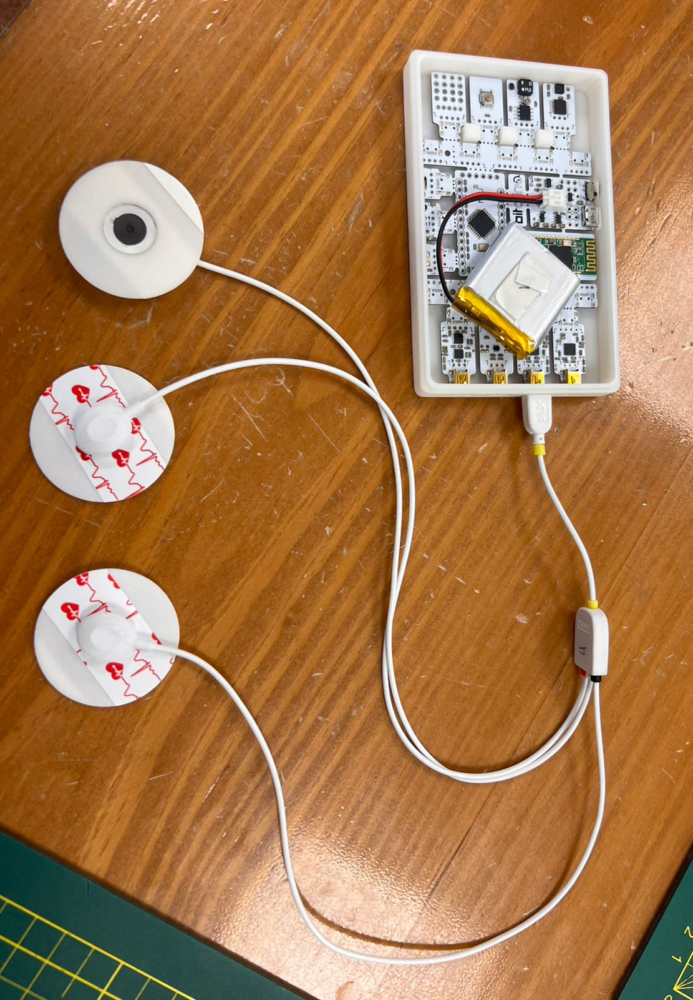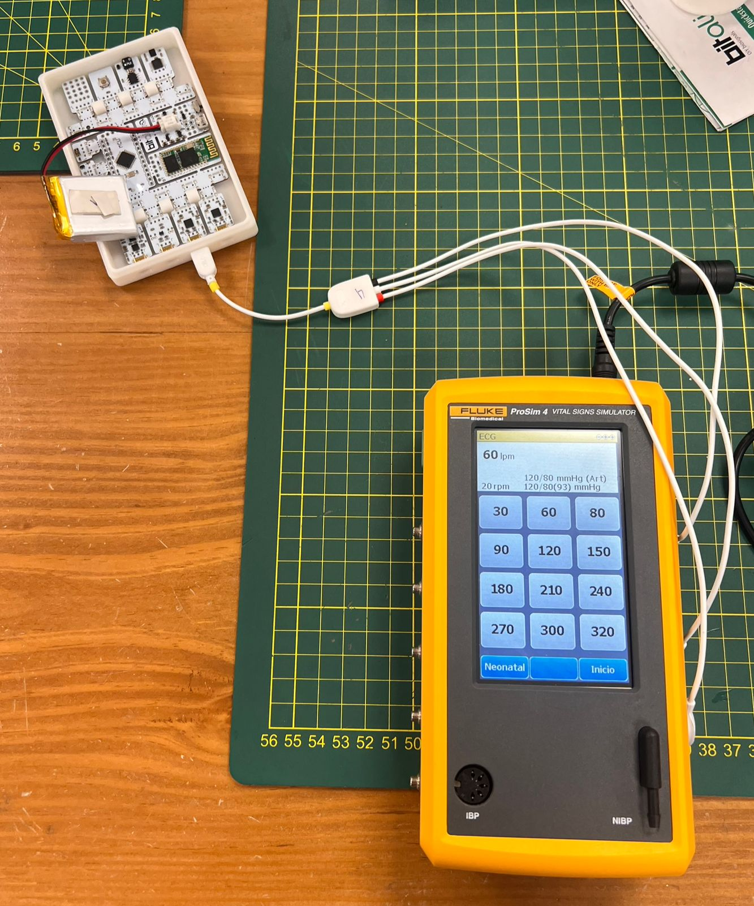

<i>Figura 2 y 3: </i>

## **Resultados:**
### 1. Señales captadas con la 1era derivación en diferentes estados:
#### <blockquote> Estado: En reposo </blockquote>

   

| **Video 1.** | **Señal obtenida** |
|:------------:|:---------------:|
| <video src="https://github.com/user-attachments/assets/9a4cd9f0-1357-4051-9b22-9e2d5093ba85"> | 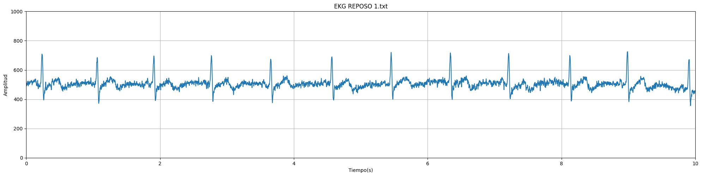 |

<i>Tabla 3. Video de la adquisición de la señal ECG y la señal obtenida. </i>

#### <blockquote> Estado: Respiración prolongada </blockquote>

   
| **Video 2.** | **Señal obtenida** |
|:------------:|:---------------:|
| <video src="https://github.com/user-attachments/assets/c4a0b0ad-e645-43a5-aa94-9c123bf638d5"> | 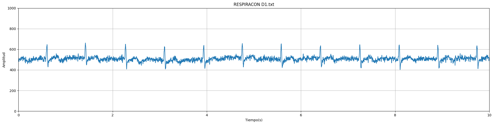 |

<i>Tabla 4. Video de la adquisición de la señal ECG y la señal obtenida. </i>

#### <blockquote> Estado: Post - Respiración </blockquote>

   
| **Video 3.** | **Señal obtenida** |
|:------------:|:---------------:|
| <video src="https://github.com/user-attachments/assets/0e6106c2-046d-48a6-badc-7b3202e11244"> | 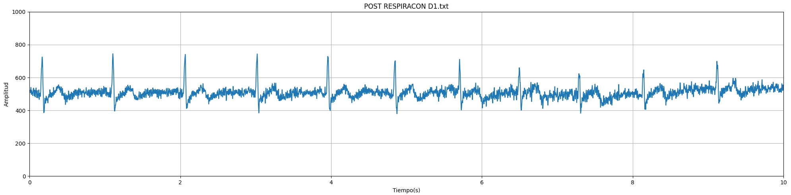 |

<i>Tabla 5. Video de la adquisición de la señal ECG y la señal obtenida. </i>

#### <blockquote> Estado: Luego de actividad física </blockquote>

   
| **Video 4.** | **Señal obtenida** |
|:------------:|:---------------:|
| <video src="https://github.com/user-attachments/assets/da7f9b48-1053-486f-b1d1-562d4cdd4ed0"> | 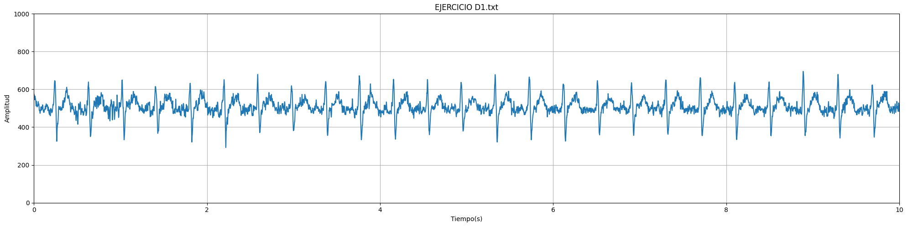 |

<i>Tabla 6. Video de la adquisición de la señal ECG y la señal obtenida. </i>

### 2. Señales captadas con la 2da derivación en diferentes estados:
#### <blockquote> Estado: En reposo </blockquote>

   

| **Video 5.** | **Señal obtenida** |
|:------------:|:---------------:|
| <video src="https://github.com/user-attachments/assets/462f440b-884a-473e-b0df-c56687fc3926"> |

<i>Tabla 7. Video de la adquisición de la señal ECG y la señal obtenida. </i>

#### <blockquote> Estado: Respiración prolongada </blockquote>

| **Video 6.** | **Señal obtenida** |
|:------------:|:---------------:|
| <video src="https://github.com/user-attachments/assets/71c4112d-03f1-428e-ad27-a58b2fef82f0"> 
|
<i>Tabla 8. Video de la adquisición de la señal ECG y la señal obtenida. </i>

#### <blockquote> Estado: Post - Respiración </blockquote>

| **Video 7.** | **Señal obtenida** |
|:------------:|:---------------:|
| <video src="https://github.com/user-attachments/assets/7b176a56-6062-483a-aa1b-311ee33d1bd8"> 
|
<i>Tabla 9. Video de la adquisición de la señal ECG y la señal obtenida. </i>

#### <blockquote> Estado: Luego de actividad física </blockquote>

| **Video 8.** | **Señal obtenida** |
|:------------:|:---------------:|
| <video src="https://github.com/user-attachments/assets/54c1ac73-5691-4f6e-80d0-187b3e229f20"> 

<i>Tabla 10. Video de la adquisición de la señal ECG y la señal obtenida. </i>

### 3. Señales captadas con la 3ra derivación en diferentes estados:
#### <blockquote> Estado: En reposo </blockquote>

   
| **Video 9.** | **Señal obtenida** |
|:------------:|:---------------:|
| <video src="https://github.com/user-attachments/assets/546a74f9-e64d-4848-bed0-1276e0c198a6"> |

<i>Tabla 11. Video de la adquisición de la señal ECG y la señal obtenida. </i>

#### <blockquote> Estado: Respiración prolongada </blockquote>

   
| **Video 10.** | **Señal obtenida** |
|:------------:|:---------------:|
| <video src="https://github.com/user-attachments/assets/604ec57c-67ca-4fcf-bc85-77f125c48e7f"> 
|
<i>Tabla 12. Video de la adquisición de la señal ECG y la señal obtenida. </i>

#### <blockquote> Estado: Post - Respiración </blockquote>

| **Video 11.** | **Señal obtenida** |
|:------------:|:---------------:|
| <video src="https://github.com/user-attachments/assets/2959df29-7fec-4bf8-a91b-4fa707863bfe"> 
|
<i>Tabla 13. Video de la adquisición de la señal ECG y la señal obtenida. </i>

#### <blockquote> Estado: Luego de actividad física </blockquote>

   
| **Video 12.** | **Señal obtenida** |
|:------------:|:---------------:|
| <video src="https://github.com/user-attachments/assets/2a476837-b060-45b9-a28e-e6cc87c3e201"> 

<i>Tabla 14. Video de la adquisición de la señal ECG y la señal obtenida. </i>

## **Ejercicio realizado:**

<video src="https://github.com/user-attachments/assets/028cd25f-daeb-482f-b897-e39af0cbee37" width="400">

<i>  Video del ejercicio realizado. </i>

### 4. Señal del Promsim4 (dispositivo de metrología que genera una señal patrón)
El **ProMSim4** es un simulador de ECG (electrocardiograma) diseñado para evaluar y calibrar dispositivos de monitoreo y diagnóstico cardíaco, como electrocardiógrafos, monitores cardíacos y sistemas de telemetría. Este tipo de simulador genera señales de ECG artificiales con patrones que imitan las señales del corazón en diversas condiciones, incluyendo ritmos cardíacos normales y arritmias[12].
#### <blockquote> Estado: En reposo (60 lpm)  </blockquote>
| <video src="https://github.com/user-attachments/assets/3a9e6d41-2c13-4a77-8595-d0bcd2dd8751"> |
#### <blockquote> Estado: Comienza a agitarse (120 lpm)  </blockquote>
| <video src="https://github.com/user-attachments/assets/f1310b2e-73b3-4d66-a538-d2f69ed7e474"> |
#### <blockquote> Estado: Haciendo ejercicio (150 lpm)  </blockquote>
| <video src="https://github.com/user-attachments/assets/d76f7100-9bc3-4378-93e1-0e02289eaa54"> |
#### <blockquote> Estado: Reponiéndose (90 lpm)  </blockquote>
| <video src="https://github.com/user-attachments/assets/fec886a4-b7b2-41b8-beef-de6fa97c5bf1"> |

## **Discusión:**

,

## **Bibliografia:**

[1]“BITalino (r)evolution Lab Guide.” Available: https://support.pluxbiosignals.com/wp-content/uploads/2022/04/HomeGuide2_ECG.pdf

‌

[2] N. Rafie, A. H. Kashou, and P. A. Noseworthy, “ECG Interpretation: Clinical Relevance, Challenges, and Advances,” Hearts, vol. 2, no. 4, pp. 505–513, Nov. 2021, doi: https://doi.org/10.3390/hearts2040039. ‌‌

[3] “Interpretación del electrocardiograma normal y patológico - DIPLOMADO,” Edupyme.edu.pe, 2022. https://edupyme.edu.pe/producto/interpretacion-del-electrocardiograma-normal-y-patologico-diplomado/ (accessed Sep. 21, 2024).‌‌

[4] E. Burns, R. Buttner, and E. Burns, “ECG Limb Lead Reversal,” Life in the Fast Lane • LITFL, Aug. 2018. https://litfl.com/ecg-limb-lead-reversal-ecg-library/ (accessed Sep. 21, 2024).‌‌

‌

 [5] M. Cadogan, R. Buttner, and M. Cadogan, “P wave,” Life in the Fast Lane • LITFL, Aug. 2020. https://litfl.com/p-wave-ecg-library/ (accessed Sep. 21, 2024).

[6] M. Cadogan and M. Cadogan, “PR Interval,” Life in the Fast Lane • LITFL, Aug. 2020. https://litfl.com/pr-interval-ecg-library/ (accessed Sep. 21, 2024).

[7] T. Cascino and M. J. Shea, “Electrocardiografía,” Manual MSD versión para profesionales, Jul. 06, 2021. https://www.msdmanuals.com/es-pe/professional/trastornos-cardiovasculares/pruebas-y-procedimientos-cardiovasculares/electrocardiograf%C3%ADa (accessed Sep. 21, 2024).‌

[8] E. Burns, R. Buttner, and E. Burns, “QT Interval,” Life in the Fast Lane • LITFL, Aug. 2020. https://litfl.com/qt-interval-ecg-library/ (accessed Sep. 21, 2024).

‌

[9] “Valoración del Segmento ST,” My-ekg.com, 2018. https://www.my-ekg.com/como-leer-ekg/segmento-st.html#google_vignette (accessed Sep. 21, 2024).
  

[10] E. Burns, R. Buttner, and E. Burns, “T wave,” Life in the Fast Lane • LITFL, Aug. 2018. https://litfl.com/t-wave-ecg-library/ (accessed Sep. 21, 2024).

[11] E. Burns and E. Burns, “U Wave,” Life in the Fast Lane • LITFL, Aug. 2020. https://litfl.com/u-wave-ecg-library/ (accessed Sep. 21, 2024).
‌

[‌12]“ProSim TM 4 Vital Signs Simulator Manual de funcionamiento básico.” Available: https://www.flukebiomedical.com/sites/default/files/resources/prosim4_gsspa0300.pdf
‌
‌
‌
‌
‌
